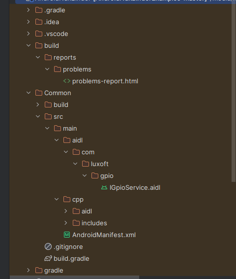
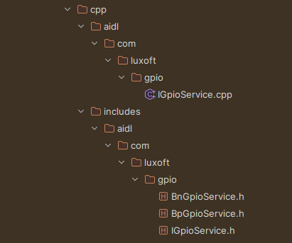
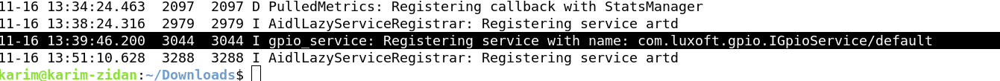
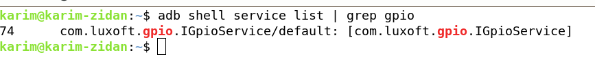
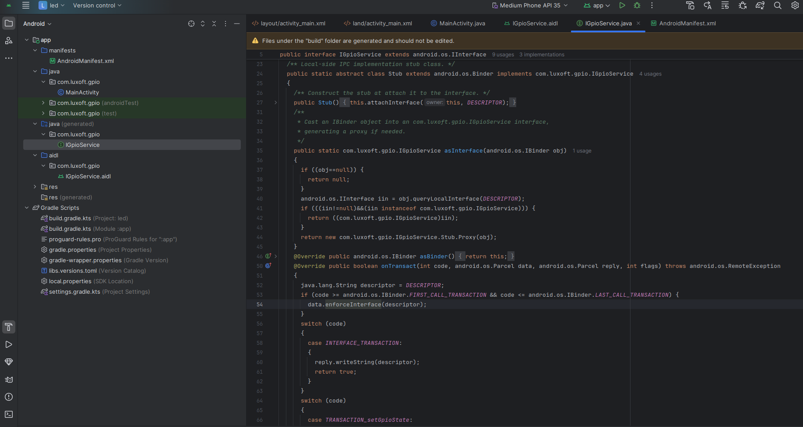
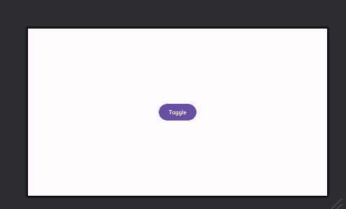

# For Developers: Native Service Creation in C++ and AIDL Binding for Android

## Prepared by Eng. Karim Zidan, Android Automotive Developer

## Introduction: What Are We Building?

In this tutorial, we will create a system where an Android application toggles an LED on a device using a native service written in C++. The communication between the Android app and the native service will be facilitated through Android **Interface Definition Language** (AIDL).

This setup is particularly useful for scenarios requiring efficient interaction between Android apps and native hardware functionalities implemented in C++.

### Prerequisites

1. A Raspberry Pi 4 board.

2. A compatible operating system for cross-compiling (usually Ubuntu or similar Linux distribution).

3. Android source code repository and necessary tools installed (like repo, Android SDK, and NDK), you can get it from here  -> https://github.com/raspberry-vanilla/android_device_brcm_rpi4

4. Android Studio installed on your computer.


By the end of this guide, you will:

1- Write a native service in C++ that interacts with hardware (e.g., toggles an LED).

2- Create an AIDL interface to enable communication between the Android app and the native service.

3- Bind the Android application to the native service and control the LED toggle through the app.


This hands-on project combines Android development, AIDL usage, and C++ native coding. It’s an excellent opportunity to understand how Android apps can leverage native capabilities for real-world applications. 

# Section 1: Setting Up the Folder Structure


```bash

mkdir /device/brcm/rpi4/led 

- inside the led here is the initial structure , but there is more files will be added on next steps 

- the gpio and include , are generted directories , you could create it now or just move the generate directories on the next steps. 

 
├── gpio
│   ├── aidl
│   │   └── com
│   │       └── luxoft
│   │           └── gpio
│   │                  └── IGpioService.aidl
│   │               
│   ├── Android.bp
│   ├── main.cpp
│   ├── GpioService.cpp
│   ├── GpioService.h
│   ├── gpio_service.rc
│   ├── includes
│   │   └── aidl
│   │       └── com
│   │           └── luxoft
│   │               └── gpio
│   ├── lib
│   │   ├── gpiohal.cpp
│   │   └── gpiohal.h
│   |   └── Android.bp
│   │ 
│   │ 
│   │ 
│   └── manifest
│       ├── device_manifest.xml
│       └── framework_compatibility_matrix.xml
│ 
│ 
└── sepolicy
    └── gpio_service
        ├── domain.te
        ├── file_contexts
        ├── gpio_service.te
        ├── service_contexts
        └── service.te


```

## Section 2: Building a HAL Application for Toggling the LED

In this section, we’ll create a Hardware Abstraction Layer (HAL) in C++ to control an LED. The HAL will provide functions to initialize the hardware and toggle the LED, which will later be accessed by the Android app through Native Service via AIDL. 

### 2.1 What is a HAL?

A Hardware Abstraction Layer (HAL) interfaces between Android and hardware, providing a consistent way to interact with device components, like the LED, without exposing implementation details.


### 2.2 Creating the HAL in C++

- inside the /lib

- gpiohal.h

```cpp
#pragma once


#include <string>


class GpioHal
{

    public :
        bool exportGpio(int pin);
        bool setGpioDirection(int pin, const char * direction);
        bool setGpioValue(int pin, bool value);
        bool getGpioValue(int pin, bool * value);


};


```
- gpiohal.cpp

```cpp


#include "gpiohal.h"
#include <fstream>
#include <string>

#define GPIO_PIN 17
#define GPIO_PATH "/sys/class/gpio/"

bool GpioHal::exportGpio(int pin) {
    std::ofstream exportFile(GPIO_PATH "export");
    if (!exportFile) return false;
    exportFile << pin;
    return exportFile.good();
}
bool GpioHal::setGpioDirection(int pin, const char* direction) {
    std::string directionPath = "/sys/class/gpio/gpio" + std::to_string(pin) + "/direction";
    std::ofstream directionFile(directionPath);
    if (!directionFile) return false;
    directionFile << direction;
    return directionFile.good();
}
bool GpioHal::setGpioValue(int pin, bool value) {
    std::string valuePath = "/sys/class/gpio/gpio" + std::to_string(pin) + "/value";
    std::ofstream valueFile(valuePath);
    if (!valueFile) return false;
    valueFile << (value ? "1" : "0");
    return valueFile.good();
}
bool GpioHal::getGpioValue(int pin, bool* value) {
    std::string valuePath = "/sys/class/gpio/gpio" + std::to_string(pin) + "/value";
    std::ifstream valueFile(valuePath);
    if (!valueFile) return false;
    int gpioValue;
    valueFile >> gpioValue;
    *value = (gpioValue == 1);
    return valueFile.good();
}


```

- create Android.bp (we will build it as .so to link it with Native Service)
```bash
cc_library_shared {

    name: "libgpiohal",
    srcs: ["gpiohal.cpp"],
    stl: "libc++",
    shared_libs: ["liblog"],
    vendor_available: true,

}

```
- build the .so

```bash

m libgpiohal

```
## Overview of NDK Binder Integration with AIDL

when you want to implement a native C++ service using the NDK Binder system, you can use the NDK's binder API to create a service directly in C++. 

1. Define the AIDL interface as usual.

2. Use the ndk::binder::Binder in C++ to implement the interface.

3. Register the service with the Android system so it can be accessed via binder IPC.

## Section 3: Creating a Native Service for the LED Toggle

- In this section, we’ll create a native service in C++ that wraps the HAL we built earlier. This service will expose methods to the Android application through AIDL so the app can toggle the LED remotely.


### 3.1 Setting Up the Service

We’ll start by implementing the service in C++. The service will utilize the GpioHal class to control the LED. The service will also provide an interface that the Android app can bind to.


## 3.2 Define the Service Interface (AIDL) 

- Creating the IGpioService.aidl

The AIDL interface defines the methods that the Android app will use to interact with the native service. We’ll define a methods to set and get the Gpio pin STATE.

- inside the same structure or even outside the aosp create com/luxoft/gpio/IGpioService.aidl
```cpp

package com.luxoft.gpio;

interface IGpioService {
	boolean setGpioState(int pin, boolean value);
	boolean getGpioState(int pin);
}


```

- there is a little work around here to generate the implementation of .aidl with NDK Binder


**we want to use NDK binder system , and tools like aidl-cpp tool in Android, it generates a Binder implementation using the ::android::binder namespace. However, since you want to use the NDK's Binder interface (which typically uses the android::binder namespace but in a slightly different manner), this requires some extra work to modify or bypass the default aidl.cpp generation behavior.**


 

- When you use an AIDL file in Android Studio and rebuild the project, the IDE automatically generates the necessary interface and stub classes for you, we will use the same concept but we will use custom script for generating a C++ implementation not java 

- you could use this script directly without Android Studio

```bash

plugins {
    id 'com.android.library'
}

android {
    compileSdkVersion 30
    buildToolsVersion '29.0.3'

    defaultConfig {
        minSdkVersion 29
        targetSdkVersion 30
        versionCode 1
        versionName "1.0"
    }

    buildTypes {
        release {
            minifyEnabled false
        }
    }

    compileOptions {
        sourceCompatibility JavaVersion.VERSION_1_8
        targetCompatibility JavaVersion.VERSION_1_8
    }
}

dependencies {
}

task compileAidlNdk() {
    doLast {
        def aidl = [android.sdkDirectory, 'build-tools', android.buildToolsVersion,
                    'aidl'].join(File.separator)

        def outDir = [projectDir.absolutePath, 'src', 'main', 'cpp', 'aidl'].join(File.separator)

        def headerOutDir = [projectDir.absolutePath, 'src', 'main', 'cpp', 'includes'].join(File.separator)

        def searchPathForImports = [projectDir.absolutePath, 'src', 'main', 'aidl'].join(File.separator)

        def aidlFile = [projectDir.absolutePath, 'src', 'main', 'aidl',
                         'com', 'luxoft', 'gpio',"IGpioService.aidl"].join(File.separator)

        exec {
            executable(aidl)
            args('--lang=ndk', '-o', outDir, '-h', headerOutDir, '-I', searchPathForImports, aidlFile)
        }
    }
}

afterEvaluate {
    preBuild.dependsOn(compileAidlNdk)
}

clean.doLast {
    def aidlCppOutDir = [projectDir.absolutePath, 'src', 'main', 'cpp', 'aidl'].join(File.separator)

    def aidlCppHeaderOutDir = [projectDir.absolutePath, 'src', 'main', 'cpp', 'includes',
                            'aidl'].join(File.separator)

    file(aidlCppOutDir).deleteDir()
    file(aidlCppHeaderOutDir).deleteDir()
}


```

- but i will make it more eaiser for u and here is an Android Studio Project you could modify the .aidl interface and the Common/build.gradle and build the project and it will generate the stubs and implmenetation for interface for you 


- you will find the Android Studio project inside the current Repo (AndroidNdkBinder.zip)  

- you could delete the previous generated code from cpp dir and generate your Own interface 




- or just create your own project and add the above script on Common/build.gradle and build with it , but i guess you have to upgrade to 
```bash
    dependencies {
        classpath "com.android.tools.build:gradle:7.0.0"
    }

``` 


- after generating you will find your generated classes here on 

 


copy the includes , aidl generated dir on your folder structure 


 


## 3.3 Define the Service Implementation

- GpioService.h

- **create GpioService class that extend the generated stub class which is part of the AIDL-to-C++ bindings**

```cpp
#pragma once

#include "aidl/com/luxoft/gpio/BnGpioService.h"
#include "lib/gpiohal.h"
namespace aidl::com::luxoft::gpio
{

    class GpioService : public BnGpioService
    {
    public:
        GpioService();

        ::ndk::ScopedAStatus setGpioState(int32_t in_pin, bool in_value, bool *_aidl_return) override;
        ::ndk::ScopedAStatus getGpioState(int32_t in_pin, bool *_aidl_return) override;

    private:
        std::unique_ptr<GpioHal> gpioHal; // Private member
    };

}
```

- **Create the C++ Service Implementation**

- GpioService.cpp 

```cpp
#include "GpioService.h"

namespace aidl::com::luxoft::gpio
{

    GpioService::GpioService() : gpioHal(std::make_unique<GpioHal>()) {}

    ::ndk::ScopedAStatus GpioService::setGpioState(int32_t in_pin, bool in_value, bool *_aidl_return)
    {
        gpioHal->exportGpio(in_pin);

        gpioHal->setGpioDirection(in_pin, "out");

        bool result = gpioHal->setGpioValue(in_pin, in_value);

        return ndk::ScopedAStatus::ok();
    }

    ::ndk::ScopedAStatus GpioService::getGpioState(int32_t in_pin, bool *_aidl_return)

    {
        gpioHal->exportGpio(in_pin);

        gpioHal->setGpioDirection(in_pin, "in");

        bool result = gpioHal->getGpioValue(in_pin, *_aidl_return);
        return ndk::ScopedAStatus::ok();
    }

}

```


**register the service to Service Manager**

- main.cpp 

```cpp

#include "GpioService.h"

#include <android-base/logging.h>
#include <android/binder_manager.h>
#include <android/binder_process.h>

int main()
{
    ABinderProcess_setThreadPoolMaxThreadCount(0);
    std::shared_ptr<aidl::com::luxoft::gpio::GpioService> gpio = ndk::SharedRefBase::make<aidl::com::luxoft::gpio::GpioService>();

    const std::string instance = std::string() + aidl::com::luxoft::gpio::GpioService::descriptor + "/default";
    binder_status_t status = AServiceManager_addService(gpio->asBinder().get(), instance.c_str());
    LOG(INFO) << "Registering service with name: " << instance;

    CHECK(status == STATUS_OK);
    if (status == STATUS_OK) {
        LOG(INFO) << "Service registered successfully.";
    } else {
        LOG(ERROR) << "Failed to register service. Status: " << status;
        return EXIT_FAILURE;
    }
    ABinderProcess_joinThreadPool();
    return EXIT_FAILURE;
}

```

## 3.4 Creating init.rc to launch the Service after boot completed


**NOTE** -> this init script still require a SEPolicy , it will be updated as soon as possible, right now we will launch it from CLI 

-gpio_service.rc

```bash

on early-boot
    chown system system /sys/class/gpio/*
    chmod 777 /sys/class/gpio/*

service gpio_service /vendor/bin/hw/gpio_service
	class hal
	user root
	group root
	

on boot
	start gpio_service

```


## 3.5 Creating device_manifest , framework_comptability_matrix

**on ./Manifest we will create two .xml files**

1. device_manifest.xml

- this xml ensures that your service is discoverable by clients (like an Android app) that wish to bind to it.

```bash
<manifest version="1.0" type="device">
    <hal format="aidl">
        <name>com.luxoft.gpio</name>
        <version>1</version>
        <interface>
        	<name>IGpioService</name>
        	<instance>default</instance>
        </interface>
    </hal>
</manifest>

```


2. framework_compatibility_matrix.xml

Purpose: The framework_compatibility_matrix is a more comprehensive document used primarily in the context of the Android compatibility program. It is used to define the compatibility criteria for Android devices and ensure that they meet certain requirements to be considered Android-compatible. 

Example of framework_compatibility_matrix:
It would look something like this (though it's not always in an XML format—it could be a table or document with detailed compatibility checks):

Component	Minimum Version Required	Remarks
GPS	        Yes	                        The device must have GPS and follow the correct API specifications.
Camera	    Yes	                        The device must implement a compliant camera HAL and camera APIs.
Bluetooth	Yes	                        Device must implement Bluetooth stack, support Bluetooth API.
GPIO	    Optional	                If the device exposes GPIO, the service must comply with the specific interface standards.

```bash

<compatibility-matrix version="1.0" type="framework">
    <hal format="aidl">
        <name>com.luxoft.gpio</name>
        <transport>hwbinder</transport>
        <version>1</version>
        <interface>
        	<name>IGpioService</name>
        	<instance>default</instance>
        </interface>
    </hal>
</compatibility-matrix>

```


## 3.6 Creating the BluePrint to build the Service as a Binary Native Service

- Android.bp

```bash

cc_binary {
    name: "gpio_service",  
    relative_install_path: "hw",  
    local_include_dirs: [
        "includes", 
    ],
    srcs: [
         "main.cpp",
        "GpioService.cpp",
        "lib/gpiohal.cpp", 
        "aidl/com/luxoft/gpio/IGpioService.cpp",  
    ],
    shared_libs: [
        "libbinder_ndk",  
        "libbinder",
        "libutils",
        "libbase",
        "liblog",
        "libhidlbase",
        "libcutils",
        "libgpiohal", 


    ],
    ldflags: ["-u", "-main"],
    init_rc: ["gpio_service.rc"], 
    vintf_fragments: ["manifest/device_manifest.xml"],
    vendor: true,
}

```

## 3.7 add SE Linux policies

1.  domain.te

```bash
type gpio_service, domain;

```


2. file_contexts

```bash 

/vendor/bin/hw/gpio_service      u:object_r:gpio_service_exec:s0

```

3. gpio_service.te

```bash
type gpio_service_exec, exec_type, file_type, vendor_file_type;


allow gpio_service gpio_service_api:service_manager add;
allow gpio_service servicemanager:binder { call transfer };

init_daemon_domain(gpio_service)

```

4. service.te

```bash

type gpio_service_api,      service_manager_type;

``` 

5. service_contexts

```bash

com.luxoft.gpio.IGpioService/default       u:object_r:gpio_service_api:s0

```

## 3.8 append FrameWork Comptability xml on /device/brcm/rpi4/BoardConfig.mk


```bash
Z_PATH = device/brcm/rpi4/led/gpio/manifest

DEVICE_FRAMEWORK_COMPATIBILITY_MATRIX_FILE += \
	$(Z_PATH)/framework_compatibility_matrix.xml \

```


## 3.9 append The service to PRODUCT_PACKEGES on /device/brcm/rpi4/aosp_rpi_car.mk

```bash

PRODUCT_PACKAGES += \
    gpio_service

```


## 3.10 Build the Service 


```bash

m gpio_service


```

## 3.11 check the registration of the service 

```bash
adb shell 

./vendor/bin/hw/gpio_service

- on another shell 

logcat  | grep "Register"


```
- Service has been registered successfully 






## Section 4: Building an Android Application for Toggling the LED

### 4.1 create the application with same package name (com.luxoft.gpio)


### 4.2 create .aidl file and paste the same .aidl signature that we used before 

```java
package com.luxoft.gpio;


interface IGpioService {

	boolean setGpioState(int pin, boolean value);
	boolean getGpioState(int pin);
}


```

### 4.3 rebuild the project to generate Proxy Stub




### 4.4 just add a button to toggle 



### 4.5 use the serviceManager to bind to the service (make sure it is running)

-MainActivity.java

```java
package com.luxoft.gpio;

import android.os.Bundle;
import android.os.IBinder;
import android.os.RemoteException;
import android.util.Log;
import android.widget.Button;
import androidx.appcompat.app.AppCompatActivity;

import java.lang.reflect.InvocationTargetException;
import java.lang.reflect.Method;

public class MainActivity extends AppCompatActivity {
    private boolean state = false;
    private IGpioService gpioService;

    @Override
    protected void onCreate(Bundle savedInstanceState) {
        super.onCreate(savedInstanceState);
        setContentView(R.layout.activity_main);

        try {
            Class<?> serviceManagerClass = Class.forName("android.os.ServiceManager");
            Method getServiceMethod = serviceManagerClass.getMethod("getService", String.class);

            if (getServiceMethod != null) {
                Object result = getServiceMethod.invoke(null, "com.luxoft.gpio.IGpioService/default");

                if (result != null) {
                    IBinder binder = (IBinder) result;
                    gpioService = IGpioService.Stub.asInterface(binder);
                    Log.d("ServiceBinding", "Successfully bound to GpioService!");
                } else {
                    Log.e("ServiceBinding", "Failed to get service binder.");
                }
            }
        } catch (ClassNotFoundException e) {
            Log.e("ServiceBinding", "Class not found: " + e.getMessage());
        } catch (NoSuchMethodException e) {
            Log.e("ServiceBinding", "Method not found: " + e.getMessage());
        } catch (InvocationTargetException e) {
            Log.e("ServiceBinding", "Invocation target exception: " + e.getMessage());
        } catch (IllegalAccessException e) {
            Log.e("ServiceBinding", "Illegal access exception: " + e.getMessage());
        }

        Button toggleBtn = findViewById(R.id.button);
        toggleBtn.setOnClickListener(v -> {
            state = !state;
            try {
                if (gpioService != null) {
                    gpioService.setGpioState(17, state);
                    Log.i("ZIDAN", "onClick: " + state);
                } else {
                    Log.e("ServiceBinding", "GpioService is not bound properly.");
                }
            } catch (RemoteException e) {
                throw new RuntimeException(e);
            }
        });
    }
}


```


### 4.6 build your app as apk 


### 4.7 push your app as a system app with privileges to access System Manager,


``` bash 

mount -o rw,remount /

exit 

adb push yourAppname.apk /system/priv-app/

pm install /system/priv-app/yourAppname.apk

- some times it needs to reboot here 

am start -n com.luxoft.gpio/.MainActivity


```

### 4.8 check if application bound to The Service 


### Congratulation you led is Toggling Now


