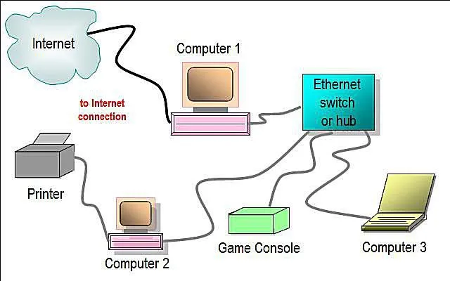
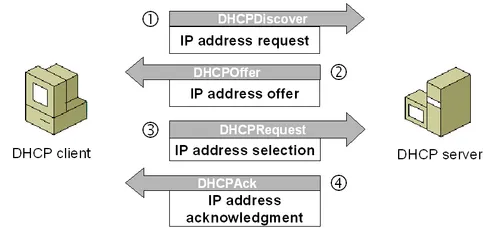
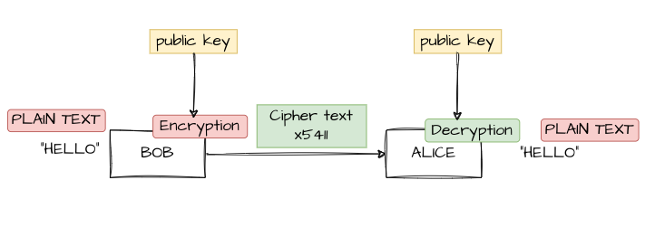
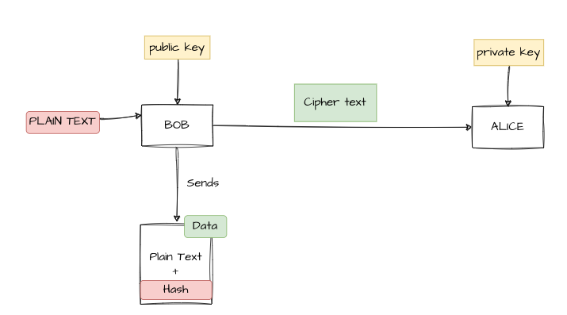
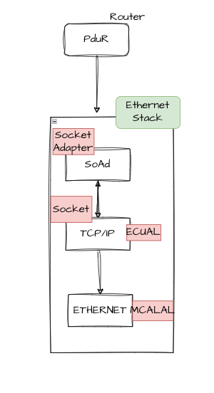

# NETWORK BASICS 

## OSI ARCHITECTURE 7 LAYERS 

### every protocole is a multilayer standart protocols , how ? 

1. datalink layer -> it define how the data gonna transfer through (wires,wifi..etc)

2. physical layer -> it define how the logical frame gonna looklike (DATA 0xAA) but on datalink layer gonna be as a voltage graph 

3. Network -> could connect multiple networks together ,sending packets (so i have to use a protocol from this layer),while packets are the individual chunks of data sent across the network. like ip,icmp 

4. Transport -> End-to-End Communication is the overall data transfer process ,tcp ip

5. rest of layer are merged

**every layer depend on the rest below layers**
## TCP/IP ARCH

 

- merging data layer and physical layer into link layer

## example 

 

## Broad-R Reach

- developed by broadcom

- with just two wires i could make full duplex , normal ethernet were based on RG 6-8 wires

## how two nodes are connected on Ethernet which 

 

## how phy and mac are connected together

 

## phy has three layers

 

- PMA -> it makes the two wires are capable to send and recieve on the same wire (so i have two wires i could send on them at the same time)

## phy hardware naming convention

 

## phy speed is set by software 

## phy topology is master - slave , but the protocole it self not master slave

## once two phy are connected together there is an initiative hardware frames to linkup together 

## when you connect a ethernet we notice two leds at first , Orange LED: Ethernet link is up and connected ,Yellow LED: Data is being transmitted or received, including test frames.

- length could be type also 

1. length 46-1500 -> length

2. 1501- ... > type 

**if type is more than 1500 it inidcate the type of payload (IPv4 frame) so it cuts the mac source,mac destination and then pass it to NETWORK LAYER TO IPv4**

- **if type is less than 1500 it is a normal frame** 
- **if type is 1500 it is a normal frame**
- **if type is 0 it is a broadcast frame**
- **if type is 0x0800 it is an IPv4 frame**
- **if type is 0x0806 it is an ARP frame**
- **if type is 0x86dd it is an IPv6 frame**
- **if type is 0x8847 it is a VLAN frame**
- **if type is 0x8100 it is a VLAN tag frame(has more 4bytes)**
- **if type is 0x88FF it is a PTP frame**

## WHAT VLAN ?
- VLAN is a virtual network that is created on a physical network
- VLAN is used to segment a network into smaller networks
- VLAN is used to improve network security and performance

**Tag frame**  
- VLAN tag (4bytes )is added to the frame
- VLAN tag contains VLAN ID and other information
- VLAN tag is used to identify the VLAN to which the frame belongs
- VLAN tag is used to forward the frame to the correct VLAN

**When a frame is received with a VLAN ID that does not match any of the VLANs I am configured to participate in, I will discard the frame, regardless of being part of the same network.**

## ethernet is node to node , so there is a problem here , how to solve it ? 

- **switch** : a device that connects multiple nodes together and forwards data between them

- types of switches 
1- managments switch ( has CPU and i could do some managment instructions on it )
2- unmanagments switch ( just do routing for frames)

- **inside switch configuration i could set VLAN EX: (port1 , port2) on VLAN1 , so i made routing , i route the frame to a specific vlan network**

- **also i could route the frame to a specific ports evenif i am not on Tag frame**

- **TCAM -> example : any ipv4 frame ignore it**

## what happen when switch received a frame with a specfic mac address ?

- **forward the frame to the port that has the matching MAC address depend on routing table**

- **if the port is not in the switching table , the frame is discarded**

- **if switching table is empty , it will make floading which is send to every one**

- **Flooding is a technique used in networking where a packet is sent to every possible destination in the network**

- **switching has autolearning that fill the switch table when he fload and then the same port response so SRC MAC , DST MAC are switched so switch will discover and fill switching table**

- **switching table is a table that contains the MAC addresses of the devices connected to the switch**

- **i could route using MAC ADDRESS or using the tagged VLAN frame** 

- **priority is for tagged , if i send unicast frame and it is a tagged for a VLAN , it will send it for the whole Virtual LAN**

- **i could overwrite untagged frame to tagged frame using the switch it self**

## unicast - multicast - broadcast 

- **unicast** : a packet is sent to a single destination

- **multicast** : a packet from untaged frame is sent to a group of destinations ,different than VLAN.

- **broadcast** : a packet is sent to all devices on the network

## i could set a nested switch to a specific port of a switch 

- **nested switch** : a switch that is connected to another switch
- **nested switch is used to increase the number of ports available on a switch**
- **nested switch is used to create a hierarchical network topology**

## IP 
- **IP: internet protocol** 
- **IP is a protocol that allows devices to communicate with each other over the internet**
- **IP is a layer 3 protocol**
- **IP is used to route packets between devices on a network**
- **IP is used to identify devices on a network**
- **IP is used to determine the path that a packet should take to reach its destination**
- **IP is used to fragment packets into smaller packets if they are too large to be sent over the network**

## SUBNET
- **subnet : a network that is a subset of a larger network**
- **subnet is used to divide a large network into smaller networks**
- **subnet is used to improve network performance**

## ROUTER
- **router : a device that connects multiple networks together**
- **router is used to route packets between networks**
- **router is used to determine the best path for a packet to take to reach its destination**
- **router is used to filter traffic and prevent unauthorized access to a network**

## evp protocol

## ptp protocol (over ethernet)
- **ptp : precision time protocol**
- **ptp is a protocol that is used to synchronize clocks on a network**
- **ptp is used to ensure that all devices on a network are synchronized to the same time on the network**
 

## ip only is not enough i want also the MAC address so we USE ARP FRAME
- **arp : address resolution protocol**

- **arp is a protocol that is used to resolve IP addresses to MAC addresses**

- **arp is used to determine the MAC address of a device on a network**

- **arp is send a broadcast (the one who owns this ip send his MAC address ) then MACADDRESS is send**

- **MAC ADDRESS TO IP called arp cache table on router**

## layer 4 : transport layer

 
- **protocol : a 2-byte field in the IP header that indicates the transport layer protocol being used** 

- **protocol is used to determine the transport layer protocol being used (e.g. UDP, TCP)** 

protcole =6 ->TCP
protcole =17 ->UCP

## UDP

- **udp : user datagram protocol**
- **udp is a connectionless protocol**
- **udp is used for applications that require fast and efficient data transfer**
- **udp is used for applications that do not require reliable data transfer**
- **udp is used for applications that require low latency**
- **udp is used for applications that require high throughput**
- **udp is used for applications that require packet loss tolerance**

## UDB FRAME

## PORT NUMBER
- **port number : a 16-bit field in the UDP header that indicates the port number of the sending and receiving applications**
- **port number is used to identify the application or service being used**
- **port number is used to determine the destination of the data**
- **port number is used to determine the source of the data**

**EX:**

- **port number 80 is used for HTTP**
- **port number 443 is used for HTTPS**
- **port number 22 is used for SSH**
- **port number 53 is used for DNS**
- **port number 123 is used for NTP**

## TCP
- **tcp : transmission control protocol**
- **tcp is a connection-oriented protocol**
- **tcp is used for applications that require reliable data transfer**
- **tcp is used for applications that require guaranteed delivery of data**

## TCP VS UDB

## DHCB
- **DHCB : data header control block**
- **DHCB is a data structure that contains information about a packet**
- **DHCB is used to store information about a packet such as the source and destination IP addresses**
- **DHCB is used to store information about a packet such as the source and destination port numbers**
- **DHCB is used to store information about a packet such as the protocol being used**
- **DHDB : must be based on UDB because at request frame i have no ip so there no connection yet , so TCP not a good solution**

- **1-DHCB at first send a broadcast with mac ff:ff:ff:ff and default ip to send to dhcb server**
- **2-DHCB server will send back a response with its ip and mac address**
- **3-DHCB client will store the ip and mac address of the dhcb server**
- **4-DHCB client will send a request to the dhcb server with its own ip and mac**
- **5-DHCB server will send back a response with the ip and mac address of the dhcb**
- **6- CLIENT PORT(68) , SERVER PORT(67)**

## dynamic DHCB 

## explain 
https://www.eventhelix.comnetworking/dhcp-flow/dhcp-sequence-diagram.pdf

- **1-Discover IP is a broadcast - i want an ip**

time sync - mac secuirty (consider it on your project)

## CyberSecurity Pulse

C I A

1- COFEDNTIALITY 
2- INTEGRITY
3- AUTHENTICAITY

- if you want to apply any feature in cybersecurity and see what it achieve from this list 

COFEDNTIALITY -> CONFIRM THAT I HAVE THE ACCESS TO THIS FEATURE 

INTEGRITY -> MAKE SURE THAT DATA FROM SENDER ARE THE SAME DATA I RECEIVED 

AUTHENTICATITY -> CONFIRM THAT THE SENDER that SEND THIS DATA I KNOW HIM (Private -> Public)

1- SYMATRIC KEYS

**only COFEDNTALITY** 
 
 - use it in Data Enclusure

2- Asymetric Key

- a pair of key that both will generate the same hash on the data 
- **public key(verify the hash and recognize who the sender of the data)**
- **private key(with only one node , calculate with private)**
- **hash**

- DIGITAL SIGNATURE

## Asymetric Key Provides 

AUTHENTICATITY , INTEGRITY
but the content it self i did not know that i have access to decrypt this data
so i have to use both symetric (public - public ) to Zipher the data at first before Hashing it 

3- Symetric key and Asymetric keys together 

Symetric Key -> Asymetric (calculate hash) -> on the otherside (decrypt)

## SEARCH FOR 
**CHAIN OF TRUST**
**Man in the middle attack**
**Diffusion**

## AUTOSAR 

on COMSTACK 
1- i send from application layer sent(ID) -> PDU -> PDU send it to the interface that has this ID 

but ethernet does not know what is the PDU , ethernet stack works with socket not with PDU 

so we have SOCKET ADAPTER -> (SoAd) , change sockets to pdus , pdus into sockets 

## SOME-IP PROTOCOLE 

- standard way to serilization for data

- to send data over SOME/IP they invent service discovery (offer service(publisher) , subscriber)

## Standards in AUTOSAR 

1. AUTOSAR 

2.  Automotive Saftey integrity Levels(ASIL)

3. Hazard and Risk Assessment(HARA)

4. Automotive SPCICE (Software Process improvement and Capability determination)

5.ISO/SAE21434 (DEFINE CYPERSECURITY REQUIRMENTS (TARA assigsment))
## READ ISO 26262 - Chapter 6

## ISO14229 (DIAGNOSTIC (MOST TRENDY PART ON AUTOMOTIVE NOWDAYS))

