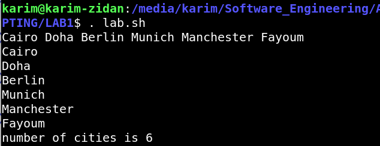

# Cities Bash Script

This Bash script demonstrates how to work with arrays in Bash by defining a list of cities, adding a new city to the list, and then iterating over the list to print each city. It also prints the total number of cities in the array.

## Script Overview

The script performs the following actions:

1. **Define an Array of Cities:** Initializes an array with five city names.
2. **Add a New City:** Adds a sixth city to the array.
3. **Print All Cities:** Prints all cities in the array.
4. **Iterate and Print Each City:** Iterates over the array and prints each city individually.
5. **Print the Number of Cities:** Prints the total number of cities in the array.

## Script Code

```bash
#!/bin/bash

# Initialize an array with five city names
cities=("Cairo" "Doha" "Berlin" "Munich" "Manchester")

# Add a new city to the array
cities[6]="Fayoum"

# Print all cities in the array
echo ${cities[@]}

# Iterate over the array and print each city individually
for city in ${cities[*]}
do
    echo $city
done

# Print the total number of cities in the array
echo "Number of cities is ${#cities[*]}"
```
##OUTPUT

