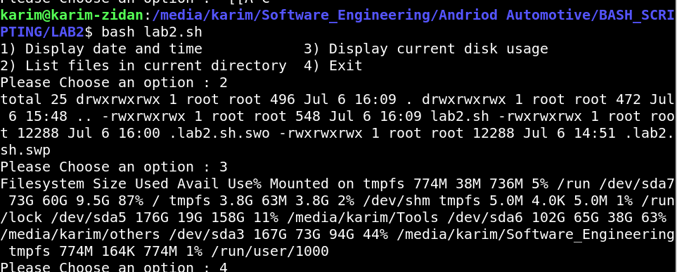

# Bash Menu Script

This script presents a simple interactive menu to the user using the `select` statement in Bash. The user can choose from several options to display the current date and time, list files in the current directory, display current disk usage, or exit the script.

## Script Overview

The script performs the following actions:

1. **Display a menu with options:**
   - Display the current date and time
   - List files in the current directory
   - Display current disk usage
   - Exit the script

2. **Execute the corresponding command based on user selection.**

## Script Code

```bash
#!/bin/bash

# Define the options for the menu
OPTIONS=("Display date and time" "List files in current directory" "Display current disk usage" "Exit")

# Prompt string for the select command
PS3="Please Choose an option : "

# Display the menu and handle user input
select TEST in "${OPTIONS[@]}"
do 
    case "${TEST}" in
        "Display date and time")
            # Display the current date and time
            echo "$(date)"
        ;;
        "List files in current directory")
            # List files in the current directory with detailed information
            echo "$(ls -la)"
        ;;
        "Display current disk usage")
            # Display current disk usage
            echo "$(df -h)"
        ;;
        "Exit")
            # Exit the menu
            break
        ;;
        *)
            # Handle invalid options
            echo "Invalid option. Please try again."
        ;;
    esac

done
```

