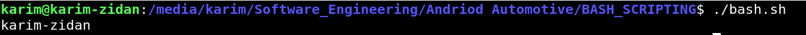
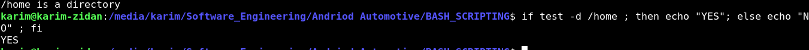
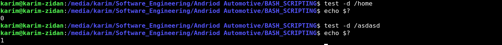
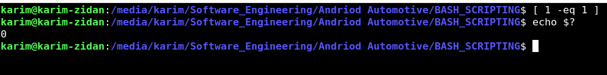
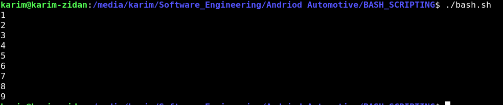
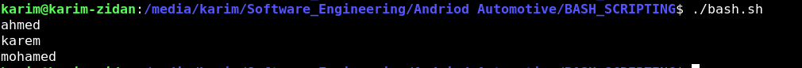
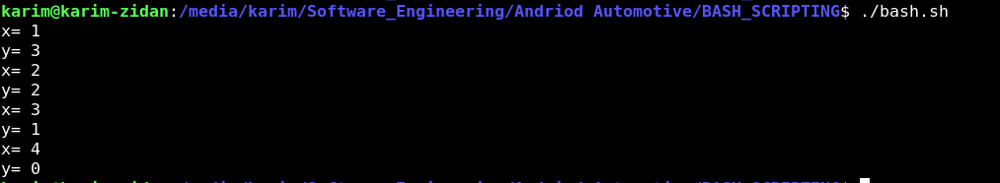
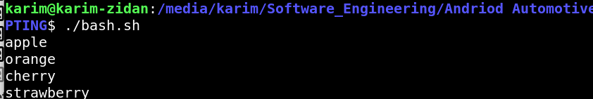
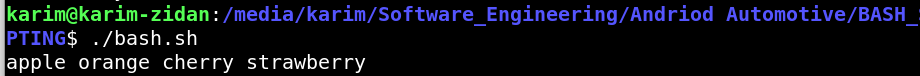
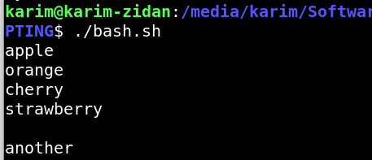

## EXECUTING_METHODS

1. ./file.sh

2.  bash file.sh

3. . file.sh -> execute in current shell

4.  source file.sh -> it will execute it in same shell like i source oe-init on poky


## declaration_Rules

1. can not start with numbers

2. can not set a a space between = and VAR NAME

3. declare NAME=100 # Local variable.

4. declare NAME=$(hostname) declare as command output.

## deletion

 Delete Variable / Array ===> unset NAME

## concatencation

name=karem

FULLNAME="${name} zidan" TRUE -> double quotes

FULLNAME ='$name zidan' WRONG


## reading from user


### a. Before script Run (Positional Parameters).            # Shell variables: 
            $0  ---> name script. 
            $1  ---> 1st paramater.
            $2  ---> 2nd parameter.

### b. After Run operation.

1. read $NAME # hold input ----> written user.

2. read -s -p "Enter Password " Pass -> to enter password -> -s suppress -p pirnt


## reading from command

```bash
#!/bin/bash


output=$(hostname)

echo ${output}

```



## TEST

syntax: test {condition}

types of conditions 

1.  integers condition 

2. string condition

3. file condition

## integer condition

operators
1. -eq  -> eq

2. -nq  -> not eq

3. -gt  -> greater than

4. -lt  -> less than

5. -ge  -> great or equal

6. -le  -> less or equal

## string operators 
1. -= 

2. -!=

3. -z -> zero charachters -> empty string 

4. -n -> non zero charachters -> not empty string

## file operators 

1.  -f-> file exist  

2.  -d-> directory exist

3.  -x-> is that file executable

## TRUE IN BASH IS 0

```bash
if test -d /home; then echo "/home is a directory"; else echo "/home is not a directory"; fi
```



## $?
it stores the exit status of last command 

0-> TRUE

1-> FALSE



## using []

```bash

if [ 1 -eq 1 ]; then
echo "TRUE"
else;
echo "FALSE"
fi
```
or 



# Logical Operators

1. && or -a 

2. || or -o 

There is a Three Syntax types

Synt1-> [ condition ]  &&-|| [ condition ] use symbols 

Synt2-> [[condition1  &&-||  condition2  &&-||   condition3   ]] also use symbols
 
Synt3-> [ condition1 operator (-a or -o ) condition2 ]

## Multiple Condition Using Test

# multiple condition

```bash
test "$num" -eq 1 && test "$string" = "ahmed"
echo 
echo $?

test "$num" -eq 1 -a "$string"="ahmed"
echo 
echo $?
```
## if condition

```bash
if [[ condition ]]; then

else

fi

#same as


if [[ condition ]]
then

else

fi
```
## elif

```bash
if [ condition1 ]; then
    # Code to execute if condition1 is true
elif [ condition2 ]; then
    # Code to execute if condition1 is false and condition2 is true
else
    # Code to execute if all conditions are false
fi
```

## for loop

```bash

!/bin/bash

for var in 1 2 3; do 
        echo $var

done


same as 

!/bin/bash

for var in 1 2 3
do 
        echo $var

done


```
# another example

```bash
for var in {1...9}
do 
        echo $var

done
```


```bash
#!/bin/bash


string="ahmed karem mohamed"


for var in "$string"; do

echo $var


done
```


```bash
#!/bin/bash


string="ahmed karem mohamed"


for var in "$string"; do

echo $var


done
```


## using c style operators

```bash

while [[ $x !=6 && $y -ge 0 ]]; do
echo "x= $x"
echo "y= $y"
((x++))
((y--))
#break
done
```


## until

```bash
until [ condition ]; do
echo "Hello"
done #or use break to break for one iteration only
```

## array

1. index array 
2. assotiative array

## index array 

1. implicit decleration ex:

```bash
fruites=("apple" "orange" "cherry")
#same as fruites -a =("apple" "orange" "cherry") -> explicit
echo ${fruites[0]} 
#insert 
fruits[3]="strawberry"

```
2. print array elements (with for or with [@])


```bash
echo ${fruits[@]} 
```

```bash

#!/bin/bash


fruites=("apple" "orange" "cherry")
 
#insert 
fruites[3]="strawberry"

for var in "${fruites[@]}"
do
echo $var
done 

```



```bash

#!/bin/bash


fruites=("apple" "orange" "cherry")
 
#insert 
fruites[3]="strawberry"

for var in "${fruites[*]}"
do
echo $var
done 
```


1. if i use it with out " " it will print all the elements as seperated elements with [@] and [*]

2. another ex:

```bash
#!/bin/bash


fruites=("apple" "orange" "cherry")
 
#insert 
fruites[7]="strawberry"

for var in ${fruites[@]}
do
echo $var
done 

fruites[5]="another"

echo ${fruites[4]}
echo ${fruites[5]}
```
OUTPUT WILL BE



## printing array length

```bash
echo ${#fruites[@]}
```
## array slicing

```bash
echo ${fruites[@]:1:2} ##array slicing from elem1 display two elements
```
## remove array element

```bash 

#!/bin/bash


fruites=("apple" "orange" "cherry")
 
#insert 
fruites[7]="strawberry"
# remove
for var in ${!fruites[@]}
do
echo $var
done 
```
## assotiative array

1. declaration -> explicit
ex:

```bash
#!/bin/bash


declare -A fruits=( [apple]="red" [banana]="yellow" )
   #printing 
echo ${fruits[apple]}
#print all values 
echo ${fruits[@]}


#print keys


for key in ${!fruits[@]}
do
echo key is $key,value is ${fruits[$key]}
done

```
## explicit casting for variable 

1. expr

```bash
((var++)) #explicit
#or 
#var2=expr(space)+(space)(value)
#ex: 
var2=expr + 1

#var=var+1 is only valid with explicit declare -i var
#with implicit use expr
var2=expr $var2 + 1

```
2. explicit declaration 
```bash
declare -i  var=5 
```
NOTE:with out spaces 

## SHELL ARGUMENTS

1. a. Before script Run (Positional Parameters).            
2.           $0  ---> name script. 
3.           $1  ---> 1st paramater.
4.           $2  ---> 2nd parameter.
5.           $#  ---> total number passed to bash script. 
6.           $@  ---> total number passed to bash script as seperated values.
7.           $*  ---> represent all arguments passed to the script as single string.


# Bash `case` Statement

The `case` statement in Bash is used to execute different blocks of code based on the value of a variable or expression. It's a more readable alternative to multiple `if-elif-else` statements when there are many conditions to check.

## Syntax

```bash
case expression in
    pattern1)
        # commands to execute if expression matches pattern1
        ;;
    pattern2)
        # commands to execute if expression matches pattern2
        ;;
    pattern3 | pattern4)
        # commands to execute if expression matches pattern3 or pattern4
        ;;
    *)
        # commands to execute if no patterns match (default case)
        ;;
esac
    
```
## SELECT

#!/bin/bash

# Define a list of options
options=("Option 1" "Option 2" "Option 3" "Quit")

# Display the menu and prompt for a choice

SELECT SYNTAX:

```bash 
select opt in "${options[@]}"
do

done
```


```bash
select opt in "${options[@]}"
do
    case $opt in
        "Option 1")
            echo "You chose Option 1"
            ;;
        "Option 2")
            echo "You chose Option 2"
            ;;
        "Option 3")
            echo "You chose Option 3"
            ;;
        "Quit")
            echo "Exiting..."
            break
            ;;
        *)
            echo "Invalid option $REPLY"
            ;;
    esac
done
```

1. asking user to choose on of the following options you set before like option array
then merge it with case 

## STRINGS
String="name"

```bash

String="ahmed"

echo ${#String} # display the string charachter numbers

substring=${String:2:4}

echo ${substring} # display the substring

```
# FUNCTIONS

## there is three syntax to write function

1. 
```bash

func(){


      }
func -> for calling 
```
2. 
```bash
function func
{


}
func
```

3. 
```bash

function func()
{


}
func

```

## local var 

```bash
#!/bin/bash
var=mohamed
Display()
{
local var=ahmed

}

Display

echo $var

```
when i add local it will not overwrite the global var

