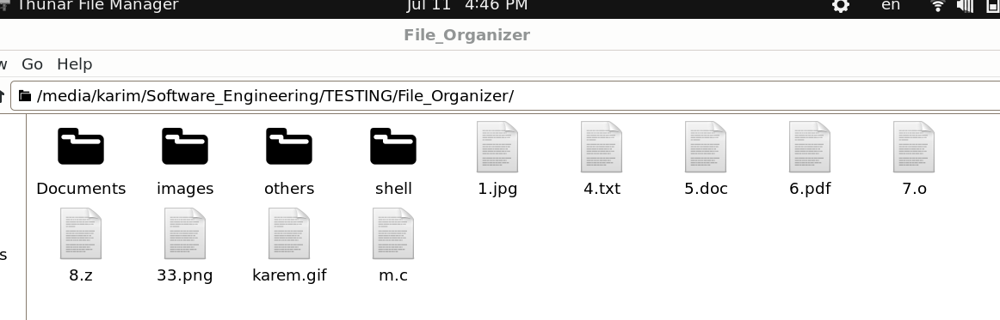
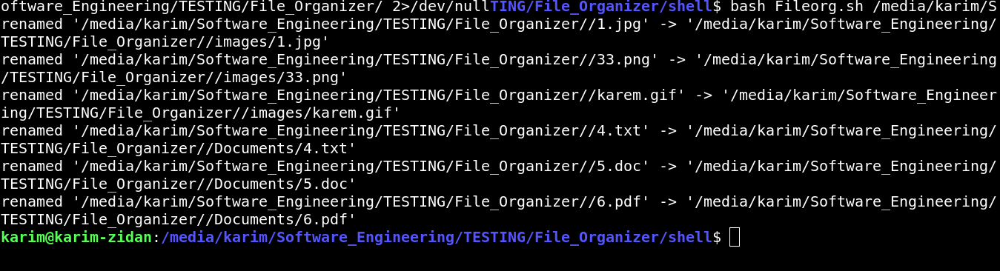
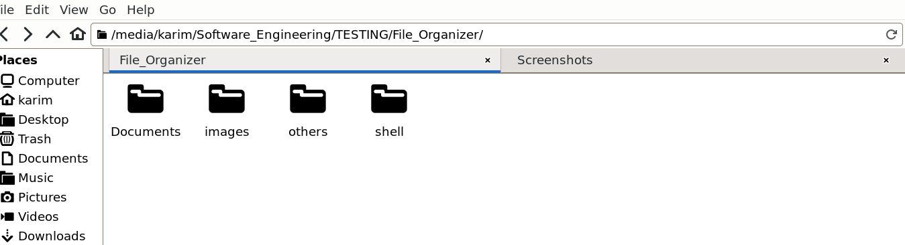
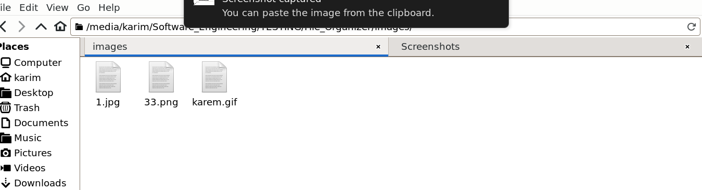
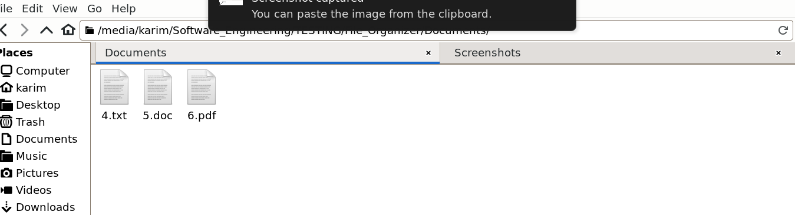

# File Organizer Script

This script organizes files in a specified directory into subdirectories based on their file types.

## How It Works

1. The script takes one argument: the source directory.
2. It checks if subdirectories `images`, `Documents`, and `others` exist within the source directory. If they do not exist, it creates them.
3. It moves image files (`.jpg`, `.png`, `.gif`) to the `images` directory.
4. It moves document files (`.txt`, `.doc`, `.pdf`) to the `Documents` directory.
5. All other files are moved to the `others` directory.

## Usage

1. Make the script executable:

    ```sh
    chmod +x organize_files.sh
    ```

2. Run the script with the source directory as an argument:

    ```sh
    ./organize_files.sh /path/to/source_directory
    ```

## Script Content

```bash
#!/bin/bash

Source_Directory=$1

if [[ ! -e $Source_Directory/images ]]; then 
    mkdir $Source_Directory/images
fi

if [[ ! -e $Source_Directory/Documents ]]; then 
    mkdir $Source_Directory/Documents
fi

if [[ ! -e $Source_Directory/others ]]; then
    mkdir $Source_Directory/others
fi

for ext in "*.jpg" "*.png" "*.gif"; do
    if [ $(find $Source_Directory/$ext -maxdepth 0 -type f) ]; then
        mv -v $Source_Directory/$ext $Source_Directory/images
    else
        echo "$ext :NOTFOUND"
    fi
done

for ext1 in "*.txt" "*.doc" "*.pdf"; do
    if [ $(find $Source_Directory/$ext1 -maxdepth 0 -type f) ]; then
        mv -v $Source_Directory/$ext1 $Source_Directory/Documents
    else
        echo "$ext1 :NOTFOUND"
    fi
done

find $1 -maxdepth 1 -type f -exec mv {} $1/others/ \;

```
## Screenshots

Below are screenshots demonstrating the script's execution and the directory structure before and after running the script.


1. **Before Running the Script:**


   - Capture the state of your current directory




2. **Running Script and it is arguments and it shows files moved:**




3. **After Running the Script:**


   - Capture the state of your current directory after running script




4. **others Directory after**


5. **images Directory after**




6. **Documents Directory after**





