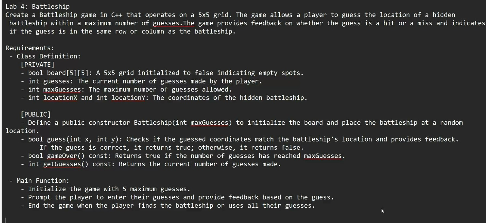
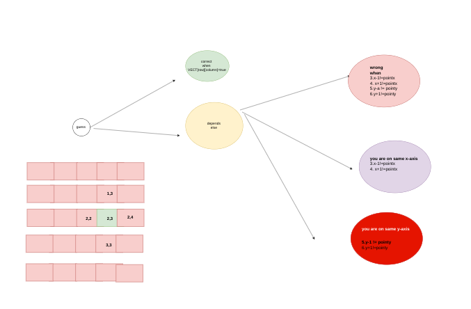

# Battleship Game





This is a simple console-based implementation of the Battleship game using C++. The game is designed to be played on a 5x5 grid, where the player has a limited number of guesses to locate the hidden battleship.

## How to Play

1. The game generates a hidden battleship at a random location on a 5x5 grid.
2. The player guesses the location by entering X and Y coordinates.
3. The game provides feedback based on the player's guess:
   - If the guess is correct, the player wins.
   - If the guess is incorrect, the game provides hints about the proximity of the guess.
4. The player has a limited number of guesses. If the guesses run out, the game is over.

## Class and Methods

### Class: Battleship

#### Private Members
- `std::vector<std::vector<int>> VECT`: The 5x5 grid represented as a 2D vector.
- `int Current_Guesses`: Counter for the current number of guesses.
- `int Max_Guesses`: Maximum allowed guesses.
- `int X_GUESS, Y_GUESS`: Player's current guess coordinates.
- `int X_LOCATION, Y_LOCATION`: Hidden battleship coordinates.

#### Private Methods
- `void fill_vect_false(void)`: Initializes the grid to all zeroes.
- `void Generate_new_place(void)`: Generates a random location for the battleship.

#### Public Methods
- `Battleship(int Max_Guesses)`: Constructor that initializes the game with the maximum number of guesses.
- `bool Guess()`: Handles the guessing logic and game flow.
- `bool Game_Over()`: Checks if the game is over based on the number of guesses.
- `int Get_Guesses()`: Returns the current number of guesses.
- `void End_Game()`: Ends the game and prompts the player to play again.
- `void Take_aPoint()`: Prompts the player to enter a guess.
- `void display(void)`: Displays the current state of the grid.

## Example Usage

```cpp
#include <iostream>
#include <vector>
#include <cstdlib> // For std::rand() and std::srand()
#include <ctime>   // For std::time()
#include <random>  // For std::default_random_engine and std::uniform_int_distribution

class Battleship
{
private:
    std::vector<std::vector<int>> VECT;
    int Current_Guesses;
    int Max_Guesses;
    int X_GUESS, Y_GUESS;
    int X_LOCATION, Y_LOCATION;

    void fill_vect_false(void)
    {
        for (unsigned int row = 0; row < 5; row++)
        {
            for (unsigned column = 0; column < 5; column++)
            {
                VECT[row][column] = 0;
            }
        }
    }

public:
    Battleship(int Max_Guesses) : VECT(5, std::vector<int>(5))
    {
        this->Max_Guesses = Max_Guesses;
        Current_Guesses = 0;
        fill_vect_false();
        Generate_new_place();
    }

    bool Guess()
    {
        bool status = false;

        while (!Game_Over())
        {
            Take_aPoint();

            if ((X_GUESS == X_LOCATION) || (Y_GUESS == Y_LOCATION))
            {
                if (VECT[Y_GUESS][X_GUESS] == 1)
                {
                    std::cout << VECT[Y_LOCATION][X_LOCATION] << std::endl;
                    status = true;
                    std::cout << "Congratulation " << "\n";
                    End_Game();
                    continue;
                }
                else if ((X_GUESS == X_LOCATION))
                {
                    std::cout << "Correct X-Axis only  :" << "\n";
                    status = false;
                }
                else if (Y_GUESS == Y_LOCATION)
                {
                    std::cout << "Correct Y-Axis only  :" << "\n";
                    status = false;
                }
            }

            if ((X_GUESS == (X_LOCATION - 1)) || (X_GUESS == (X_LOCATION + 1)))
            {
                std::cout << "You are close -> X-Axis  :" << "\n";
                status = false;
            }
            else if ((Y_GUESS == (Y_LOCATION - 1)) || (Y_GUESS == (Y_LOCATION + 1)))
            {
                std::cout << "You are on Close -> Y-Axis  :" << "\n";
                status = false;
            }
            else
            {
                std::cout << "Wrong Guess \n";
                status = false;
            }
            Current_Guesses++;
            std::cout << "your Current Guesses is : " << Get_Guesses() << "\n ";
        }

        return status;
    }

    bool Game_Over()
    {
        bool status = false;

        if (Current_Guesses >= Max_Guesses)
        {
            VECT[Y_LOCATION][X_LOCATION] = 0;
            End_Game();

            status = true;
        }

        else
        {
            status = false;
        }
        return status;
    }

    int Get_Guesses()
    {
        return Current_Guesses;
    }
    void End_Game()
    {
        int decision = 0;
        std::cout << "GAME OVER -_- " << "\n";
        std::cout << "Play Again ?  1-> Yes 2->No " << "\n";
        std::cin >> decision;
        if (decision == 1)
        {
            Current_Guesses = 0;
            this->fill_vect_false();
            Generate_new_place();
        }
        else
        {
            std::cout << "Thank You for Playing" << "\n";
        }
    }
    void Take_aPoint()
    {
        std::cout << "Enter X-point Y-point \n";
        std::cin >> this->X_GUESS >> this->Y_GUESS;
    }
    void Generate_new_place(void)
    {
        fill_vect_false();
        std::srand(static_cast<unsigned int>(std::time(0)));
        int random_row = std::rand() % 5;
        int random_column = std::rand() % 5;
        VECT[random_row][random_column] = 1;
        this->X_LOCATION = random_column;
        this->Y_LOCATION = random_row;
    }

    void display(void)
    {
        for (auto i : VECT)
        {
            std::cout << "row : " << " data is : \t";

            for (auto value : i)
            {
                std::cout << value << "\t";
            }
            std::cout << "\n";
        }
    }
};

int main()
{
    Battleship Game(5);
    Game.Guess();

    return 0;
}

```

1. Guess Function Diagram




