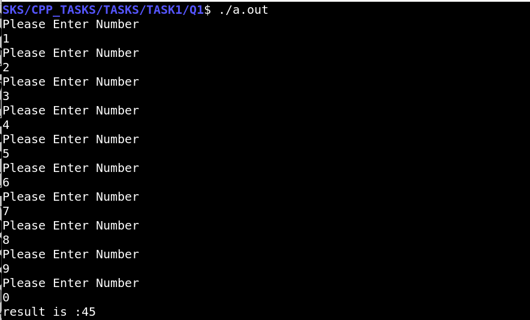

# Sum of Numbers Program

This program continuously prompts the user to enter numbers, sums them up, and displays the result when the user enters `0`.

## Description

The program:
1. Prompts the user to enter a number.
2. Adds the entered number to the cumulative sum.
3. Repeats steps 1 and 2 until the user enters `0`.
4. Displays the cumulative sum and exits.

## How to Use

1. Compile the program using a C++ compiler.
2. Run the compiled program.
3. Follow the on-screen instructions to enter numbers.
4. Enter `0` to display the sum and exit the program.

### Example

```cpp
#include <iostream>
using namespace std;

int main() {
    int result = 0, number = 0;
    while (1) {
        cout << "Please Enter Number\n";
        cin >> number;
        if (0 != number) {
            result += number;
        } else {
            cout << "result is :" << result << "\n";
            break;
        }
    }
    return 0;
}
```
## Compilation and Execution
To compile and execute the program, follow these steps:

1. Open a terminal.
2. Navigate to the directory containing the source code file.
3. Compile the program using the following command:

```bash
g++ -o sum_program sum_program.cpp
```

4. Run the compiled program using the following command:

```bash
./sum_program
```



