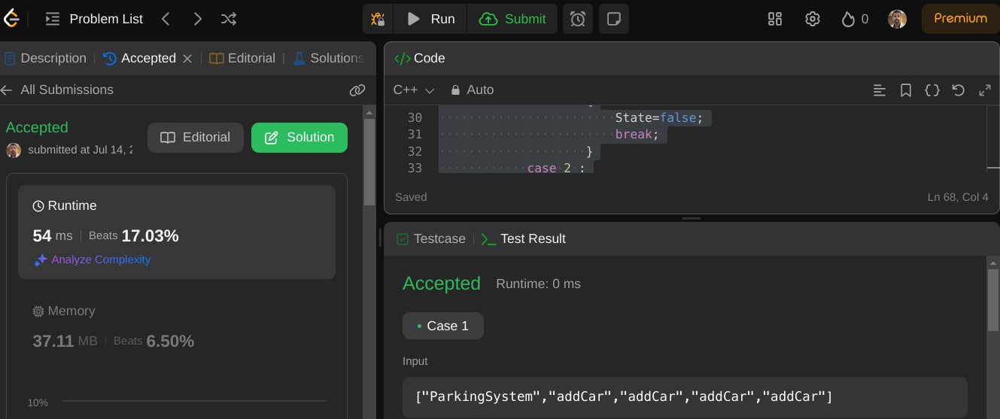

# Design Parking System
## Problem Description
Design a parking system for a parking lot. The parking lot has three kinds of parking spaces: big, medium, and small, with a fixed number of slots for each size. Implement a class ParkingSystem:

1. ParkingSystem(int big, int medium, int small) initializes the object with the number of slots for each parking space.

2. bool addCar(int carType) checks whether there is a parking space available for the car type represented by carType, which can be:

    1.  for a big car

    2. for a medium car

    3. for a small car

A car can only park in a parking space if there is a slot available for the respective car type. If there is a space available, the car parks and the function returns true. Otherwise, it returns false.

## Constraints

- 0 <= big, medium, small <= 1000
- carType is either 1, 2, or 3
- At most 1000 calls will be made to addCar
## Solution

The solution involves creating a ParkingSystem class that keeps track of the number of available parking slots for each car type. The class methods are implemented to check and update the availability of parking slots.

```cpp

class ParkingSystem {
private:
    int big_max_size = 0;
    int medium_max_size = 0;
    int small_max_size = 0;
    int big_current_size = 0;
    int medium_current_size = 0;
    int small_current_size = 0;

public:
    ParkingSystem(int big, int medium, int small) {
        this->big_max_size = big;
        this->medium_max_size = medium;
        this->small_max_size = small;
    }
    
    bool addCar(int carType) {
        bool State = false;
        switch(carType) {
            case 1: 
                if (this->big_max_size > this->big_current_size) {
                    big_current_size++;
                    State = true;
                    break;
                } else {
                    State = false;
                    break;
                }
            case 2:
                if (this->medium_max_size > this->medium_current_size) {
                    medium_current_size++;
                    State = true;
                    break;
                } else {
                    State = false;
                    break;
                }
            case 3:
                if (this->small_max_size > this->small_current_size) {
                    small_current_size++;
                    State = true;
                    break;
                } else {
                    State = false;
                    break;
                }
            default: break;
        }
        return State;
    }
};
```

## How to Use
1. Instantiate the ParkingSystem with the maximum sizes for big, medium, and small parking slots.

2. Call the addCar method with the car type to park a car.

## Example
```cpp

// Create a ParkingSystem with 1 big, 1 medium, and 0 small slots
ParkingSystem* parkingSystem = new ParkingSystem(1, 1, 0);

// Attempt to park cars of different types
std::cout << parkingSystem->addCar(1) << std::endl; // returns true (1 big slot available)
std::cout << parkingSystem->addCar(2) << std::endl; // returns true (1 medium slot available)
std::cout << parkingSystem->addCar(3) << std::endl; // returns false (0 small slots available)
std::cout << parkingSystem->addCar(1) << std::endl; // returns false (no big slots available)
```
This example demonstrates creating a ParkingSystem object and attempting to park different types of cars, showing whether the parking was successful based on the availability of slots.

## Evidance 


