## KERNEL CUSTOMIZATION


## 1-Kernel for (vexpress) QEMU-EMULATOR 

```bash
git clone --depth=1 git://git.kernel.org/pub/scm/linux/kernel/git/stable/linux.git
cd linux

#configure the kernel to vexpress
make ARCH=arm vexpress_defconfig

# To indentify your kernel version 
make ARCH=arm kernelversion

## Then Open Menuconfig
make ARCH=arm menuconfig


```
**Then Open Menuconfig**

1. enable kernel compression mode (XZ)

General Setup -> enable kernel compression mode


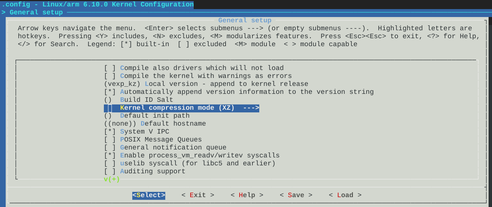


2. open debug console for kernel 

Boot-options -> Default kernel command string

- console=ttyAMA0

- save and exit 


```bash
export CROSS_COMPILE=Path/ToCompiler/arm-cortexa9_neon-linux-musleabihf-


make -j4 zImage modules dtbs

```
- now kernel is ready 

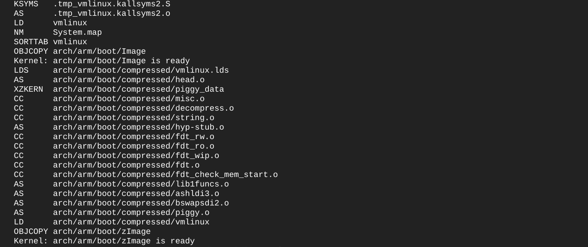


3. you gonna find zImage,Image this path 

```bash

cd arch/arm/boot

```
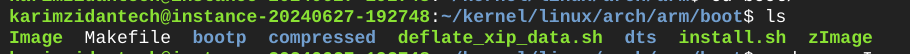


4. you gonna find (vexpress-v2p-ca9.dtb) file on this path

```bash

arch/arm/boot/dts/arm

```
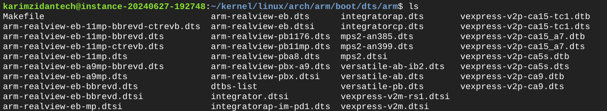

then we need to copy both file (zImage , vexpress-v2p-ca9.dtb)

- if you didn't find vexpress-v2p-ca9.dtb file

```bash
make dtbs 
```

5. move both to the bootable partition of our virtual SDCARD


6. launch qemu 

```bash 

sudo qemu-system-arm -M vexpress-a9 -nographic -kernel u-boot -sd PATH/TO/EMULATEDSD.img -net nic -net tap,ifname=tap0,script=/PATH/TO/NETWORKSCRIPT


```
- now we can load (zImage , vexpress-v2p-ca9.dtb) manually or by a script 

**AT FIRST WE GONNA LOAD IT MANUALLY** 

1. load vexpress-v2p-ca9.dtb

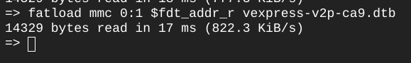


2. load zImage

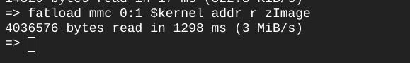

3. launch kernel

```bash
bootz $kernel-addr-r - $fdt_addr_r
```

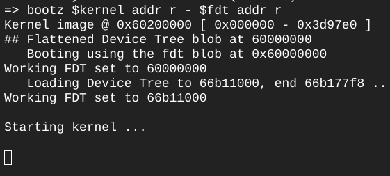


- then we get Paniced kernel 


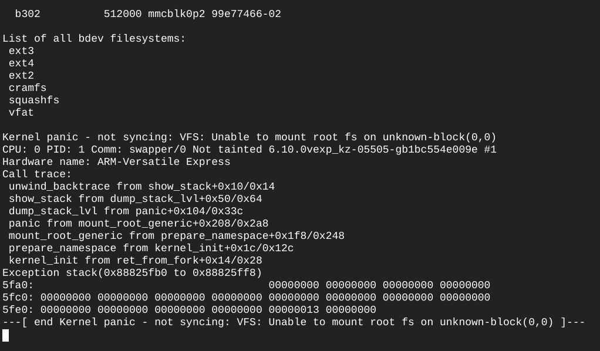


**LOAD USING SCRIPT** 

 use this script to load or follow steps to build your own script-> check it here (https://github.com/KarimZidan007/Andriod-Automotive/tree/main/Embedded_Linux_Tasks/U-boot_Script)


```bash
Autoboot (runcmd) will execute script manually and load the image and dtb file
bootz $kernel_addr_r - $fdt_addr_r 
```
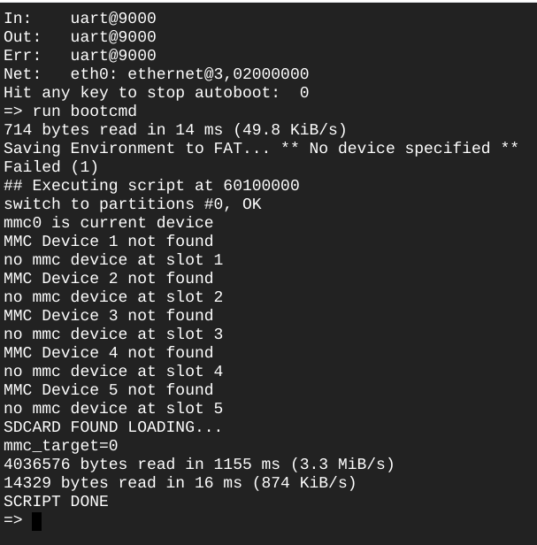

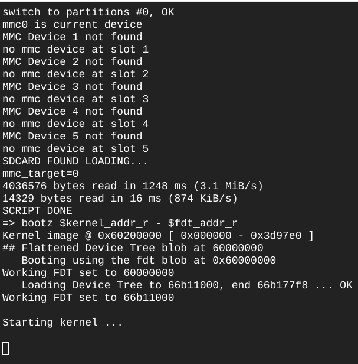

SESSION SUMMARIZATION : 

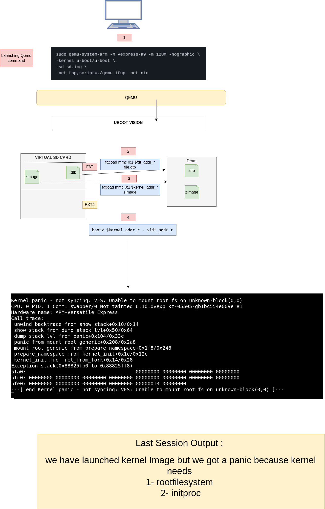


**Why Kernel Got Panic?**

#Kernel Panic Explanation:

**The kernel panicked because it couldn’t mount the filesystem or locate the initial process. This usually happens because:**

1. Missing Filesystem:

The kernel needs a filesystem to organize and access files. Without it, the kernel cannot load system files or user data.

2. No Init Process:

The kernel couldn’t find or start the initial process (usually /sbin/init) needed to initialize system services.


- Summary:

 A filesystem is essential for managing and accessing files, and the init process is crucial for system startup. Without these, the kernel cannot proceed, leading to a panic.

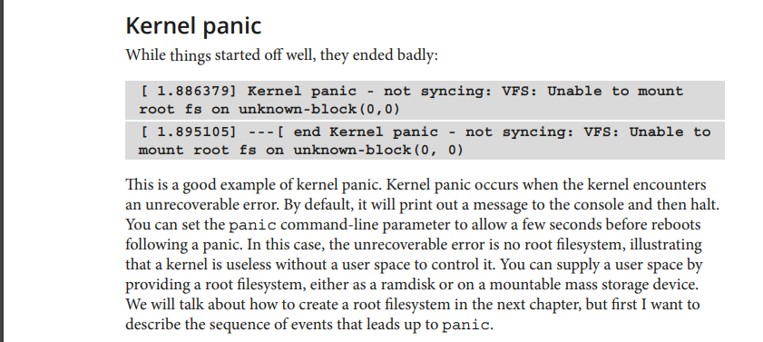

