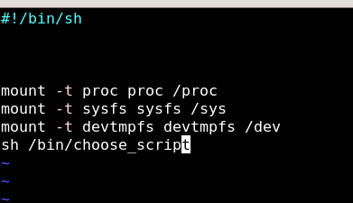
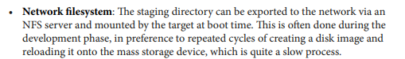

# BOOTING AND SWITCHING INTO USERSPACE  

## LAST SESSION OUTPUT


## File system

Why we need File System ?

 

- also we need filesystem becuase kernel does not include all of its modules during build there is a lodable modules during time 


**EX:**


## Essential rootfs Structure


## What is the types of File Systems?


## on last session we got a kernel panic and we know now the reason was filesystem and initproc

- ON **U-BOOT** there is an shared variable called **bootargs** on U-boot


## create a directory called rootfs

```sh

# create directory rootfs
mkdir rootfs


# change directory to rootfs
cd rootfs

# create the rest folder for rootfs
mkdir -p ./dev /etc /proc /mnt

#create folder inittab
touch /etc/inittab

```


## How to customize your own rootfilesystem ?

1. create every directory as we mentioned the structured before , download source code for a shell , utilites and cross compile them and move the binaries into /bin and choose your init process 

- so we need 1. shell 2. utilites 3. initproc and set them into our structure


2. or just use busybox tool 

## what is busybox ? 

- BusyBox is a lightweight utility that combines many common Unix utilities into a single executable.

- It provides minimal versions of commands like ls, cp, sh, and more, designed for embedded systems and resource-constrained environments.

- BusyBox simplifies system administration and reduces disk space usage by consolidating multiple tools. 

## so we are going to use Busybox


 

```sh
make menuconfig

```


- you could customize your set of utilites you want depend on the image size you want


**IMPORTANT CONFIGURATIONS**

1- IF YOU ARE GOING TO USE RAMFS -> YOU HAVE TO BUILD IT STATICLLY -> WHY?

When using RAMFS, it is often beneficial to build static binaries to:

a- Minimize memory usage by avoiding the need to load dynamic libraries.

b- Ensure the executable is self-contained and not dependent on the presence of specific library versions.

 


2- set your directory path that we created before here 

 

3- set the path for your crosscompiler you going to use 


 


```sh

make install

```
## OUTPUT
1- if you change your distination as we mentioned before you will find the binaries on your rootfs 

2- if you don't so you have to copy all directories on _install directory on busybox directory into your rootfs

```sh
# to go out from busybox directory
cd ..

# create directory rootfs
mkdir rootfs

# copy the content inside the _install into rootfs
cp -rp ./busybox/_install/ ./rootfs

```

## if you build dynamically 

1 - here you want to move the sysroot directory on the x-tools directory (the directory that contain the output of cross-compile build tool ct-ng that we used before)


```sh 

sudo rsync -a sysroot/ /path/to/rootfs/


```


**NOTE**

the sysroot directory in crosstool-NG contains the essential components of the target system's root file system, ensuring that the cross-compiled applications can run correctly on the target platform. It includes standard libraries, headers, and potentially other necessary files.


## WE HAVE CREATE THE FILESYSTEM NOW WE GOING TO CUSTOMIZE OUR SIMPLE INIT PROCESS  


init process is at **/sbin/init** -> it parse configuration from **/etc/inittab**

1. /etc/inittab is a configuration file used by the **System V** init system in Unix-like operating systems.

2. It defines how the system runs different processes at various runlevels 

3. i Could customize my configurations 


## Here are its main features in short lines:

1. Runlevel Configuration: Specifies which scripts to run at each runlevel.

2. Syntax: Each line consists of 

```bash 

node :: action ::Application to run 

```
EX: 

```sh

ttyAMA0::askfirst:-/bin/sh

```

types of Actions 

1. Sysint -> what happen first 
2. Wait  -> run application and wait for completion
3. Once ->run application but does not wait for completion
4. respond -> read about it 
5. askfirst -> propmt messege before running (ask me first)
6. ctrl+alt+del -> make a specific action when you press that 
5. shutdown -> close application


## WHAT IS procFS and SysFs


**so we have to mount those device nodes on myfile systems to be like an entry point to get some info about devices and process from kernel**

## LETS CUSTOMIZED IT

1. i want /sbin/init (init process) to mount the procfs on /proc and devtmpfs o /dev and sysfs  on /sys 

- so before we gonna compress our ramfs i have to customize my configuration 

1. mount -t proc proc /proc 

2. mount -t sysfs sysfs /sys

3. mount -t devtmpfs devtmpfs /dev

4. launch my Script 


- so lets change directory to our ramfs 


```sh

cd PATH/TO/ramfs/

cd /etc 

touch inittab 

mkdir init.d 

touch ./init.d/rcS 

```

## 1- add configurations to the inittab 

```bash

## launch a process called rcS that going to mount the devnodes
::sysinit:/etc/init.d/rcS

# Start an "askfirst" shell on the console (whatever that may be)

ttyAMA0::askfirst:-/bin/sh

# Stuff to do when restarting the init process

::restart:/sbin/init

```


## 2- add rcS script

```sh

cd init.d 

vim rcS

```


- ADD THIS steps

```sh
#!/bin/sh

mount -t proc proc /proc

mount -t sysfs sysfs /sys

mount -t devtmpfs devtmpfs /dev

# and if you want to create your own init process you could launch it from here like this example
```




## NEVER FORGET TO MAKE ALL SCRIPTS AND INIT PROC TO HAVE EXECUTABLE PERMISSION


## if i want to add user beside root

1- during runtime use this command -> adduser
 
2- creating user before my system loads  ->

 i have to create /etc/passwd , /etc/shadow /etc/group  

zidan:x:1000:1000:  /home/zidan  /bin/sh 

# BOOT USING DISK FILE SYSTEM

- lets mention how diskfilesystem works


- any change happen on runtime (ON RAM) will be affect the original version on diskfilesystem 

## STEPS

1- move rootfs on SDCARD ext4 Partition


2- launch qemu

```sh

sudo qemu-system-arm -M vexpress-a9 -nographic -kernel u-boot -sd PATH/TO/SDCARD.img -net nic -net tap,ifname=tap0,script=/PATH_TO_NETWORKSCRIPT

```

3- load zImage

```sh
fatload mmc 0:1 $kernel_addr_r zImage

```

4- load dtbfile

```sh
fatload mmc 0:1 $fdt_addr_r vexpress-v2p-ca9.dtb

```
5- editenv bootargs 

```sh
editenv bootargs

console=tty0 console=ttyAMA0,38400n8 root=/dev/mmcblk0p2 rootfstype=ext4 rw rootwait init=/sbin/init

```

6- boot

```sh
bootz $kernel_addr_r - $fdt_addr_r

```
## BOOTING


## DONE


# initramfs 

a file system which is loaded into ram by u-boot and any changes in the initramfs files does not affect after rebooting because it is not like the diskfs that goes and write the changes into the diskversion 

**i have to compile install on static way**

## ADVANTAGES 

1. faster

2. used in bootloader double bank to switch to another bank if i update my firmware
 
3. i could make it as boot manager i boot to it first and then choose which partitionn i will boot 

4. for security -> checksum for the partition before i boot to it to ensure that there is no manipulation
 
5. used in recoverymood in kernel that grub make options to boot into it 

## QUICK SUMMARY OF WHAT WE GOING TO DO 


**SO ANY CHANGE DURING RUNTIME WILL NOT BE LOST ONCE WE REBOOT**

## STEPS OF BOOTING INTO RAMFS

## 1-LAUNCH QEMU


## 2-LOAD KERNEL


## 3- LOAD DTB 


## 4- LOAD RAMFS (0x61000000) address is sutible for vexpress-a9


## 5- EDIT KERNEL PARAMETERS (notify that init proc will be /sbin/init

 


## 6- start kernel

```sh
bootz $kernel_addr_r 0x61000000 $fdt_addr_r 

```


**your kernel has to be configured with CONFIG_ROOT_NFS ENABLE BY DEFAULT**

## NFS (NETWORK FILE SYSTEM) 

1. What is NFS ?

a root file system on another machine on Network

2. why we use it ?

on developing phase without inserting in and out the usb or sd card use the nfs to test an application on run time or fetch logs from targets and trace it




## on Host Machine SIDE

```bash
 sudo apt install nfs-kernel-server

sudo vim /etc/exports


/home/karimzidantech/rootfs *(rw,sync,no_subtree_check,no_root_squash)

```
* on the exports file line means that any client ip could access rootfs (if you want to make it available for specific address just replace * with ip)


or


## Ask NFS server to apply this new configuration (reload this file)

```bash

sudo exportfs -r


```

## on U-BOOT  SIDE


1. set the host - server -netmask configurataions 


```bash
setenv serverip 192.168.0.1
setenv ipaddr 192.168.0.2
setenv netmask 255.255.255.0

```


2. 


```bash

tftpboot $kernel_addr_r zImage
tftpboot $fdt_addr_r vexpress-v2p-ca9.dtb

```


3. set bootargs passed to kernel to notify kenerl that iam using nfs and you will find it on <server-ip>:<root-dir> 

```bash
# i have to add this info to the kernel through bootargs 
root=/dev/nfs rw nfsroot=<host-ip>:<root-dir> ip=<target-ip> init=/sbin/init

```

1. root=/dev/nfs

/dev/nfs: This tells the kernel that the root filesystem will be provided via NFS. This is a placeholder that indicates the use of NFS for the root filesystem.
Purpose:

Kernel Boot: During the boot process, the kernel needs to know where to find its root filesystem. By setting root=/dev/nfs, you're informing the kernel that the root filesystem will be available over the network, and it should prepare to mount it via NFS.

2. nfsroot=<host-ip>:<root-dir>
The nfsroot parameter provides additional details necessary for the kernel to locate and mount the NFS root filesystem.


```bash
setenv bootargs  root=/dev/nfs ip=192.168.0.2:::::eth0 nfsroot=192.168.0.1:/home/karimzidantech/Usersace/dynamic/rootfs,nfsvers=3,tcp rw init=/sbin/init
```


3. booting the kernel after passing all arguments (nfs ,initproc)


```bash 

bootz $kernel_addr_r - $fdt_addr_r 

```


## SUMMARY

this process are provided as a Script as a task -> (https://github.com/KarimZidan007/Andriod-Automotive/tree/main/Embedded_Linux_Tasks/3-BOOTING_INTO_RAMFS_TASK)
