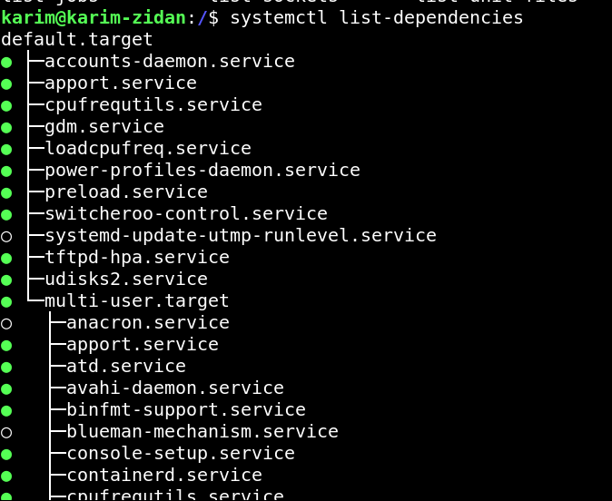

# INIT PROCESS

## 1-Busybox


## 2-SystemV

there is a runlevels which is equal to mode

## Common Runlevels and Targets
0: Halt (shutdown)
1: Single-user mode
2: Multi-user mode without network
3: Multi-user mode without GUI but with network (multi-user.target)
4: Userdefined
5: Multi-user mode with GUI (graphical.target)
6: Reboot

**mode is used to reduce cpu load on the system**

## SWITCH TO ANOTHER RUNLEVEL

using init command or telinit

```sh
#switch to Multi-user mode with GUI 

init 5

```


## Why it is Important for embedded linux ?


1. Application Mode/UserMode (Infotainment with all functionallity)

2. maintainance mode -> (Flash a new Software , Diagnostic on service center)


## inittab
```sh
node :runlevel : action :script
: R 1 2 3 4 5 6: wait :rc

```


## 1- go make scripts under /etc/init.d

**NOTE**
this scripts not the binaries it self it is a scripts just call or kill the tftp from /bin 


**how to write this script. example:**


## 2- make runlevel directories under /etc/rc1.d , /etc/rc5.d ..etc

**1- each run level has his own folder**

**2- make softlink for required scrips**


Example : if i want to make a mode that disable network ,and enable ssh

1. make softlink for network,ssh on the directory 

S -> Start 

if i want to start a new script on the mode write S before it

K -> Kill

- if i want to kill a running script on the mode write K before it

- add a number after S , K for a priority 


```sh
ln -s /etc/init.d/network Ko1network
ln -s /etc/init.d/ssh  So2ssh
```


## rc.c

- there is a command check where run level am i 

```sh

runlevel

```

rc.c script

```c
switch(runlevel)
{
1:
    cd /etc/rc1.d/
    parse for all file start with k with forloop (increment with priority) on rc1.d
    for(parsing(k),0)
    {
    # this script which locate on /etc/init.d
    script(stop)
    //so this script will kill all running applications on rc1.d 
    }

etc
```

## and i will go to systemv repo clone and cross compile

then pass it as the init process init=/sbin/init 

1. parse inittab 
2. add to it run level 


same as rcS that we wrote before but add to the columns run level for every action


## Problem of System V

every thing initialized sequential not parallel even if i have multicores


## 3-SystemD

it use parallisim 


## system d vs system v


initprocess softlink /lib/systemd/system

/lib/systemd/systemd -> normal c code 

## 2 Main directories in systemd

1. /etc/system/systemd/ -> customizable

2. /lib/systemd/system

3. /run/systemd

system d interdouce unit (file)

units under two paths 

1. /etc/system/systemd/


2. /lib/systemd/system

 

3. 3. /run/systemd

## unit types

1. service 
2. mount 
3. network
4. automount 
5. socket  
and there is more


## every unit has a different concept to run


 

## example for a unit file

 

## how to write a unit 
under conifguration /etc/systemd/system

touch name.(typeofservice)

```sh
touch myservice.service 
```
but before intrdouce service we need to know more about process

types of process 

1- foreground 

2- background 

3- orphan process 
process its parent has been killed at this case on system d this process gonna be adapted by the first process (PID 1)

4- zombie process
if i have 1   ->    2   ->   3    -> if 3 has been finish but 2 does not get its exit status because parent maybe on while 1  
so 

1. it takes one of the process column on the process table that kernel give the system on ram
    (we can increment process table number kernel could create -> cat /proc/sys/kernel/pid_max) , also (we can increment number of file describtors )


5- daemon process
it is the same concept of background but i can not make it a foreground

so System D based on daemons -> services  to display daemons
 
```sh 

jobs
```

unitfile is has three sections

1. Header section 
EX:

```sh
[Unit]
Description=" description for my own unit file "
Documentation= "            "
SourcePath="ApplicationPath"
Before="Unit file"-> run the current service (i develop it now) before "Unit file" don't wait for my completion
After="Unit file" -> run the current service (i develop it now) after "Unit file" don't wait for completion
wants="Unit file" -> wait for this unit to run then make sure it is on active state
requires=run myservice wait till i go into active state
```
## SERVICE(CONFIG FILE)+APPLICATION = DAEMON

```sh
[Service]

Type = typeof process

1. simple -> service  -> /usr/bin/hello    (hello -> while(1)) / will run application directly

init Proc -> .Service -> hello  (if i make stop to service will die (strong coupled))
-------------------------------------------------------------------------------------------------------------
2. oneshot

like initialization (a service just run for a one time)
-------------------------------------------------------------------------------------------------------------
3. forking

init Proc -> .Service -> .hello   (if i make stop will not die until i kill it losely coupled  )

-------------------------------------------------------------------------------------------------------------
ExecStart =application to run (only one has one only Exec Start) -> Systemctl start


ExecStop =what happen when i stop service (run this application when you send stop signal to the service) systemctl stop

Workdir=/usr/bin/Service  (just to do not right full pass everytime)


restart=on-failure -> when it return exit status (fails) , always -> when application ends start it again 

Restart sec =3 -> wait 3 seconds before start one more time 

```

## STEPS 

```sh
touch myserivce.service 
touch mynetwork.network


```


```sh

my.service.service

[Unit]

wants=mynetwork.network

[Service]

Type=simple

execstart=ping 192.168.1.10 -t // rasp or qemu  

Restart=Always 
restartSec=3
WorkDir=/usr/bin

[Install]
wantedBy=graphic.target -> it is a folder that softlink to my service (myservice.service) 

# did i create soft link by myself ? 

no you just type systemctl enable service

```


```sh

myNetwork.network

[Unit]

Name="interface name"

[Network]

ip=192.168.1.9
subnet=255.255.255.0

After=mynetwork.network


```

## COMMANDS

systemctl (1. start - 2. stop - 3.cat - 4.edit) -> service 

systemctl get-default , set-default 

OUTPUT

```sh
graphical.target
```

## WHAT IS THE TARGET 
group of services which is equal runevel on system v 

collection of services 


## where iam going to create any unit 
```
/etc/systemd/system
```

2. then touch myservice.service


3. and write that it is wanted by= graphical.target which is a directory 

4. systemctl enable myservice (once i write it it will softlink to myservice.service)


## ATFIRST SYSTEMD RUNS TARGET AT FIRST 

what is that 

```sh 
systemctl get-default
```

how to change my default ? 

```sh
systctl set-default multi-user-target

```

how to disable the default ? 

```sh

systemctl disable multi-user-target
```

systemctl (units)



 


```sh


journal

```
## steps

1. systemctl stop tftpd-hpa.service 

2. status

3. systemctl restart myservice.service 
