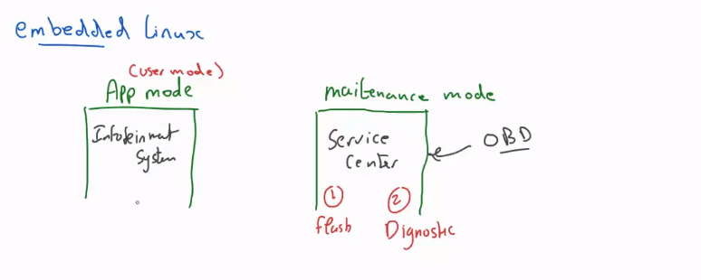
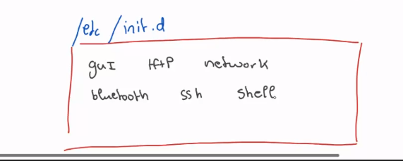
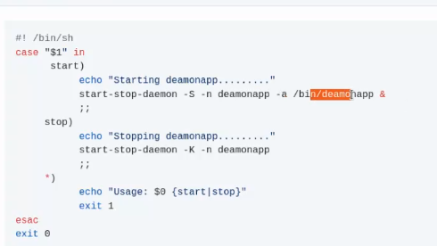
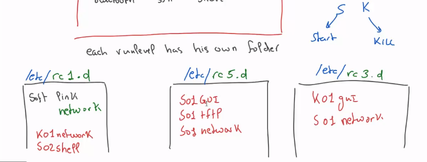
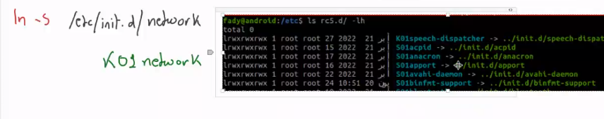
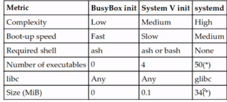
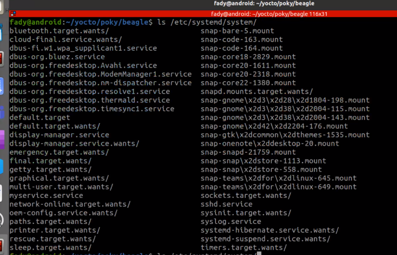
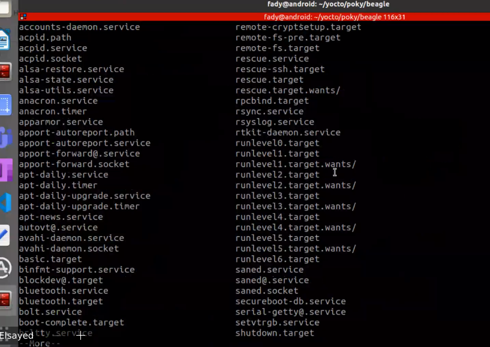
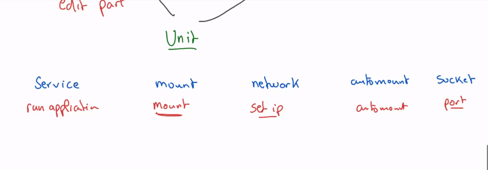
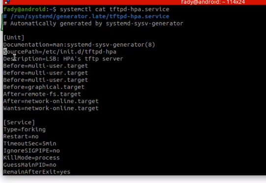

# INIT PROCESS

## 1-Busybox


## 2-SystemV

there is a runlevels which is equal to mode

## Common Runlevels and Targets
0: Halt (shutdown)
1: Single-user mode
3: Multi-user mode without GUI (multi-user.target)
5: Multi-user mode with GUI (graphical.target)
6: Reboot

**mode is used to reduce cpu load on the system**

## SWITCH TO ANOTHER RUNLEVEL

using init command or telinit

```sh
#switch to Multi-user mode with GUI 

init 5

```
## Why it is Important for embedded linux ?



1. Application Mode/UserMode (Infotainment with all functionallity)

2. maintainance mode -> (Flash a new Software , Diagnostic on service center)


## 1- go make scripts under /etc/init.d

**NOTE**
this scripts not the binaries it self it is a scripts just call or kill the tftp from /bin 



**how to write this script. example:**



## 2- make runlevel directories under /etc/rc1.d , /etc/rc5.d ..etc

**1- each run level has his own folder**

**2- make softlink for required scrips**




Example : if i want to make a mode that disable network ,and enable ssh

1. make softlink for network,ssh on the directory 

S -> Start 

if i want to start a new script on the mode write S before it

K -> Kill

- if i want to kill a running script on the mode write K before it

- add a number after S , K for a priority 


```sh
ln -s /etc/init.d/network Ko1network
ln -s /etc/init.d/ssh  So2ssh
```



## rc.c

- there is a command check where run level am i 

```sh

runlevel

```

rc.c script

```c
switch(runlevel)
{
1:
    cd /etc/rc1.d/
    parse for all file start with k with forloop (increment with priority) on rc1.d
    for(parsing(k),0)
    {
    # this script which locate on /etc/init.d
    script(stop)
    //so this script will kill all running applications on rc1.d 
    }

etc
```

## and i will go to systemv repo clone and cross compile

then pass it as the init process init=/sbin/init 

1. parse inittab 
2. add to it run level 


same as rcS that we wrote before but add to the columns run level for every action


## Problem of System V

every thing initialized sequential not parallel even if i have multicores


## 3-SystemD

it use parallisim 


## system d vs system v





initprocess softlink /lib/systemd/system

/lib/systemd/systemd -> normal c code 

## 2 Main directories in systemd

1. /etc/system/systemd/ -> customizable

2. /lib/systemd/system

3. /run/systemd

system d interdouce unit (file)

units under two paths 

1. /etc/system/systemd/



2. /lib/systemd/system

 

3. 3. /run/systemd

## unit types

1. service 
2. mount 
3. network
4. automount 
5. socket  
and there is more


## every unit has a different concept to run


 

## example for a unit file

 

## how to write a unit 
under conifguration /etc/systemd/system

touch name.(typeofservice)

```sh
touch myservice.service 
```
unitfile is has three sections

1. Header section 
EX:

```sh
[Unit]
Description=" description for my own unit file "
Documentation= "            "
SourcePath="ApplicationPath"
Before="Unit file"-> run the current service (i develop it now) before "Unit file" don't wait for my completion
After="Unit file" -> run the current service (i develop it now) after "Unit file" don't wait for completion
wants="Unit file" -> wait for this unit to run then completed first successfully
requires=run myservice wait till i complete then run the unit file
```


