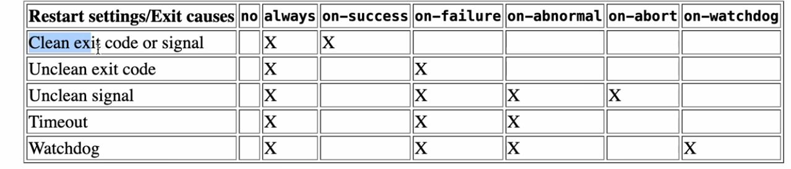
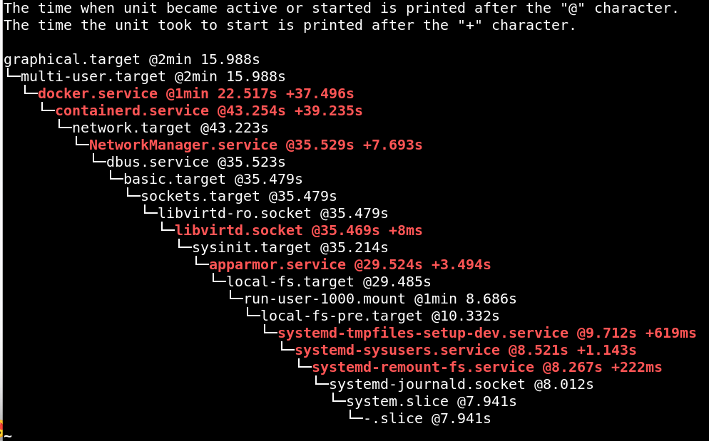

# SYSTEM-D

## how to identify init process on Your system ? 

`pstree`

## SYSTEMD is not a process -> it is a Service Managment System (service manager)

## they called SYSTEMD -> superkernel 

## how to interact with SYSTEM D ?

1. `commands`


2. Units 

What is Units-> files .

## there is a libraries i need it to interact with kernel 


------------------------------------------------------------

## how to know the path where binary located ? 
```sh
## where this process located in mydisk
sudo realpath /proc/1/exe 
```


------------------------

systemD (init) -> read system.conf (/lib/systemd) -> then make a booting sequence in parallel (load drivers or nozzles) , (run process)/services 


**NOTE:->every daemon have conf file will parse it one daemon will launch** 

--------------------------------------------------------------------------
## CPUaffinity

i could set cpu threads and configure the process runs on it 

i could choose a cpu for forked process from system d and others for another threads

--------------------------------------------------------------------------

# Units 
- as we mentioned before units are files 
- there many types of Units put we gonna discuss

1. Service Units 

2. Socket Units 

3. Path Units 

4. Target Units

--------------------------------------------------------------------------

System-D -> read units and action depend on configuration on unit 

where this units location on my disk ?

`/lib/systemd/system`

EX:


systemd ->parse ModemManager.service -> run ModemManager 

--------------------------------------------------------------------------
## 1.SERVICE UNITS

- serivce is a process should be run at certian time 

- systemd -> parse .service unit (file) -> Run 

what information that .service file (unit) contain ?

1. dependencies

2. how service should be run

3. how service should be killed 

4. the privillage ?

5. how can i restart 

6. on which target this serivce is installed ?

--------------------------------------------------------------------------
## structure of .service file 


- `ExecStartPre` -> preprocess that gonna run before Exec Start , at usual it is for testing the service like `ssh -t` 

- `ExecStart` -> run process

- `KillMode` -> if it equal Process (kill it and leave child)

- `KillMode` -> if it equal to process-group (kill all)

- `Restart` = ex: on-failure



- `Type` =notify  -> the forked child service notify the systemd that proc has started or finished


- `Runtimedirectory` = set directory under /run 

- `Runtimedirectorymode` = permission for this directory
 
## Dependencies

 Wants= (weak requirement dependency)
Requires=(Strong requirement dependency)
After= my service gonna start after the service i set here
Before= my service gonna start before the service i set here

--------------------------------------------------------------------------
# 2.Socket Units

## 1-socket is a unit used to create network socket
 

## 2-socket unit control the services that needs a socket

## What is Network Socket ?

- array or buffer (allocated on memory) that receive requests from iplayer (network stack on kernel) **CHECK OSI LAYER**
 


- **SO SYSTEM-D HAS MADE A NEW STRATEGY , before system-d the process that need a socket to receive data from internet the process it self has the responsability for creating the socket , but system-D came with Socket-unit , if service needs a socket , the socket gonna be created standalone through systemD**

- also it provide a greate feature that process could go on sleeping mode and one socket receive data -> socket gonna notify the process


- so all we need to know that every service unit needs a socket , it will need a socket unit seperated than service unit , look at ssh at the following example 


## SOCKET-STRUCTURE


- `conflict` : here means that socket and process can not be both running 

- `Accept` : every time there is new data on socket , socket will create instance of the service 

**NOTE** 
- for every socket unit

under [Install] 
WantedBy:sockets.target 

**NOTE**
`xxx.socket will link with xxx.service`
- make sure both are with same prefix 

--------------------------------------------------------------------------
## 3.PATH UNITS

- if the path attached with path unit changed it will active a specific service


## structure


- if this directory not empty i will launch the service with my same prefix

**NOTE**
`xxx.path will link with xxx.service`
- make sure both are with same prefix 
--------------------------------------------------------------------------
# What is Targets?

- Target is an unit contain array of units 

- target contain multi units runs by system-D (similar to run level)

- atleast mysystem has one target runs 

`how to know the default target`

```sh
sudo systemctl get-default
```
--------------------------------------------------------------------------


**`systemctl` is a command-line tool that interacts with systemd, which is the system and service manager used by many Linux distributions. systemd manages system services, handles system initialization, and oversees various system processes.**


--------------------------------------------------------------------------
# interaction os systemD 

## what is the type of interaction we could use

1. verify status of service

`systemctl status (unitname)` 


--------------------------------------------------------------------------
2. start service


`sudo systemctl start (unitname)`

**the process which is located on ExecStart will be started**
--------------------------------------------------------------------------
3. stop service 

`sudo systemctl stop (unitname)`

**the process which is located on ExecStop will be Start ,if not set will be substitute by termination signal**

--------------------------------------------------------------------------
4. enable service 

`sudo systemctl enabled --now (unitname)`

**Enable Means if SystemD start the target which contain the service , the service will start by default , if it is disabled and SystemD start the target , the service will not be started**
--------------------------------------------------------------------------
5. disable service 

`sudo systemctl disabled --now (unitname)`

**if it is disabled and SystemD start the target , the service will not be started**
--------------------------------------------------------------------------
6. reload service 

- will be reload the binary then start it , helpful if i changed in configuration

**the process which is located on ExecReload will be started**

    a. kill service 

    b. execute what is in ExecStartPre 

    c. then execute ExecStart

`systemctl reload (unitname)`
--------------------------------------------------------------------------
7. restart service 

`systemctl restart (unitname)`

    a- stop service 

    b- start service
--------------------------------------------------------------------------
8. kill service

`sudo systemctl kill (unitname)`
--------------------------------------------------------------------------
9. masking service (edit on it)

`sudo systemctl edit --full (unitname)`

## Resource Control over Services throw Units

- if i want to set some rules to control resources ,EX: make a while list for ssh ip's that could connect with my machine , search for systemd-resource-control
--------------------------------------------------------------------------
## CREATE NEW SERVICE FROM SCRATCH

1. touch a file under /lib/systemd/system or run this
`sudo systemctl edit --force --full servicename.service`

- as we mentioned before there is three sections

[UNIT]


[Service]


[Install]

WantedBy=(target) 
ex: 
WantedBy=multi-user.target

**at install section we installed this unit at a specific target**
-------------------------------------------------------
2. enable the service 

`sudo systemctl enable --now (unit_name)`

## After any Change we need to run the following commands 

1- `systemctl daemon reload <service unit>`

- **`systemctl daemon-reload`**: Reloads the systemd manager configuration to apply changes made to unit files. This updates systemd with new or modified unit files.

2- systemctl restart <service unit>

--------------------------------------------------------------------------

## Targets Unit

- as we mentioned before target is a unit contain set of units (services-sockets-paths..etc) 

- it is like runlevel in system-v

- systemd choose default target and start to execute all service inside this target

## how to list all targets ?

`systemctl list-units --type=target`

## where the location or directory of those targets ? 

`/etc/systemd/system/<targetname.wants>` 

## so the target unit it self where it is ? 

`/lib/systemd/system/<targetname>` 

- the file is with the same name but with .wants extension


- so both directory that contain the services.units and the main unit of the target are located on `/lib/systemd/system`


## what is the structure of the target unit ?


- we have discuss all of this parameters except `Conflicts` 

- `Conflicts` means that this target can not operate with those targets or services they should be killed first

## Units that related on this target are on this directory


## units that this target depend on it or has a relation between this target 

- we could print it using command 

EX:

```sh
sudo systemctl list-dependencies --all graphical.target
```
 

## how to change the default target ?

```sh
sudo systemctl set-default <unitname.target>
```

# BOOTING OF SYSTEM-D

1- getting the time of userspace booting sequence through this command 

`systemd-analyze`

 

- Time on Kernel means the time that kernel took to load the modules (loadable drivers)

2. getting the time with specific description of every service using this

`systemd-analyze critical-chain`

 

## this command used to know the time of every service initialization

`systemd-analyze blame`

 

