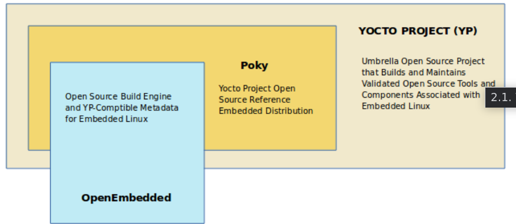
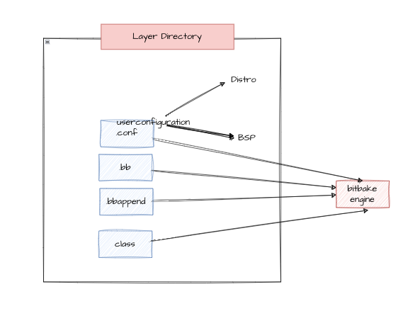
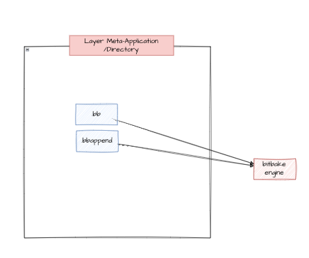
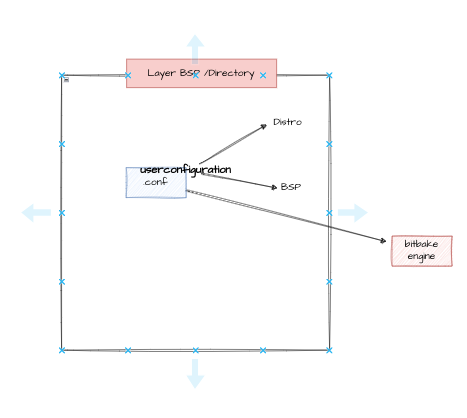
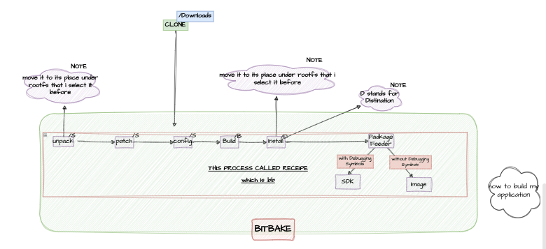
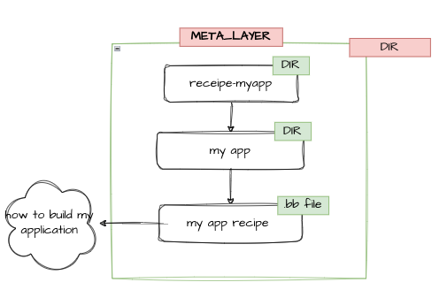

## HISTORY OF YOCTO

Started by  **open embedded community** 


they build a tool based on python called **bitbake**


- Buildtool input is configuration 

- this CONFIGURATION called **metadata**


## HOW TO GET BITBAKE TOOL ?

**from openembedded github**

## HOW ?

```sh
mkdir image_generate_dir

cd image_generate_dir

git clone https://github.com/openembedded/bitbake.git
```

## then they create some thing called layer 

those layers contain applications.

## what if i need python on my image

1. seach for the layer contain this application. 

2. for example it is meta-core 

3. search for it and then clone it 


## but what if i want to download the Board Support Packages (kernel,uboot,crosscompiler)

**there is a layer has board support packgaes called meta-raspberrypi**

```sh 

mkdir meta-rpi

git clone https://github.com/agherzan/meta-raspberrypi

```
## so Meta refere to layer 

## what is the layer types ?

1. application (UserSpace)
 
2. Board support package (HW Space)

3. at some times we merge two into one layer 

## here there is a problem i don't know how these folders going to interact with bitbake


##  Then Yocto Cames and Solve all of these Problems 

## what is yocto ?

- it is a community also it is a reference teach us how to build our own distribution using openembedded buildengine (bitbake) and some layers from them

**yocto started by creating their own layers**

1. meta-poky (contain applications)

2. meta-yocto-bsp (contain hardware support package) 

and then they make a repo on github contain the following 

1. both layers the create

2. add to them the most important layers on openembedded like

 EX :

    (meta-core) , 

    (meta) ,

    (meta-skeleton)  -> it is a templete for how to create board support packages

3. bitbake build engine

**and they called it Poky**
  
## So What is Poky ?  
Poky is the reference distribution of the Yocto Project, providing a set of tools and metadata to create custom Linux distributions for embedded systems. It includes everything needed to get started with the Yocto Project, including a build system, default configurations, and example recipes. 

## What is bitbake

BitBake is the build engine used by the Yocto Project and other similar projects. It parses recipes, handles dependencies, and orchestrates the build process, allowing developers to automate the compilation and assembly of software components and it was developed by openembedded.





## Also YOCTO community has provide comptability between bitbake buildengine version and meta-layers 

## how ? 

before yocto if some one clone the following 

1. bitbake (v.20)
2. meta-core (v.10) 

it going to generate a problem for sure because incomptability of versions between bitbake and meta-layer 

## HOW YOCTO MADE IT COMPTABLE ?

they did poky branches (releases) 

ex: 
zeus: Yocto Project 3.0 release. 

- so all the contributers who create a meta-layer , they create it depend on comptability with the branch like :(zeus) for example

- i want to clone meta-layer i will clone it to comptable with my branch 

- every poky branch it is LTS (LONG TERM SUPPORT UNTILL A SPECIFIC DATE )

## Most famous poky branches 

1. zeus: Yocto Project 3.0 release.

2. dunfell: Yocto Project 3.1 LTS release.

3. gatesgarth: Yocto Project 3.2 release.

4. hardknott: Yocto Project 3.3 release.

5. honister: Yocto Project 3.4 release.

6. kirkstone: Yocto Project 4.0 LTS release.

7. langdale: Yocto Project 4.1 release. 

## how to clone a layer ? 

1. clone poky from the github repo and choose kirkstone branch


```sh
# or clone it directly from here 
git clone git://git.yoctoproject.org/poky 

# if you want to clone only kirkstone 

git clone git://git.yoctoproject.org/poky -b kirkstone

```
2. git clone (specific layer) 

3. git checkout kirkstone

**if there is a confliction bitbake will notify**

## bitbake




## application layer 



## bsp layer




## BAKE PROCESS DONE BY BIT-BAKE 

- bitbake -> bake a recipe by passing to him the receipe (instruction ,configurations) 




- receipe is written by me and i should follow this structure 




