## Manual Customization 

through manual customization journey we have done the following 
1. Cross Compiler
2. U-boot
3. kernel
4. busybox

what is the benefits of building image from scrach ? 

1. smaller size 
2. every part is customizable 

what it's disadvantages ? 
1. complex 

2. has many issue 

3. needs a knowledge of every element

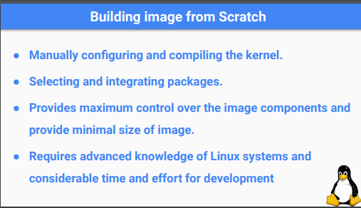

## packages with manual customization

1. clone source code 

2. build it to my target

3. move it into /bin


## Auto Buildroot

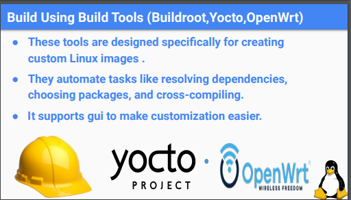

it is a tool i pass conifguration to it and it contain scripts that build to me 

CONF ->TOOL -> Image 

Image will be ready to use 

 
```sh 
dd if=image of=/dev/mmc0 bs=4M status=progress
```
and it will format your sd card into two partitions 

1. fat contain all bootable files 

2. ext4 contain the rootfs 

## packages with auto buildroot

just from config check the required packages


## What is the types of auto buildroot 

1. buildroot

2. yocto


## what is the difference ? 

- build root support less packages than yocto which support way more packages 

- if i want to download a specific pakcage i write my own scripts on buildroot

- yocto is more complex than buildroot which provide just a GUI menuconfig that we could choose our required crosscompiler,bootloader,kernelversion,initprocess,etc..

- buildroot footprint (size on ram) And workspace size( on development machine) smaller than yocto 

- buildroot way less in time than yocto

- build root is eaiser on integration of new application or packages


## Steps 

1. Clone from buildroot github

```sh

git clone https://github.com/buildroot/buildroot

```
2. 
```sh

cd buildroot

make list-defconfigs

# Or you can list the files inside 
ls configs/
```
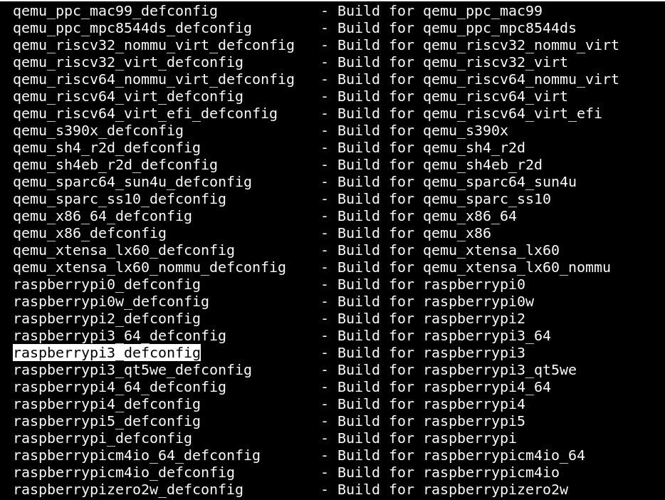

3. use board configurations for raspberrypi-3 family

```sh
make raspberrypi3_defconfig

```
3. add some configurations

```sh
make menuconfig 
```
2. choosing type of init process  
3. choose type of shell
4. choose root password
5. type of shell 
6. system hostname

move to -> Systemconfiguration 


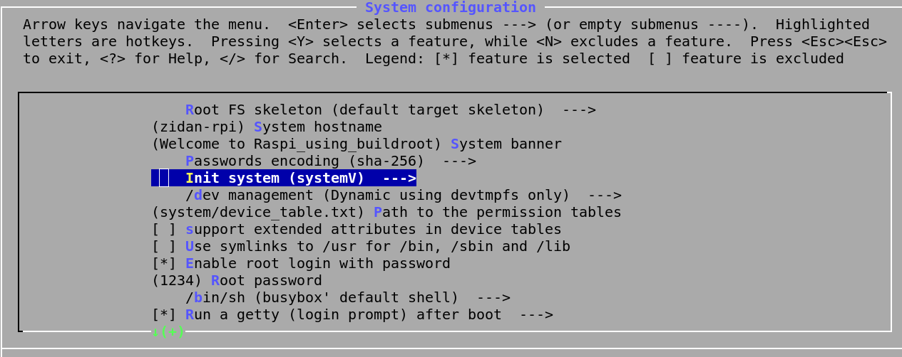


7. choose C library

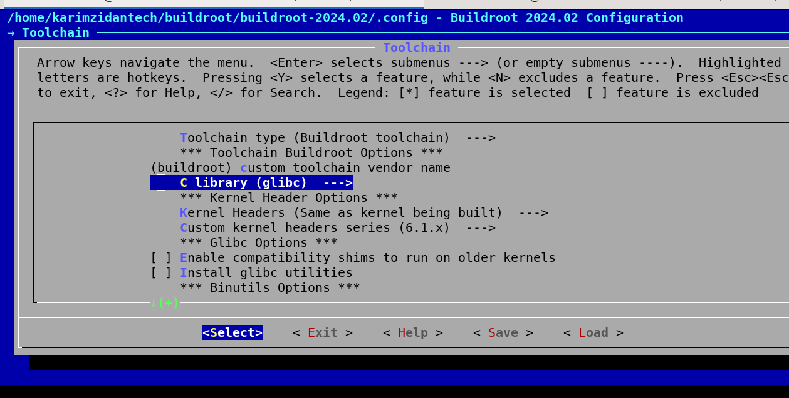


8. kernel version 

move to -> kernel

9. select target packages (on userspace)
move to -> Target Packages -> Networking Application  

like dropbear -> SSH ,SCP COMMANDS

also like games ->chocholate


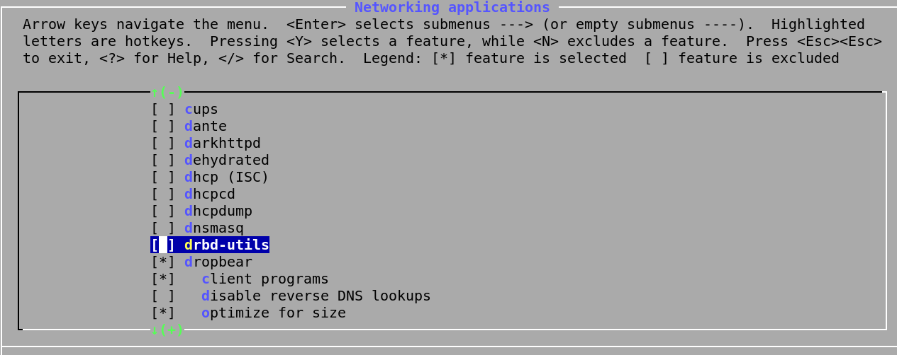


10. file system images

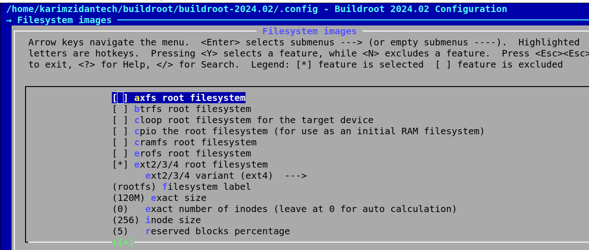

11. bootloader

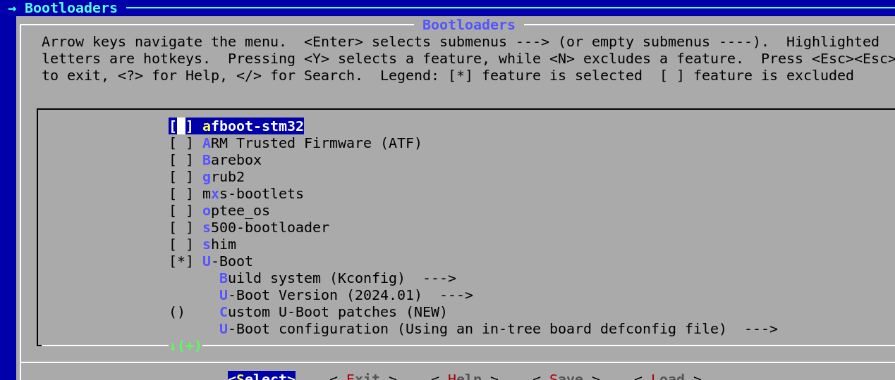

12. if you want to change download directory

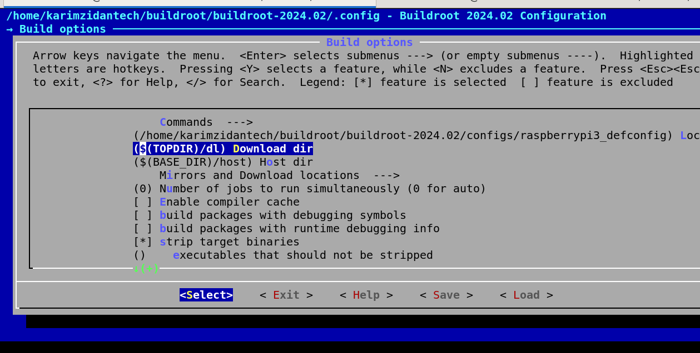


13. change number of jobs depend on your CPU thread number like we was adding -j4 for 4 jobs

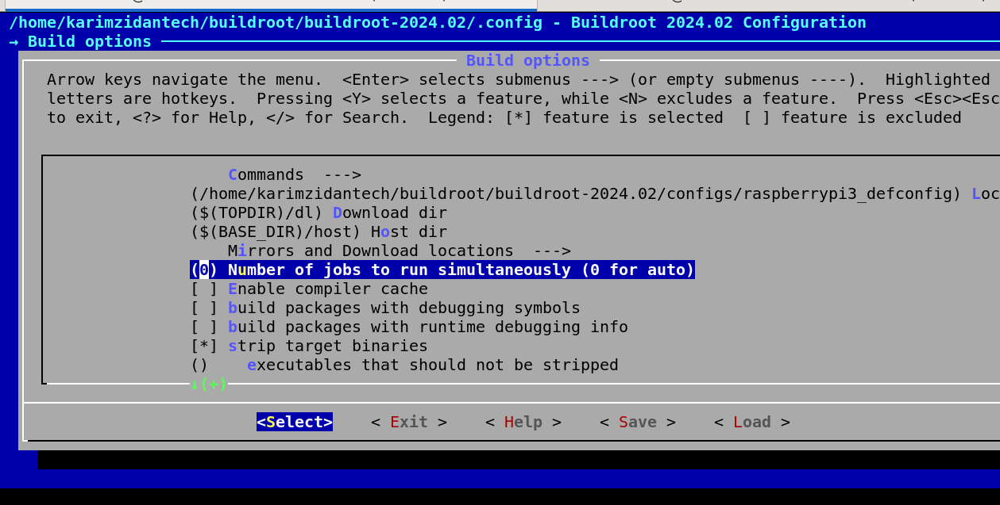


```sh

make

```

## After building 

```sh
cd output/images/

ls 
```

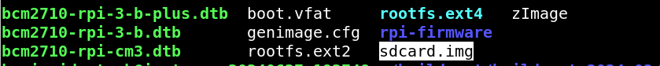

## HOW TO BOOT raspberrypi using these files?

1. attach your sdcard or usb 

on my case iam using usb , if you using sd card just replace /dev/sda with /dev/mmc0

```sh
dd if=sdcard.img of=/dev/sda bs=4M status=progress
```
**The command dd if=sdcard.img of=/dev/sda bs=4M status=progress writes the sdcard.img image file to the /dev/sda disk, using a block size of 4 megabytes, while showing progress updates. This will overwrite the contents of /dev/sda with the image file,you will find two partitions  making it suitable for use with a Raspberry Pi 3 B+.**

a- boot partition

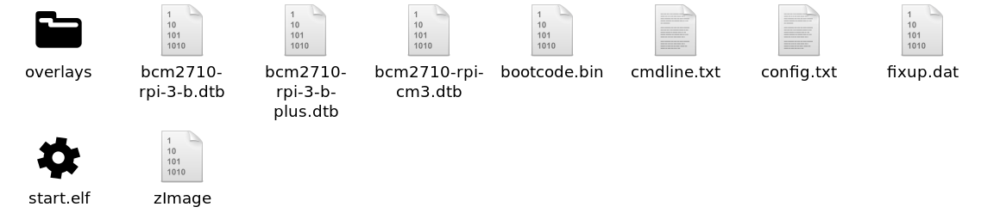

1. you have to add the following lines into config.txt

enable_uart=1
device_tree=bcm2710-rpi-3-b-plus.dtb


2. you have to add (rw rootfstype=ext4) to cmdline.txt
root=/dev/sda2 rw rootfstype=ext4  rootwait console=tty1 console=ttyAMA0,115200 

b- rootfs partition 
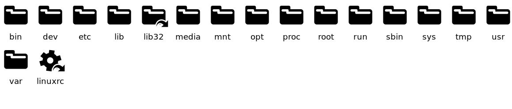


## now attach SDCARD , connect ttl , open picocom

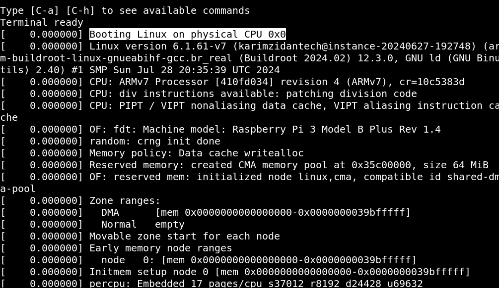

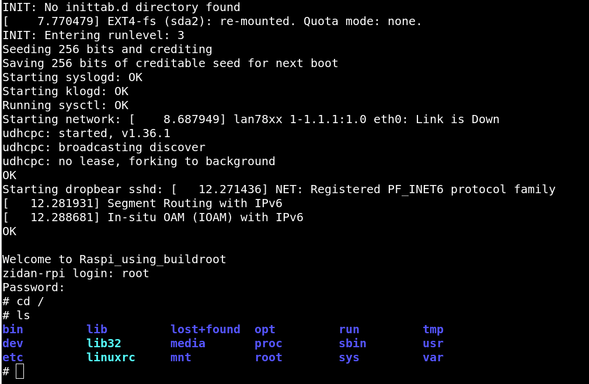

##  builroot TASK Description

1. build anew package (multi thread) using c++ 

2. push it to git hub as sourcecode

3.  add it on menuconfig checkbox 

## HOW ?


1. modify on this  -> (Kconfig) 

2. mkdir ->  ./packages/DemoApp/

3. make the following files 

a- Config.n 

b-  makefile && cmake 

c- file.mk 

## you could find the task at this link 

(link)
