## HISTORY OF YOCTO

Started by  **open embedded community** 


they build a tool based on python called **bitbake**


- Buildtool input is configuration 

- this CONFIGURATION called **metadata**


## HOW TO GET BITBAKE TOOL ?

**from openembedded github**

## HOW ?

```sh
mkdir image_generate_dir

cd image_generate_dir

git clone https://github.com/openembedded/bitbake.git
```

## then they create some thing called layer 

those layers contain applications.

## what if i need python on my image

1. seach for the layer contain this application. 

2. for example it is meta-core 

3. search for it and then clone it 


## but what if i want to download the Board Support Packages (kernel,uboot,crosscompiler)

**there is a layer has board support packgaes called meta-raspberrypi**

```sh 

mkdir meta-rpi

git clone https://github.com/agherzan/meta-raspberrypi

```
## so Meta refere to layer 

## what is the layer types ?

1. application (UserSpace)
 
2. Board support package (HW Space)

3. at some times we merge two into one layer 

## here there is a problem i don't know how these folders going to interact with bitbake


##  Then Yocto Cames and Solve all of these Problems 

## what is yocto ?

- it is a community also it is a reference teach us how to build our own distribution using openembedded buildengine (bitbake) and some layers from them

**yocto started by creating their own layers**

1. meta-poky (contain applications)

2. meta-yocto-bsp (contain hardware support package) 

and then they make a repo on github contain the following 

1. both layers the create

2. add to them the most important layers on openembedded like

 EX :

    (meta-core) , 

    (meta) ,

    (meta-skeleton)  -> it is a templete for how to create board support packages

3. bitbake build engine

**and they called it Poky**
  
## So What is Poky ?  
Poky is the reference distribution of the Yocto Project, providing a set of tools and metadata to create custom Linux distributions for embedded systems. It includes everything needed to get started with the Yocto Project, including a build system, default configurations, and example recipes. 

## What is bitbake

BitBake is the build engine used by the Yocto Project and other similar projects. It parses recipes, handles dependencies, and orchestrates the build process, allowing developers to automate the compilation and assembly of software components and it was developed by openembedded.


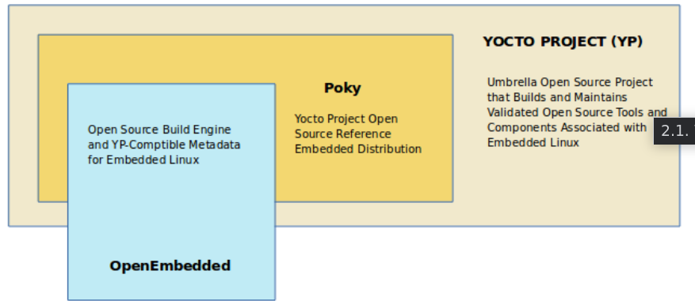


## Also YOCTO community has provide comptability between bitbake buildengine version and meta-layers 

## how ? 

before yocto if some one clone the following 

1. bitbake (v.20)
2. meta-core (v.10) 

it going to generate a problem for sure because incomptability of versions between bitbake and meta-layer 

## HOW YOCTO MADE IT COMPTABLE ?

they did poky branches (releases) 

ex: 
zeus: Yocto Project 3.0 release. 

- so all the contributers who create a meta-layer , they create it depend on comptability with the branch like :(zeus) for example

- i want to clone meta-layer i will clone it to comptable with my branch 

- every poky branch it is LTS (LONG TERM SUPPORT UNTILL A SPECIFIC DATE )

## Most famous poky branches 

1. zeus: Yocto Project 3.0 release.

2. dunfell: Yocto Project 3.1 LTS release.

3. gatesgarth: Yocto Project 3.2 release.

4. hardknott: Yocto Project 3.3 release.

5. honister: Yocto Project 3.4 release.

6. kirkstone: Yocto Project 4.0 LTS release.

7. langdale: Yocto Project 4.1 release. 

## how to clone a layer ? 

1. clone poky from the github repo and choose kirkstone branch


```sh
# or clone it directly from here 
git clone git://git.yoctoproject.org/poky 

# if you want to clone only kirkstone 

git clone git://git.yoctoproject.org/poky -b kirkstone

```
2. git clone (specific layer) 

3. git checkout kirkstone

**if there is a confliction bitbake will notify**

## bitbake

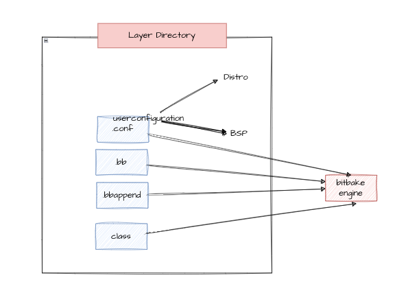


## application layer 

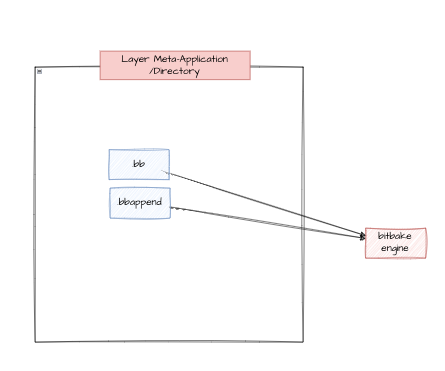

## bsp layer

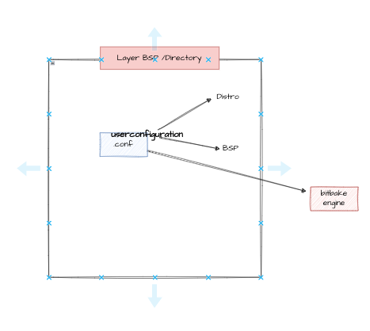


## BAKE PROCESS DONE BY BIT-BAKE 

- bitbake -> bake a recipe by passing to him the receipe (instruction ,configurations) 

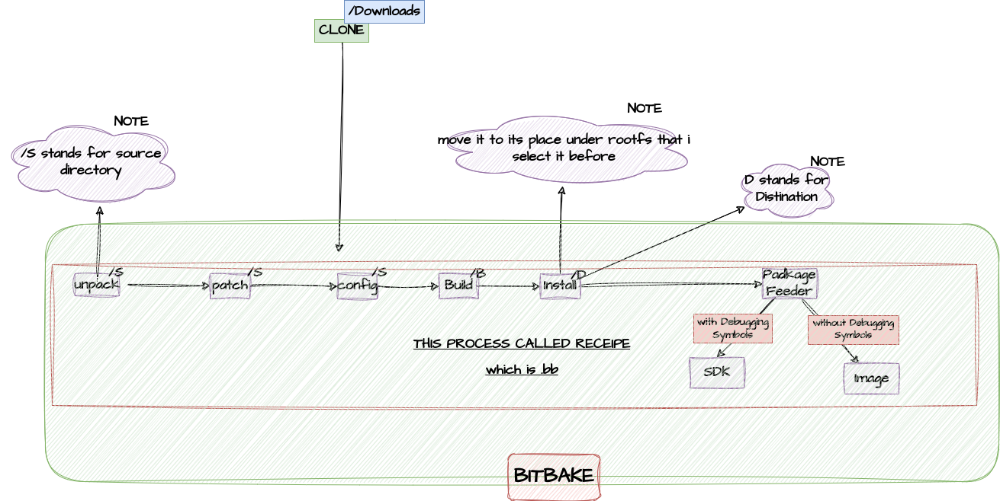


- receipe is written by me and i should follow this structure 

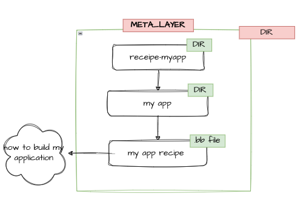

------------------------------------------------------------------------
## LEC2

- Every meta-layer has a variable indicate the comptability with poky branch

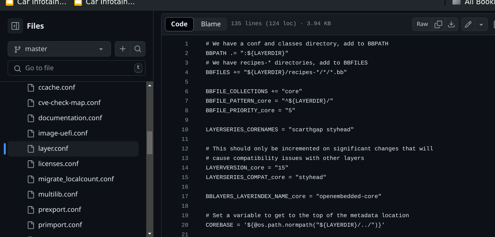


## Variables with yocto 

**1. local**

`any files of these extensions contain local variable`

1. .bb
2. .bbappend
3. .class

**2. global**

1. .conf

## How to assign Variable 

```sh
myvar = "string"
```

## how to read global variable ? 

through bitbake tool

bitbake-getvar (VAR) 
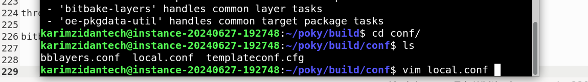

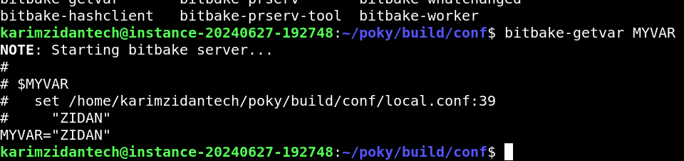

## Variable assignation 

**1. weak assignation**

```sh
MYVAR="3"
MYVAR ?="4" 

# MYVAR out will be 3

```
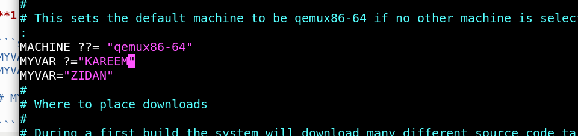
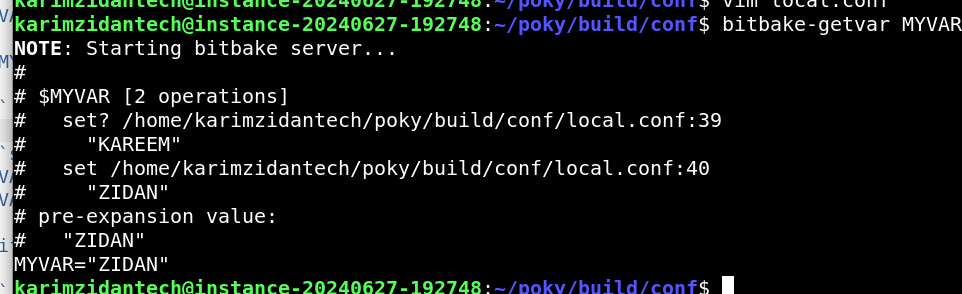


```sh
MYVAR ?="3"
MYVAR ?="4"

# if both are weak MYVAR out will be 3 

```

```sh
MYVAR="3"
MYVAR="4" 

#out will be 4

```


**2.weak weak assignation**

MYVAR ??=3

eg:

```sh
MYVAR ??="4"
MYVAR ?="3"

#bitbake result will be 3 
#double assignation going to be execute at last of the assignation process if there is no another assignation

```

```sh

MYVAR ??="4"
MYVAR ??="3" 

#bitbake result 3

```

**3.append**

1. overwriting (notrecommended)
```sh
MYVAR="4"
```

2. appending 

MYVAR +="5" -> "4 5"

MYVAR:append="5" -> "45"


```sh
out will be "5 6"
```


```sh
out will be "7"
```
3. preappend

MYVAR =+7
MyVAR:prepend=7


--------------------
XAR=3 
MYVAR="${XAR}"
XAR="4"

MYVAR WILL be 4 also
--------------------
4. immediate assignation (:=)

XAR=3
MYVAR :="${XAR}"
XAR="4" 
MYVAR will be 4

--------------------
MYVAR ?? ="6"
XAR := "${MYVAR}
MYVAR ?? ="7"

```sh
out will be 6
```
--------------------
MYVAR ? ="6"
XAR := "${MYVAR}
MYVAR  ="7"

```sh
out will be 6
```

--------------------
6. append & prepend with dots 

.= append 
=. prepend
--------------------
7. remove 

MYVAR= "3 5 6" 

MYVAR:remove="5" 

```sh
result ="3 6"
```

## most common variables in yocto

S -> directory
B -> directory
D -> directory


1. create a layer (outside of poky and anything related to 1-openembedded 2-thirdparty)

use bitbake-layers to create it
```sh
bitbake-layers create-layer ../meta-iti
```
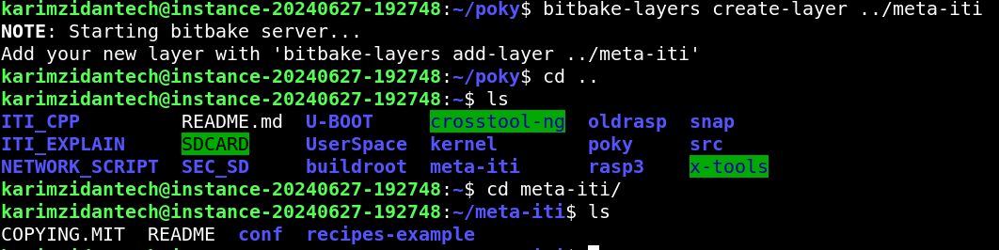

/conf contain all .conf files 

- contain a file called layer.conf 

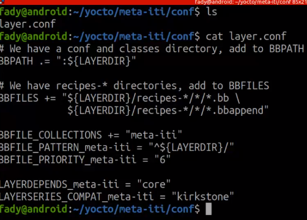

- contain comptable version of poky

- and depend on other layer (LAYERDEPENDS)

2. then append my layer to BBFILES 


`BBFILES:append = " ${LAYERDIR}"/mylayer-*/*.bb`


BBFILES used to make bitbake find receipes on your layer

dont forgot space after " 


## how to run receipe ? 

using bitbake

```sh

bitbake (myrecipy)
```

if i start to bake will not find myreceipe 

## why ? 

because there is layer paths that bit bake search on it 

so i have to add my layer path on BBLAYER.conf

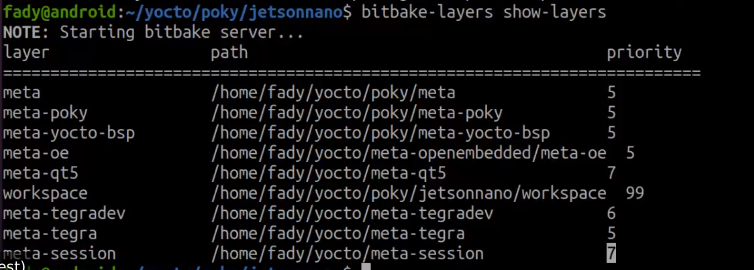 


**NOTE yocto deals only with absloute path**

or just by a command 


`bitbake-layers add-layer (ABS/PATH)`


## 3- when you add a layer make sure you are on /poky/buildenviroment


## 4- run bitbake on your recipe 
```sh
bitbake receipe
```

## one of the important script to (build your own enviroment)

oe-init-build-env

this script create build dir and set enviroments 


## TASK of LEC 2
1. create an enviroment     
2. create layer  outside poky

3. create recipe 

4. edit on display func 

5. if (variable==3) -> display hi else variable ==4 display myfriend 

then create on layer.conf variable that i check on the display receipe function


-----------------------------------------------------------------------------------

# LEC 3

## HOW TO WRITE a RECIPE ?

 ### A. start by header section

**1. SUMMARY** 

**2. DESCRIPTION**

**3. HOMEPAGE** 

### they are not maindatory

**4. LICENCE**

**5. LIC-FILES-CHKSUM**

`LICENCE Purpose`: Specifies the licensing terms for the software in the recipe.

Usage: Set to the license name or identifier, e.g., MIT, GPL-2.0+.

if you do not want to use check  sum use =CLOSED

**if you used MIT LICENCE**

`LIC_FILES_CHKSUM`: Provides checksum of the license file to ensure accuracy.


- you have to calculate check sum

`md5sum`

LIC_FILES_CHKSUM = "file://path/to/license/file;md5=checksum_value"

**NOTE:it has to be absloute path**

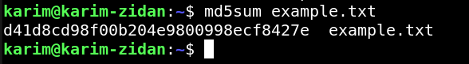

`bitbake-getvar COREBASE`

- it will set COREBASE TO =COREBASE="/home/karimzidantech/yocto/poky"

- absloute directory of poky

- you could use it on LIC_FILES_CHECKSUM


## 6. SRC_UAI VARIABLE

1. it is a local variable 
2. responsible to clone files into `dl` directory 

## how to use it to clone from git?

SRC_URI="git://<repo_link>,protocole=`https`,branch=`main`"

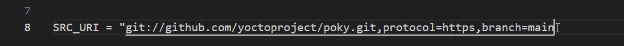

## how to use it locally ?

**NOTE: it depends (it should be set at special place)** 

there is a LOCAL variable called **FILESPATH** 


## 7.SRCREV 

- used only with git 

- SRCREV ="COMMIT HASH"

- to check out to specific hash commit

## 8.WORK_DIR 

    contain S , D , B

## 9- there is some local variables point to some directories related to my receipe

**THISDIR** contain receipe path 

**WORKDIR**  This directory is where the build system performs operations like extracting sources, applying patches, and compiling the software. 


## 10- there is another local variables hidden in each recipe 

PV -> package version

PR -> Package release

PN -> package name


name_version_release.bb

PN_PV_PR.bb

so every local variable parse its value 

## how to read value for a local variable 

`bitbake -e recipe | grep variable` 

`e -> for expand `

i could append all the expandables on a file .txt and use it to customize my task

`bitbake -e recipe > trace.txt` 

**bitbake takes all the variables in recipe and generate python command with hidden variables setted by bitbake itself**

## HOW TO WRITE A RECIPE


**CLEANALL**

remove everything Under WORKING DIRECTORY 


## LIST ALL tasks for a recipe
`bitbake listall (reciepe-name)`
- you will find all tasks that bitbake will generate it for you 


--------------------------------------------------------------------------------------

if have a do_compile task on recipe (but i want to compile using cmake not make ) so i will customized my do_compile

EX :

on my recipe i will overwrite the do_compile task that generated by bitbake 

do_compile(){
#B is the build directory where i will find my app on it 
${cc} ${CFLAGS} pathto/main.c ${B}/myapp  

}

**i could overwrite any local variable like PV (package version)**

## You remember when we discuss this ?
## how to use it locally ?

SRC_URI ="file://main.c" 

**NOTE: it depends (it should be set at special place)** 

there is a LOCAL variable called **FILESPATH**

ican append on it the files path to force bitbake to notice my files.


## now we have compiled the source we need to mv it to the target fs 

so i will make an install bash task 

do_install()
{
    mkdir -p ${D}/usr/bin


    cp ${B}/myapp ${D}/usr/bin
}

## what if i want to make python task ? 

- write python before name of task

python do_install()
{


}

## there is local var called bindir =/usr/bin

do_install()
{
    mkdir -p ${D}/${bindir}
    cp ${B}/myapp ${D}/${bindir}
}

## how to run specific task ? 

```sh

bitbake -c <taskname> <recipe_name>

```
## Most imortant Files in yocto (documentation.conf) it contains everything about local variables 

## bitbake.conf (standart target filesystem path) all variables related to it


**GLOBAL VARIABLES are ON GLOBAL.CONF** 

- GLOBAL VARIABLES could depend on another VARIABLES how ?

EX:

GLOBALVAR =$(SRC_URL):another data

 WHEN I SET SRC_URL on .bb it becomes local var to the recipe


---------------------------------------------------------------------------

## TASK

1. clone fady's repo 

2. fady's program based on Cmake

3. so i will use cmake to generate make file  `(cmake -S . B build)`

4. then i will inherit[something] something to use **make -C ${B}**

5. set all of that on tasks , do configure ,do compile ,do install 


# Lecture 4

### how to find the local variable through bitbake-getvar ?

`bitbake-getvar -r (recipe name) (variable)`

**BBPATH : indicate the path for classes for layer it is on layer.conf**

## DISCUSSION ABOUT DOCUMENTATION.CONF file

- it is the most important file in yocto
`/home/karimzidantech/yocto/poky/meta/conf`

- provide alot of information about VARIABLES IN YOCTO

## DISCUSSION ABOUT LOCAL.CONF

- **it contain MACHINE variable -> to which board or soc iam going to build the hardware dependent packages**

- **NOTE braglebone is most supported board from yocto search on (beaglebone-yocto.conf)**

- **so iam going to write a .conf file which has all the machine conf under my layer/conf/machine/include like beaglebone-yocto.conf (BSP layer)****

- **on my layer i will include the application and bsp recipes together , i could make two layers under the main layer**

- **any package that change from arch to another arch i set it on boardsupportpackages**

- **if i want to build more than image with diff configuration i could make a new WORKDIR and change WORKDIR on a recipe , or just pull the sstate folder and downloads out and start build again to use the dependencies that i download before**
## IMPORTANT NOTE (YOCTO IS ALL ABOUT SETTING VARIABLES)

## IMPORTANT VARIABLES

- **SSTATE_DIR-> store info about the tasks that has already runned and finished , so if i rebitbake it is not start from beggining again it is on local.conf** 


- **TMDIR -> WORKING DIRECTORY FOR APP RECIPES**

- **Deploy -> image**

- **DISTRO -> (NAME OF DISTRIBUTION)**

- **1-ihave to create conf file for disto on this dest meta-layer/conf/distro/NAMEOFDISTRO.conf**

- **2-i could include meta-poky/conf/distro/poky.conf then add my changes**

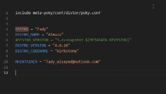

 - **what is difference between distros?**
1. package manager supported by yocto

    a.ipk 

    b.apt

    c.rpm


2.library

    a.musl

    b.glibc


3. init process

    a.busybox

    b.systemd 

    c.systemv

------------------------------------------------------------------------------

- **PACKAGE_CLASSES ?= type of package i want it as an ouput**
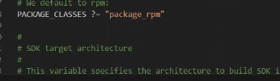


- **so i could share it with any one with my same packagemanager and mymachine type**


------------------------------------------------------------------------------


- **BB_DISKMON_DIRS -> this is used to set the disk space for the build process**

------------------------------------------------------------------------------


- **CONF_VERSION -> VERSION OF MY local.conf**

------------------------------------------------------------------------------

-**INHERIT -> i could set this to minimize the size of image


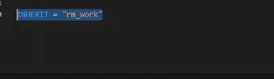
------------------------------------------------------------------------------

- **Patchresolve = "noop" or "user" -> if i made it user it will print error on terminal and then open anew terminal to resolve my problem then it will continute**
------------------------------------------------------------------------------
## types of metadata
1. .conf files


2. reciepe (.bb)


3. recipe.bbappend 

- it is used to extend functionality to existing recipe

- naming conventions for .bbappend

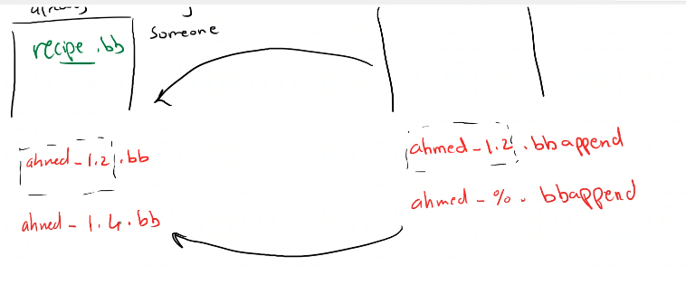

**NOTE - if i have 3 recipes with different versions -> bitbake will parse the latest version**

**NOTE - if i have 3 recipes with same versions -> bitbake will parse the highest priority recipe**

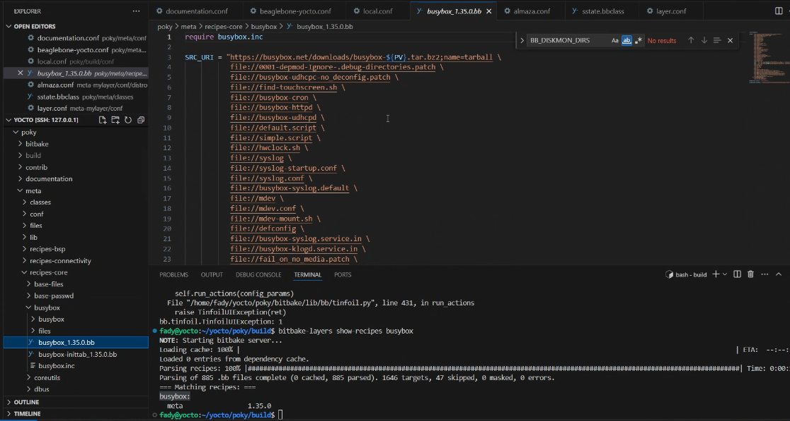


- on another layer there is busybox-append

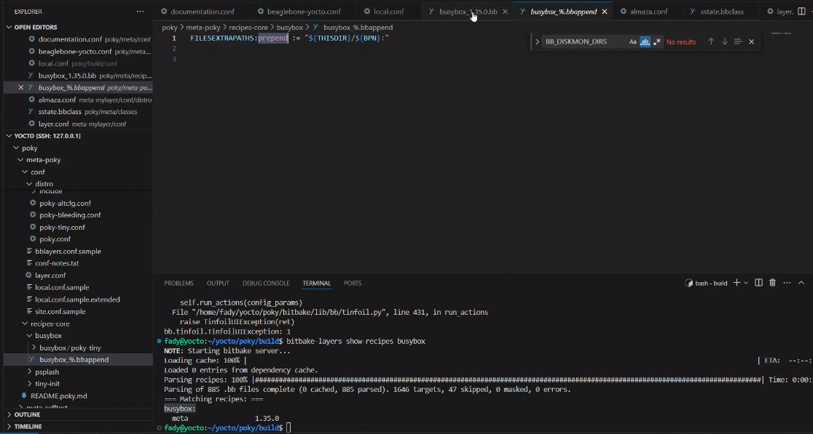

- **append file will add to the original file**


another EX:

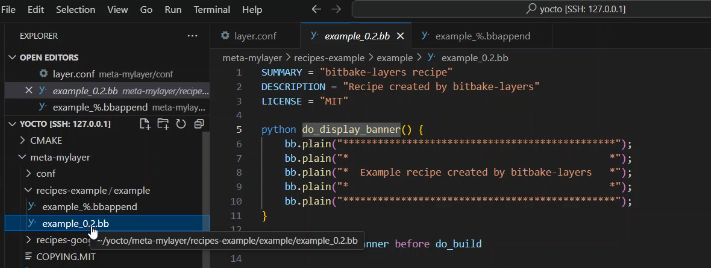

-**NOTE on append file**

-adding append to function

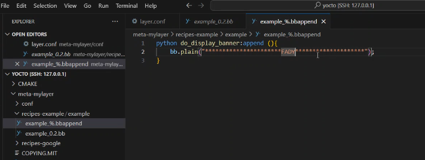


------------------------------------------------------------------------------

## BBClass

-> (launch function in background)


->any thing got inherited is a  (class)

- prepare the envioment for a specific functionallity 

- like inherit cmake -> download it and configure it , install and make it sutiable for use on my recipe 


INHERIT=SYSTEMD


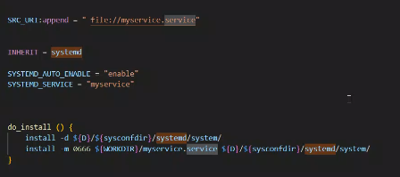

------------------------------------------------------------------------------------
## how this outputs gonna be installed on rootfilesystem ?
- **IMAGE_BBCLASS -> configure the rootfilesystem**

**NOTE-> this one is maindatory**

- **IMAGE_INSTALL -> install package into rootfilesystem
- **IMAGE_INSTALL:append =" myrecipe"  

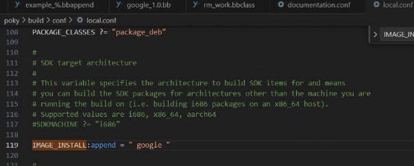

poky/build/conf/local.conf

## if you want to download the qt5 , add it layer , checkout to kirkstone , then downloaded the dependencies layers , bitbake receipe 


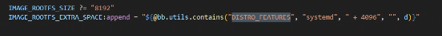

## READ about package feeder

------------------------------------------------------------------------------
## TASK

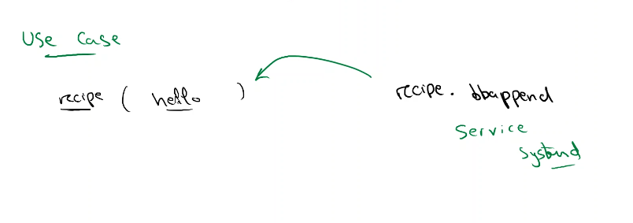

## STEPS


- make it like this

`"file://main.c \"`
because iam going to SRC_URI the service.service also

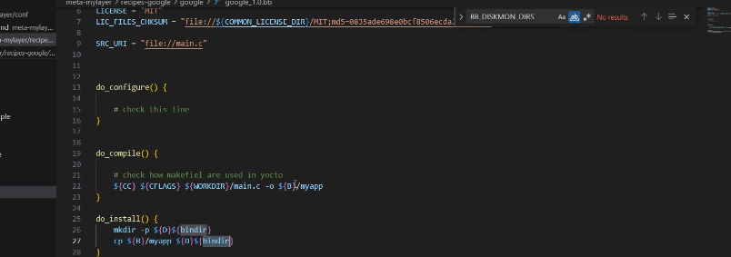 


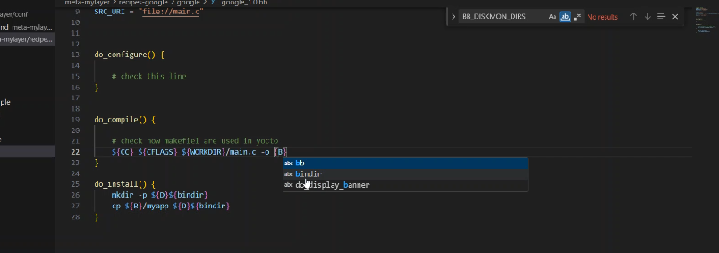


## then create a service file


## append it to /etc/systemd/system

using this 
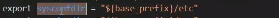


## on do_install append

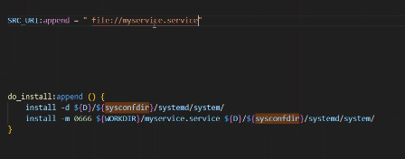

## check build/expand 

## TASK

1. image -> rpi 
2.create layer
3. create conf/ 

4. create distro 

5. almaza.conf (include poky.conf , edit some info)

6. create recipe (ping on my computer ip , if successfull -> led off , if ping off(led on ) )


## how to on led ?
led on /sys/class/gpio 


# LEC 5

how to design layer ?
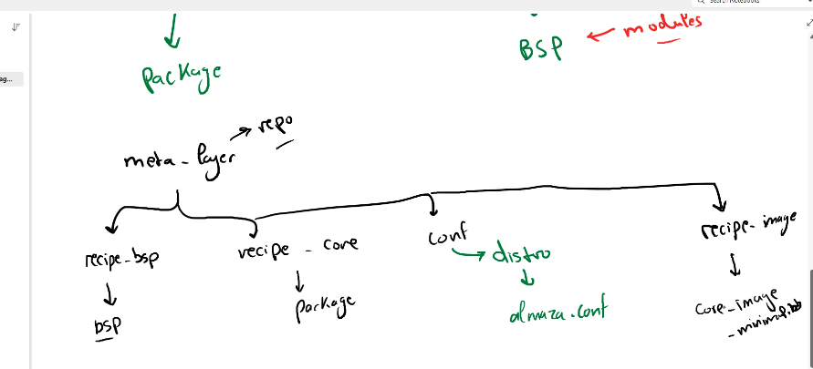


- what if i want to build a kernel module through yocto and include it with build ?

i could use meta-skelton provided skelton for building kernelmod

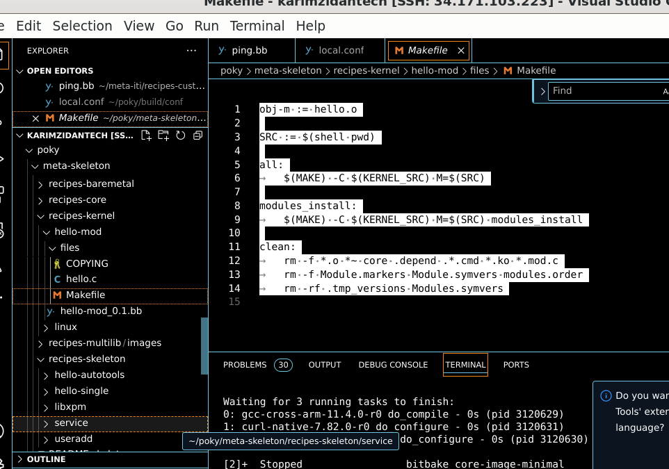

## if i want to search at more than a path recommended to use this 

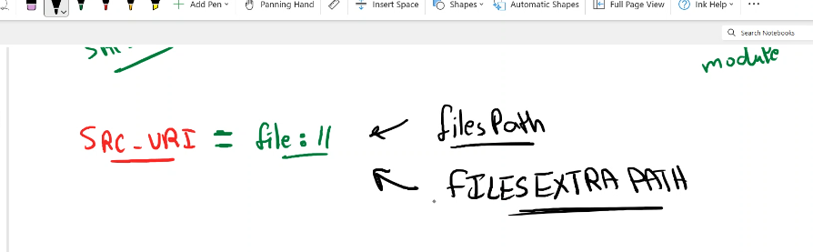

## PATCHING

- create a patch file to modify in source file (loading address for example)

- patch file has an extension of .patch

if i have source file and i make a change on the src 

`git diff main > file.patch` , now i have a patch file 

`git apply     .patch`

## how yocto apply patching ?

1. using SRC_URI to clone patch
2. patch contain all info required for src file 


## DEPENDENCIES ON RECIPES 

-**if i have a receipe calulator depend on another recipe i have to add this**
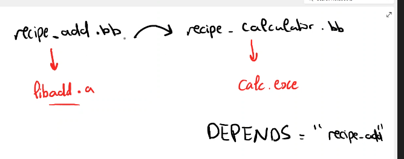

- **bitbake take output of DEPEND RECEIPE into your recipe**

## i could make some thing like alias on DEPENDENCES 
1. depend on recipe it self 
2. depend on output of the receipe

### both could be used on that way


**start by script that PROVIDE then the script that Depends on Provider**

## RUNTIME PROVIDES

## RDEPENDS 

`RDEPENDS` -> depends on a package on runtime so bitbake by default will send this package into myimage 


## TASK (MAKE A LAYER CONTAIN BSP AND APPLICATION) and push it to github

------------------------------------------------------------------------
Yocto by deafult -> SystemV

how to add Systemd ? 
**DISTRO_FEATURE**

------------------------------------------------------------------------


**write this on conf for distro**
if systemd with DISTRO FEATURES extend the rootfs space by 4GB
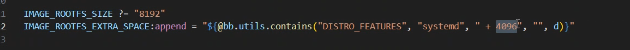

------------------------------------------------------------------------

my image will boot with systemv , if iwant to switch into systemd through 


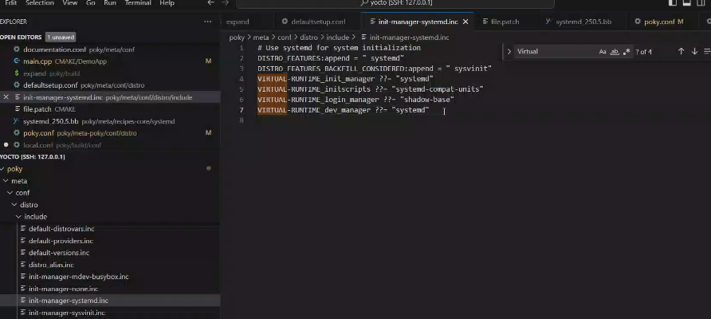

`DISTRO_FEATURES:append = " systemd"`

**add this to almaza.conf**

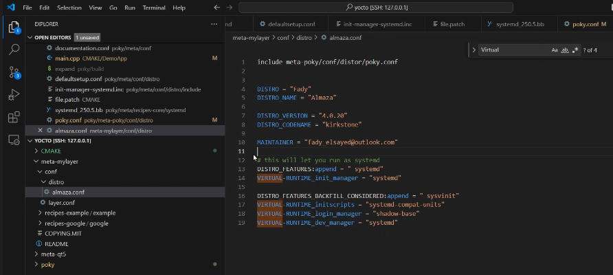

------------------------------------------------------------------------
1.create recipes-image/image 

2.create myimage.bb

3. add this to it 

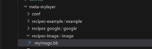

# SO ALL I MODIFY IN LOCAL.CONF IS (MACHINE ,DISTRO)


------------------------------------------------------------------------
## TASK
1.c0re-image-minimal -> it starts with terminal

2.core-image-sato -> GUI
## sato difference between minimal

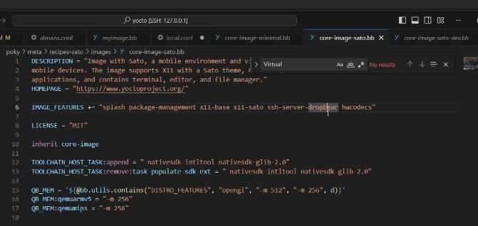

3. core-image-westron 

------------------------------------------------------------------------

1. write QT APP on version QT5 

2. start this QT on host-machine 

3. write a recipe to start this hello application 

------------------------------------------------------

how ? 

i need a XServer  - qt5-layer required recipes not all recipes  like qt-base 
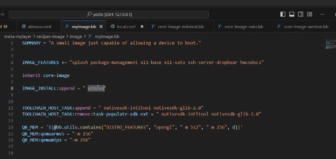 (hint and add)


4. my own recipe (qt application) (download config build install)

to build i need to 

`inherit qt (maybe-search for it)`
`inherit qmak5-base` 


4. include this recipe on IMAGE_INSTALL variable 


5. upgrade QT GUI add button to led on ,led off 


## make sure i add this INHERIT ="rm_work"
---------------------------------------
## to list tasks use bitbake -c core-image-minimal listtasks

there is tasks if i want to use it i have to use it explicitly 

1. do-populate-sdk

2- do-populate-sdk.ext

two tasks to generate SDK

## to run more tasks with bitbake 
`bitbake core-image-minimal  -c listtasks`

listtasks are a tasks called do_listtasks

to explicitly generate SDK 

1- bitbake core-image-minimal -c  populate-task 

2- `cd /build/tmp/deploy/sdk`

3- you will find .sh script that responsible to create sdk

4- --help on it and you will find this (./sh -d (SDK DIR))

5- you will find bashscript called enviroment-setup-cortex53- 


1- SDK is used for generate DEBUGGING SYMBOLS for the recipes 

2- CREATE ENVIRONMENT ( i could build an application with it is make file that i wrote for x86 to work on arm) then use scp to move it to raspberrypi for example (with out creating recipe for it and build the image again)


## devtool,recipe tool 

automated writing for recipes 


it will create workspace-layer and add it to bblayer directly 


- `devtool deploy "recipe" IP `

1- COMPILE
2- deploy it using scp 

`devtool add URI`

manifest -> file has all the builded recipe versions


## if we gonna build JAVA APPLICATION we have to RDEPENDS="JVM"


---------------------------------------
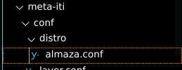

the process of baking
**OPEN BUILD DIRECTIOR/CONF**
1- READ MACHINE CONF EX:(raspberrypi3) -> search for raspberrypi3.conf 

2- READ DISTO CONF from local.conf -> if DISTRO IS = "almaza" -> search for "almaza.conf"

3- LOAD THEM INTO DICTIONARY DIRECTORY 

4- search for core-image-minimal.bb

```sh
find . -name "core-image-minimal.bb"
./meta/recipes-core/images/core-image-minimal.bb
```

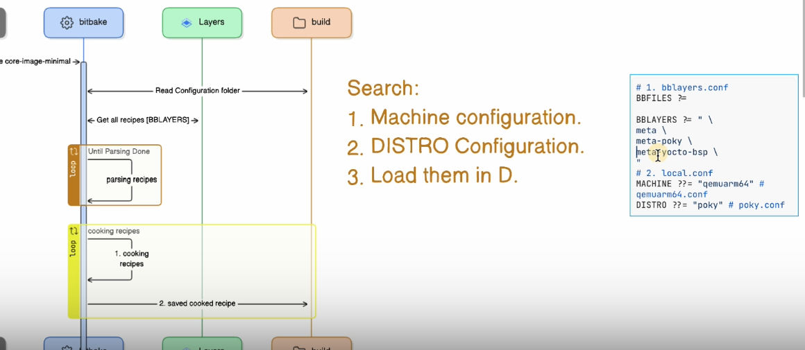


**WHAT IS DATA DICTIONARY**
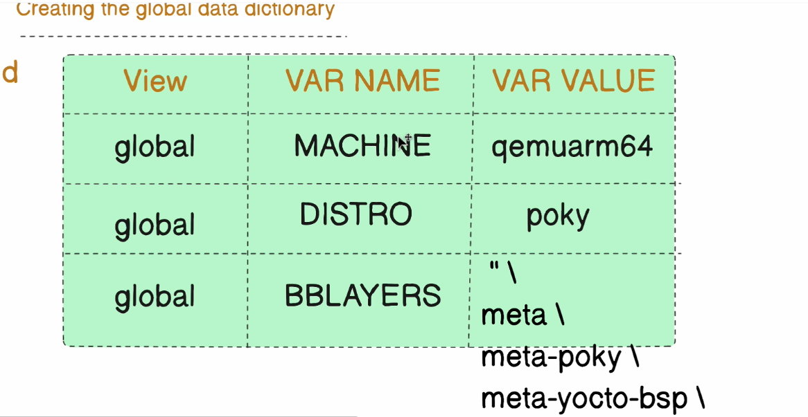

**ANY FILE.conf has global variables**


## LAYERS OPERATIONS

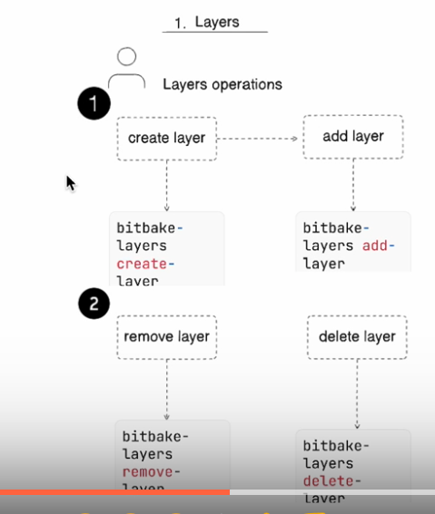

- there is no delete layer operation so i will do it as an alias

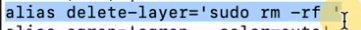

## creating a sd bootable image direct through this command 

`sudo wic create sdimage-raspberrypi -e ${IMAGE-NAME}`


## Types of Recipes 

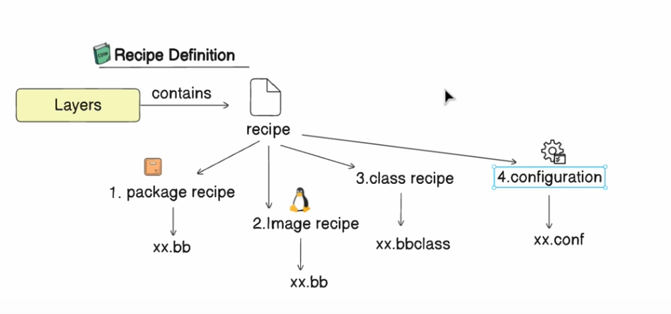

## Operations on Recipes

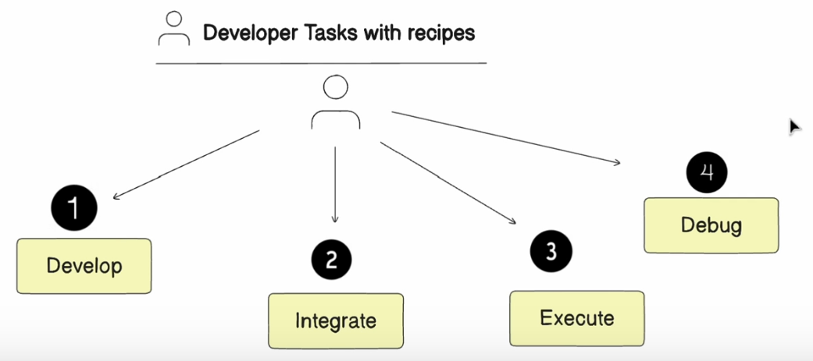

## Create recipe using recipe tool 

`recipetool create -o (recipename.bb) (src link)`


