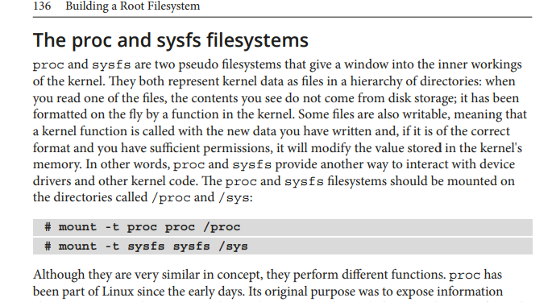
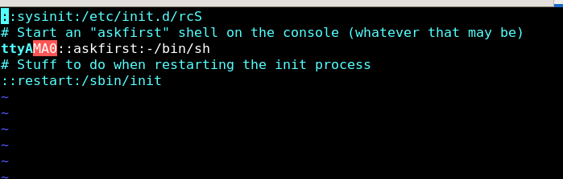
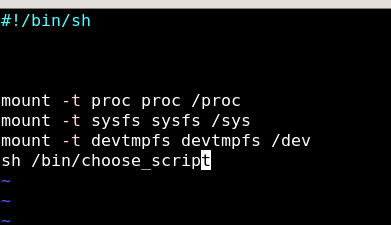

## File system 

i want to notifey kernel that root file system is on Partition2

there is an shared variable called **bootargs** on U-boot


to make kernel mount 

 mount -t ext4 /dev/mmcblk0p2 / 

root=/dev/mmcblk0p2 rw


also to say that i want to display on this 

console=/dev/ttyO or /dev/tty0 -> rpi 

console =/dev/AMA0 -> qemu


## creating an application 


1. make an application and cross compile it 


2. 


pass the rootfile system

```sh

console=ttyAMA0,38400n8 root=/dev/mmcblk0p2 rw

```


then add init

```sh

console=tty0 console=ttyAMA0,38400n8 root=/dev/mmcblk0p2 rw init=/

```

3. run bootcmd 


 

4. i want now to download a set of commands using busybox


5. 

```sh
make menuconfig

```


6. choose required commands 


7. 

```sh

make install

```
8. then under install_ i will get a rootfs arch for the output 

9. so i will make my own filesystem and copy the data on it 

10. 


b- make usr/bin -> copy from install_ 
   usr/sbin-> copy from install_ 
   usr/lib -> sysroot


init process is at **/sbin/init** -> it parse configuration from **/etc/inittab**

1. /etc/inittab is a configuration file used by the **System V** init system in Unix-like operating systems.

2. It defines how the system runs different processes at various runlevels 

3. i Could customize my configurations 


## Here are its main features in short lines:

1. Runlevel Configuration: Specifies which scripts to run at each runlevel.

2. Syntax: Each line consists of 

```bash 

node :: action ::Application to run 

```
EX: 

```sh

ttyAMA0::askfirst:-/bin/sh

```

types of Actions 

1. Sysint -> what happen first 
2. Wait  -> run application and wait for completion
3. Once ->run application but does not wait for completion
4. respond -> read about it 
5. askfirst -> propmt messege before running (ask me first)
6. ctrl+alt+del -> make a specific action when you press that 
5. shutdown -> close application


## WHAT IS procFS and SysFs




**so we have to mount those device nodes on myfile systems to be like an entry point to get some info about devices and process from kernel**

## LETS CUSTOMIZED IT

1. i want /sbin/init (init process) to mount the procfs on /proc and devtmpfs o /dev and sysfs  on /sys 

- so before we gonna compress our ramfs i have to customize my configuration 

1. mount -t proc proc /proc 

2. mount -t sysfs sysfs /sys

3. mount -t devtmpfs devtmpfs /dev

4. launch my Script 


- so lets change directory to our ramfs 


```sh

cd PATH/TO/ramfs/

cd /etc 

touch inittab 

mkdir init.d 

touch ./init.d/rcS 

```

## 1- add configurations to the inittab 

```bash

## launch a process called rcS that going to mount the devnodes
::sysinit:/etc/init.d/rcS

# Start an "askfirst" shell on the console (whatever that may be)

ttyAMA0::askfirst:-/bin/sh

# Stuff to do when restarting the init process

::restart:/sbin/init

```


## 2- add rcS script

```sh

cd init.d 

vim rcS

```


- ADD THIS steps

```sh
#!/bin/sh

mount -t proc proc /proc

mount -t sysfs sysfs /sys

mount -t devtmpfs devtmpfs /dev

# and if you want to create your own init process you could launch it from here like this example
```




**output will be in install_**

## busybox TC 

vim .config 

search for /CONFIG_TC 

## init does not appear 

make it executable

make soft link for commands that already here 

busybox make it by default make softlink for busybox for every command on /bin 

- create inittab

::sysinit:/etc/init.d/rcs -> rcs (run command start)
::askfirst:/bin/sh

i will make the a script make the above mount rcs 
mount the sys init 

then on bootarg init=/sbin/init


**sequence**
1. after i made init=/sbin/init -> parse /etc/init.d/rcs -> it will mount then -> it will askuser first to open shell so i will find the changes


## steps
1. mount sd card 
2. mkdir -p bin sbin usr/bin usr/sbin  usr/lib /etc/init.d dev sys proc 
3. hack command  rsync  -a ~/busybox/_install  ~/media/sdcard 
4. rsync -a ~/x-tool/arm/sysroot -> libraries that i build for musl or libcc i need it 
5. then i will editenv bootarg (init) or if i use efi partition i will use APPEND   


## initramfs 

this used for recovery mood  

_install  


i will take bin sbin usr  

so for size i will take the essential commands (mount ls mdsum ) ->compression (cpio) on x86 or host -> and set it on /boot  

   
now /boot -> dtb , uboot ,zImage , extlinux/extlinux.conf , u-boot.env 


i want to say to u-boot to boot on 
1. initrd=/bin/sh -> init proc for the initramfs 

or

2. init=/bin/init -> for my main root file system 

then load it to ram using 

```sh
fatload -> to any address away from ram 

bootz $kernel $initramfs $dtb 

- was the initramfs
 
if i remove - and initramfs will boot on rfs normally 
```

1. after i make commands and scripts cpio then and fatload to ram   
2. i will boot on it -> mount the partition that i will switch to it 
3. then i will change root i will use chroot to switch to the 


i want initramfs -> make c script scanf if 1 make action if 2 make action  (so i want to open file then execute) 
if 1 i will boot from partition 1 if 2 partition 2 and change root 


(FINAL TASK AFTER NEGOTIATION)
----------------------

i will add /etc/inittab on ramfs 
and init=/sbin/init which will parse inittab 

/etc/inittab 
::sysiint:init.d/rcs

inside rcs 
read - p ,which partition 

switch(var) 

mount the partition
chroot(to rfs)


----------------------


if i used INITRD -> give it the initramdisk -> init (proc or rootfile) 

----------------------

if i want to add user 

adduser 

and i have to create /etc/passwd , /etc/shadow /etc/group  


creating user before my system loads 

fady:x:1000:1000:  /home/fady  /bin/sh 


to boot on initramfs -> static busybox -> compiled static 


sudo qemu-system-arm -M vexpress-a9 -nographic -kernel ~/SDCARD/PART1/zImage -append "console=ttyAMA0 rdinit=/bin/sh " -dtb ~/SDCARD/PART1/vexpress-v2p-ca9.dtb -initrd ~/UserSpace/

=> fatload mmc 0:1 $kernel_addr_r zImage
4036576 bytes read in 1304 ms (3 MiB/s)
=> fatload mmc 0:1 $fdt_addr_r vexpress_v2p_ca9.dtb
Failed to load 'vexpress_v2p_ca9.dtb'
=> fatload mmc 0:1 $fdt_addr_r vexpress-v2p-ca9.dtb
14329 bytes read in 17 ms (822.3 KiB/s)
=> fatload mmc 0:1 0x61000000 uRamdisk
65009661 bytes read in 19682 ms (3.1 MiB/s)
=> editenv bootargs
edit: console=tty0 console=ttyAMA0,38400n8 rdinit=/bin/sh
=> saveenv
bootz $kernel_addr 0x61000000 $fdt_addr_r


## initramfs

a file system which is loaded into ram by u-boot and any changes in the initramfs files does not affect after rebooting because it is not like the diskfs that goes and write the changes into the diskversion 


 and it used in embedded systems for several reasons

## ADVANTAGES 
1. faster
2. used in bootloader double bank to switch to another bank if i update my firmware 
3. i could make it as boot manager i boot to it first and then choose which partitionn i will boot 
4. for security -> checksum for the partition before i boot to it to ensure that there is no manipulation 
5. used in recoverymood in kernel that grub make options to boot into it 


## MAKE YOUR OWN INITRAMFS


i have to compile install on static way


**your kernel has to be configured with CONFIG_ROOT_NFS ENABLE BY DEFAULT**

## NFS (NETWORK FILE SYSTEM) 

1. What is NFS ?

a root file system on another machine on Network

2. why we use it ?

on developing phase without inserting in and out the usb or sd card use the nfs to test an application on run time or fetch logs from targets and trace it


## on Host Machine SIDE

```bash
 sudo apt install nfs-kernel-server

sudo vim /etc/exports


/home/karimzidantech/rootfs *(rw,sync,no_subtree_check,no_root_squash)

```
* on the exports file line means that any client ip could access rootfs (if you want to make it available for specific address just replace * with ip)


or


## Ask NFS server to apply this new configuration (reload this file)

```bash

sudo exportfs -r


```

## on U-BOOT  SIDE


1. set the host - server -netmask configurataions 


```bash
setenv serverip 192.168.0.1
setenv ipaddr 192.168.0.2
setenv netmask 255.255.255.0

```


2. 


```bash

tftpboot $kernel_addr_r zImage
tftpboot $fdt_addr_r vexpress-v2p-ca9.dtb

```


3. set bootargs passed to kernel to notify kenerl that iam using nfs and you will find it on <server-ip>:<root-dir> 

```bash
# i have to add this info to the kernel through bootargs 
root=/dev/nfs rw nfsroot=<host-ip>:<root-dir> ip=<target-ip> init=/sbin/init

```

1. root=/dev/nfs

/dev/nfs: This tells the kernel that the root filesystem will be provided via NFS. This is a placeholder that indicates the use of NFS for the root filesystem.
Purpose:

Kernel Boot: During the boot process, the kernel needs to know where to find its root filesystem. By setting root=/dev/nfs, you're informing the kernel that the root filesystem will be available over the network, and it should prepare to mount it via NFS.

2. nfsroot=<host-ip>:<root-dir>
The nfsroot parameter provides additional details necessary for the kernel to locate and mount the NFS root filesystem.


```bash
setenv bootargs  root=/dev/nfs ip=192.168.0.2:::::eth0 nfsroot=192.168.0.1:/home/karimzidantech/Usersace/dynamic/rootfs,nfsvers=3,tcp rw init=/sbin/init
```


3. booting the kernel after passing all arguments (nfs ,initproc)


```bash 

bootz $kernel_addr_r - $fdt_addr_r 

```


this process are provided as a Script as a task -> (link)
