## UBOOT vs  GRUB


## 1-Size Comparison

1. size of uboot->1MB is less than grup->100MB

**U-Boot**: U-Boot is typically quite small, often around 512KB to 1MB in size, although this can vary depending on the configuration and features included.

**GRUB**: GRUB (GRand Unified Bootloader) can be significantly larger, especially when considering the complete installation including modules and support files, which can be around 100MB.

## 2-Terminal Interface

**U-Boot** : U-Boot has a command-line interface (CLI) that allows users to interact with the bootloader, configure settings, and perform various tasks.

**GRUB**:GRUB also has a command-line interface where users can enter commands manually.


## 3-Custom Commands


**U-Boot**: U-Boot has its own set of commands tailored for embedded systems and bootloader-specific tasks.

**GRUB**: GRUB also has its own set of commands, which are different from those in U-Boot.


## MORE ABOUT U-BOOT

1. **U-Boot**: On some platforms, like the Raspberry Pi, start.elf is part of the boot sequence that is handled by the firmware. To use U-Boot in such environments, it might be necessary to customize the boot process, but this involves modifying how the firmware loads U-Boot.

2. **U-Boot** is designed for embedded systems and can be used to boot a Linux kernel in environments with limited 
 resources (RAM).

## Summary 

1. U-Boot is generally smaller in size compared to GRUB.

2. Both U-Boot and GRUB have terminal interfaces.

3. Both have their own command sets.

4. U-Boot is suited for small footprint systems and can boot a Linux kernel.

5. Customizing the boot sequence to load U-Boot before the operating system image might involve modifications specific to the platform's firmware.

# Prerequisites 

## 1-Previous Lecture ->Creating Emulated SDCARD (Link to the steps)

- we made the following

1. first Partition FAT16 (200MB) this partition going to contain-> [U-boot,kernel,bootcode.bin Start.elf] 

2. the second Partition will be for applications (user space ,rootfilesystem)

## 2-CROSS TOOLCHAIN -> (Link to Quick Guide)

1. we build a cross tool chain for Arm-a9 Arch 

## Ensure the following packages are installed on your system 

```bash 
sudo apt install cfdisk
sudo apt-get install qemu-system
sudo apt-get install device-tree-compiler
git clone git://git.denx.de/u-boot.git
```


## Set Up Board Configurations

1. clone u-boot 

```bash 
git clone git://git.denx.de/u-boot.git
cd /u-boot
```
2. choose board configurations

```bash 
cd /configs
ls | grep "vexpress"
```


3. choose "vexpress_ca9x4_defconfig"

4. make vexpress_ca9x4_defconfig

```bash 
#changing current directory to u-boot directory
cd ..
make vexpress_ca9x4_defconfig

```


4. modify the CROSS_COMPILE envvar on makefile

**NOTE** 

with out modifing the CROSS_COMPILE destination that we have built before using ct-ng it will compile the u-boot with native compiler (x86) 

- here is the var CROSS_COMPILE


a. change directory to /x-tools -> the output of ct-ng build tool


b. copy the current PATH 

c. move back to u-boot directory 

d. OVERWRITE CROSS_COMPILE var -> export CROSS_COMPILE=/PATH/TO/arm-cortexa9_neon-linux-musleabihf-
   


5- build our u-boot

```bash
make
```


**FINAL OUT**


**MAKING SURE That we have built for the right board**

```bash
strings u-boot.bin | grep -i board
```


**board=vexpress**

- So now We have built the U-boot and we going to boot from qemu emulator
 
## qemu

```bash
sudo apt-get install qemu-system
sudo apt-get install device-tree-compiler
```

- to open qemu emulator run the follwing command with board and arch info 
```bash
 qemu-system-arm -M vexpress-a9 -nographic -kernel u-boot 
```
- output will be like this :


## u-boot Commands

2. **bfinfo** -> command in U-Boot prints detailed information about the board configuration and hardware setup

    

3. **mmc dev** -> Check if there is SDCARD connected 

    a- case that we do not have SDCARD OUTPUT WILL BE:

    

    b- case that we already attached SDCARD OUTPUT WILL BE:

    

4. **echo** -> normal terminal echo 

    


5. **printenv** -> print variable

     

6. **md** -> memory display display address in ram 

 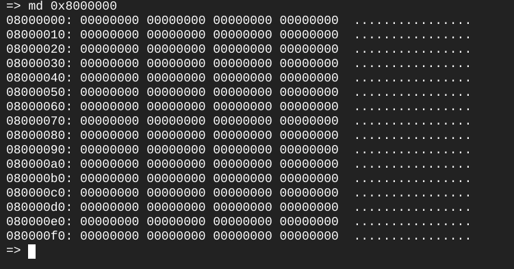    

**Variables** Variables here i could set it to a value or a script  
6. how to create new variable -> **setenv** -> create new var
EX: 

a- Variable Contain value 

```bash
setenv MYNAME=ZIDAN
echo ${MYNAME}
```
     

b- Variable contain script

7. i use **run** command to exec the variable which store -> script 

```bash

setenv MYNAME "echo Hi ; echo My Name is ; echo Zidan"
run MYNAME

```
    
- also we could use shell script if condition and loops 

EX:
 
## if condition
```bash
bash script templete 
setenv VAR1 1 
set env VAR2 1
setenv myvar "if mmc dev ;then echo sdcard exist; elif test ${VAR1} = ${VAR2} ;then echo equal; else echo no; fi"
```
 
    
## for loop
```bash

setenv LOOP "for i in 1 2 3 4;do echo ZIDAN; done"
```
    


- why i use scripts in U-BOOT ?

 to load kernel into ram there

and there is two methods to load kernel into ram

1. through sd card 

2. through internet


## AUTOBOOT

1. Auto boot happen after the first 2 seconds 

    

2. it is called something and boot it 

3. to know just echo **bootcmd**   


    

4. this is the first script to run after autoboot happen -> **bootcmd**

```bash 

run distro_bootcmd; run bootflash

```
5. it is like script run and call another script called distro_cmd then run bootflash


## what if i want to Customize the Autoboot script ?
 
- so i have  to change it from menuconfig change bootcmd to required command for EX: echo zidan
1. exit qemu (Alt+a) then X 
2. 
```bash
make menuconfig
```

3. Choose Boot Options


    

4. Choose AutoBoot Options

    

5. change here for the required command or chain or commands

    

EX: 
1. change it to echo a String

 
   
2. Load and Save

3. then run make command

```bash
make
```

4. launch qemu one more time 

```bash 
qemu-system-arm -M vexpress-a9 -nographic -kernel u-boot

```
    

## changing the autoboot delay

- if i want to change an envvar i have to enable on menuconfig 

1. exit qemu 

2. 
```bash
make menuconfig
```
3. enable editenv | saveenv

4. 

 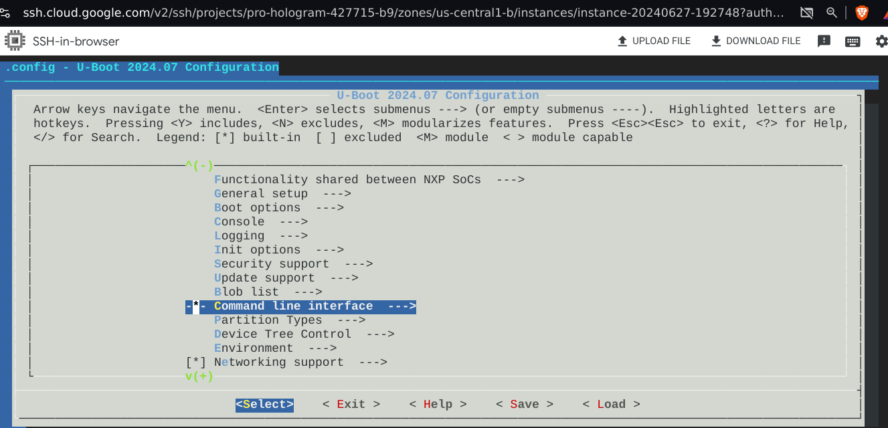   


 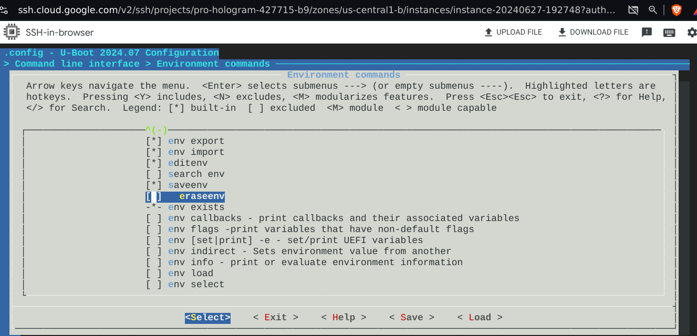   

```bash
make
qemu-system-arm -M vexpress-a9 -nographic -kernel u-boot

```
## now we can changing variable value

1. **editenv** (var_name)

2. set the new value 

3. saveenv

4. run (var_name)


EX:

  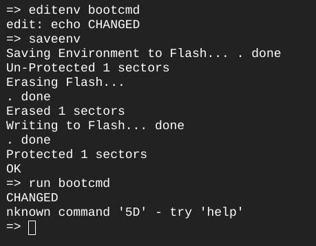   


## try it with **bootdelay** env make autoboot delay with 5 seconds 


- how to know the first address of DRAM or ROM?

   using->  **bdinfo**

  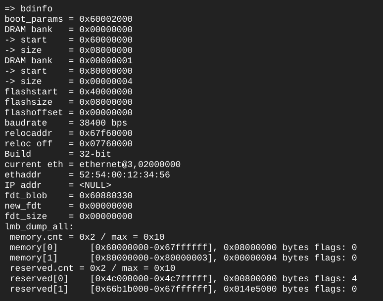   

## as we now kernel image is a file so i could load kernel on RAM in that way 

1. exit qemu

2. change directory to EMULATED SDCARD - FAT16 Partition (Bootable partition that we have create before)

  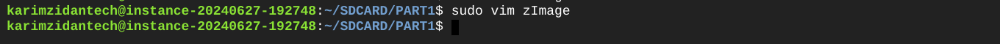   

3. create a file called zImage and write a string on it 
    
   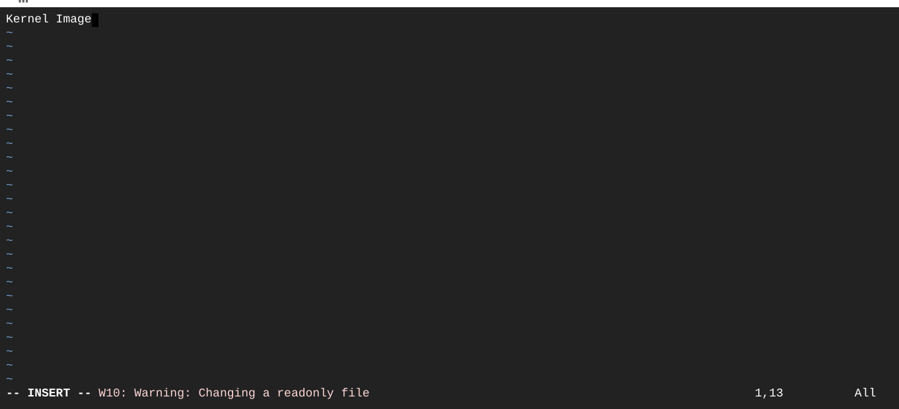   

4. now switch to qemu but add -sd /PATH/TO/EMULATEDSD.img 


```bash
qemu-system-arm -M vexpress-a9 -nographic -kernel u-boot -sd /PATH/TO/EMULATEDSD.img 

//to check that sd card has been attached
mmc dev 

```

 and - use **fatload** command 

-fatload ->fatload <interface> [<dev[:part]> [<addr> [<filename> [bytes [pos]]]]]

- there is a variable called $kernel_addr_r -> has the address of the kerenl 

   

5. now we can load the zImage and then check it on memory
EX:

```bash
    fatload mmc 0:1 0x60100000 zImage
    md 0x60100000
```

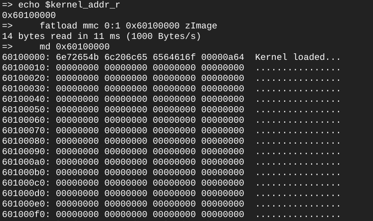   


## TFTP CONNECTION 

1. TFTP USE -> :69 -> Port

2. connection throw ethernet cable / or virtual network interface 

**what is virtual network interface**?


- setting up a new virtual network interface called tap on my host which gonna interact with uboot nic  (virtual network interface card) 

## SETPS 

- on x86

1. display the tftp on x86

```bash

sudo apt install tftp-hpa

```

2. change the configuration of tftp from --secure (read) add --create (write)

```bash
sudo vim /etc/default/tftpd-hpa
```
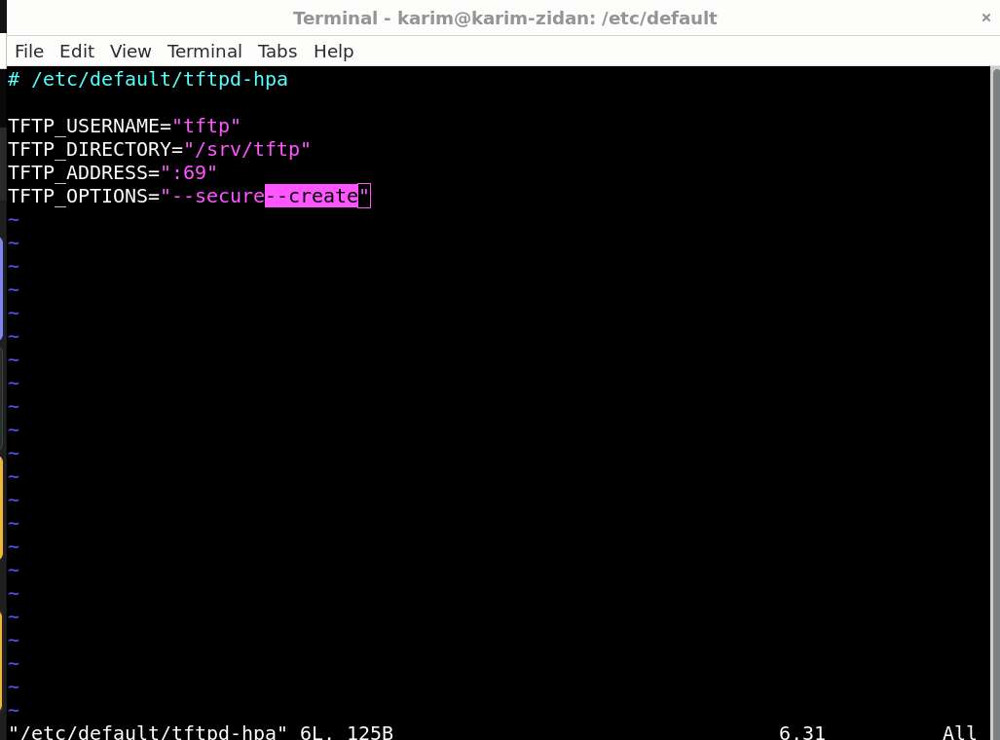   


3. change owner of the tftp folder 

```bash
sudo chown tftp:tftp /srv/tftp/

```
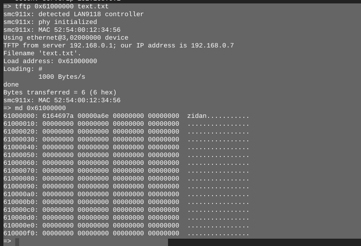   

then 

1. sudo ip tuntap add dev tap0 mode tap (run ip a -> and you will find the new interface on down mode)

    

2. add address to tap by -> ** ip a add 192.168.0.1/24  dev tap0 

3. ip set link Tap up    -> (run ifconfig and then you will find the interface on up mode now)

or just doing it by a script

```bash
sudo ip tuntap add dev tap0 mode tap
sudo add address to tap by -> ** ip a add 192.168.0.1/24  dev tap0 
sudo ip set link Tap up  
```

then access qemu using this command 

```bash 
sudo qemu-system-arm -M vexpress-a9 -nographic -kernel u-boot -sd ~/SDCARD/EMULATEDSD.img -net nic -net tap,ifname=tap0,script=/home/karimzidantech/NETWORK_SCRIPT/qemu-ifup

```

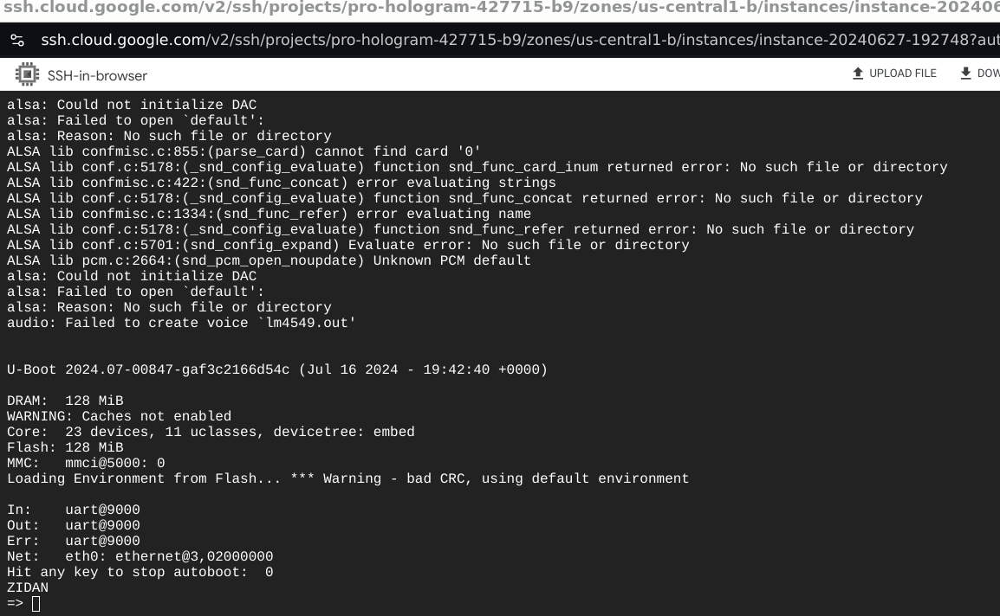   

4. setenv ipaddr  (ip) 

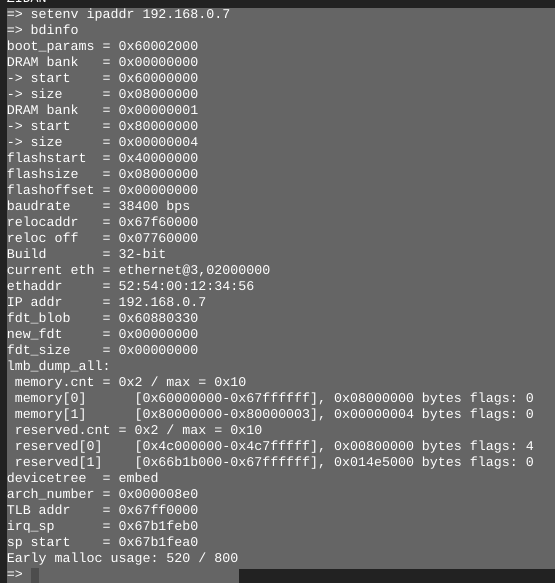   


## transfer file using tftp

**ON HOST MACHINE**
1. change directory to this tftp directory -> this file attached to tftp protocol 
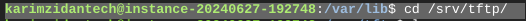   

2. touch a file (text.txt) for example then write any string on it 
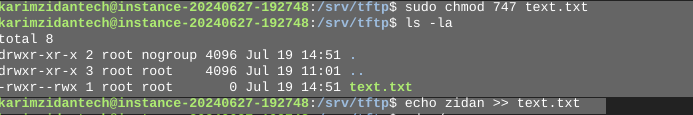

  
**on u-boot side**

1. set this variables first

- setenv ipaddr <YOUR_IP_ADDRESS> -> address different to the host 

- setenv netmask <YOUR_NETMASK> - >255.255.255.0

- setenv serverip <SERVER IP>  -> ip of host machine that runs tftp server 

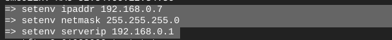   

2. in U-Boot, run bdinfo, which will allow you to find out that RAM starts at 0x60000000. Therefore, we
will use the 0x61000000 address to test tftp.

3. run this command

```bash 
tftp 0x61000000 textfile.txt

```
4. then display memory at this address

```bash
md 0x61000000
```
   


## what is the difference between U-image / Image /zImage

1. zImage -> compressed generic image for any type of bootloaders
2. Image / iImage -> uncompressed generic image for any type of bootloaders
3. Uimage -> compress/uncompressed specified for U-boot only

##What is mkimage?

mkimage is a tool that prepares files, such as kernel images, device tree blobs, and ramdisk images, for use with U-Boot. It generates images with headers that include metadata required by U-Boot to properly load and execute them.

```bash
sudo apt-get update
sudo apt-get install u-boot-tools
```

- mkimg is often used to create images of filesystems or to prepare bootable images. Here’s a basic example of how you might use mkimg:

-  simply we need it to convert our script into executable script on u-boot enviroments 

so input of mkimg is (zImage/Image)

-T -> type 

1. script
2. image(zimage - image)

-C -> the image is compressed or no 

-e -> entrypoint (address to load)

-A archeticture

-d -> path to (Script/kernel) input

```bash
mkimage -A arm -T script -C none -n 'Boot script' -d /PATH/TO/SCRIPT.txt /PATH/TO/boot_script.img

```

- run script -> source (address)
- bootm - bootz -booti -> image


 
## using EXTLINUX

when i run a command called bootflowscan 

1. uboot goes to the sdcard search for primary bootable (EFI) partition then search for extlinux.conf which going to guide u boot to the zimage directory

1. download extlinux.conf and then replace with cmdline.img

or make it by your self 
```bash
mkdir extlinux 
cd extlinux
touch extlinux.conf
```

vim extlinux.conf

```bash
LABAL my extconf
KERNEL ../zImage
FDT ../myfile.dtb
```
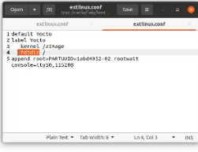   


## is DTC COMPILER DEPENDED?


