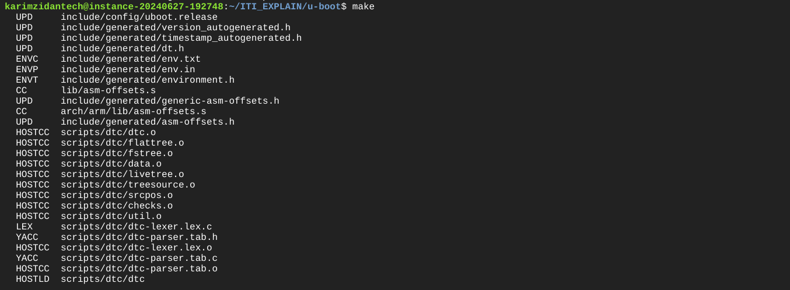

## UBOOT vs ## GRUB


## 1-Size Comparison

1. size of uboot->1MB is less than grup->100MB

**U-Boot**: U-Boot is typically quite small, often around 512KB to 1MB in size, although this can vary depending on the configuration and features included.

**GRUB**: GRUB (GRand Unified Bootloader) can be significantly larger, especially when considering the complete installation including modules and support files, which can be around 100MB.

## 2-Terminal Interface

**U-Boot** : U-Boot has a command-line interface (CLI) that allows users to interact with the bootloader, configure settings, and perform various tasks.

**GRUB**:GRUB also has a command-line interface where users can enter commands manually.


## 3-Custom Commands


**U-Boot**: U-Boot has its own set of commands tailored for embedded systems and bootloader-specific tasks.

**GRUB**: GRUB also has its own set of commands, which are different from those in U-Boot.


## MORE ABOUT U-BOOT

1. **U-Boot**: On some platforms, like the Raspberry Pi, start.elf is part of the boot sequence that is handled by the firmware. To use U-Boot in such environments, it might be necessary to customize the boot process, but this involves modifying how the firmware loads U-Boot.

2. **U-Boot** is designed for embedded systems and can be used to boot a Linux kernel in environments with limited 
 resources (RAM).

## Summary 

1. U-Boot is generally smaller in size compared to GRUB.

2. Both U-Boot and GRUB have terminal interfaces.

3. Both have their own command sets.

4. U-Boot is suited for small footprint systems and can boot a Linux kernel.

5. Customizing the boot sequence to load U-Boot before the operating system image might involve modifications specific to the platform's firmware.

# Prerequisites 

## 1-Previous Lecture ->Creating Emulated SDCARD (Link to the steps)

- we made the following

1. first Partition FAT16 (200MB) this partition going to contain-> [U-boot,kernel,bootcode.bin Start.elf] 

2. the second Partition will be for applications (user space ,rootfilesystem)

## 2-CROSS TOOLCHAIN -> (Link to Quick Guide)

1. we build a cross tool chain for Arm-a9 Arch 

## Ensure the following packages are installed on your system 

```bash 
sudo apt install cfdisk
sudo apt-get install qemu-system
sudo apt-get install device-tree-compiler
git clone git://git.denx.de/u-boot.git
```


## Set Up Board Configurations

1. clone u-boot 

```bash 
git clone git://git.denx.de/u-boot.git
cd /u-boot
```
2. choose board configurations

```bash 
cd /configs
ls | grep "vexpress"
```


3. choose "vexpress_ca9x4_defconfig"

4. make vexpress_ca9x4_defconfig

```bash 
#changing current directory to u-boot directory
cd ..
make vexpress_ca9x4_defconfig

```


4. modify the CROSS_COMPILE envvar on makefile

**NOTE** 

with out modifing the CROSS_COMPILE destination that we have built before using ct-ng it will compile the u-boot with native compiler (x86) 

- here is the var CROSS_COMPILE


a. change directory to /x-tools -> the output of ct-ng build tool


b. copy the current PATH 

c. move back to u-boot directory 

d. OVERWRITE CROSS_COMPILE var -> export CROSS_COMPILE=/PATH/TO/arm-cortexa9_neon-linux-musleabihf-
   


5- build our u-boot

```bash
make
```


**FINAL OUT**


**MAKING SURE That we have built for the right board**

```bash
strings u-boot.bin | grep -i board
```


**board=vexpress**

- So now We have built the U-boot and we going to boot from qemu emulator
 
## qemu

```bash
sudo apt-get install qemu-system
sudo apt-get install device-tree-compiler
```

- to open qemu emulator run the follwing command with board and arch info 
```bash
 qemu-system-arm -M vexpress-a9 -nographic -kernel u-boot 
```
- output will be like this :


## u-boot Commands

2. **bfinfo** -> command in U-Boot prints detailed information about the board configuration and hardware setup

    

3. **mmc dev** -> Check if there is SDCARD connected 

    a- case that we do not have SDCARD OUTPUT WILL BE:

    

    b- case that we already attached SDCARD OUTPUT WILL BE:

    

4. **echo** -> normal terminal echo 

    


5. **printenv** -> print variable

     

**Variables** Variables here i could set it to a value or a script  
6. how to create new variable -> **setenv** -> create new var
EX: 

a- Variable Contain value 

```bash
setenv MYNAME=ZIDAN
echo ${MYNAME}
```
     

b- Variable contain script

7. i use **run** command to exec the variable which store -> script 

```bash

setenv MYNAME "echo Hi ; echo My Name is ; echo Zidan"
run MYNAME

```
    
- also we could use shell script if condition and loops 

EX:
 
## if condition
```bash
bash script templete 
setenv VAR1 1 
set env VAR2 1
setenv myvar "if mmc dev ;then echo sdcard exist; elif test ${VAR1} = ${VAR2} ;then echo equal; else echo no; fi"
```
 
    
## for loop
```bash

setenv LOOP "for i in 1 2 3 4;do echo ZIDAN; done"
```
    


- why i use scripts in U-BOOT ?

 to load kernel into ram there

and there is two methods to load kernel into ram

1. through sd card 

2. through internet


## AUTOBOOT

1. Auto boot happen after the first 2 seconds 

    

2. it is called something and boot it 

3. to know just echo **bootcmd**   


    

4. this is the first script to run after autoboot happen -> **bootcmd**

```bash 

run distro_bootcmd; run bootflash

```
5. it is like script run and call another script called distro_cmd then run bootflash


## what if i want to Customize the Autoboot script ?
 
- so i have  to change it from menuconfig change bootcmd to required command for EX: echo zidan
1. exit qemu (Alt+a) then X 
2. 
```bash
make menuconfig
```

3. Choose Boot Options


    

4. Choose AutoBoot Options

    

5. change here for the required command or chain or commands

    

EX: 
1. change it to echo a String

 
   
2. Load and Save

3. then run make command

```bash
make
```

4. launch qemu one more time 

```bash 
qemu-system-arm -M vexpress-a9 -nographic -kernel u-boot

```

 


## attach EMULATED SD card that we create before with qemu 


13. how to attach sdcard ? -> 

```bash
qemu-system-arm -M vexpress-a9 -nographic -kernel u-boot **-sd** ../PATH/TO/SD.img
```


13. then **bootdelay** is 2 seconds and i want to change it what should i do ?


1. make menuconfig
2. bootd -> run bootcmd like it 
3. saveenv
4. editenv
5. mmc 

- search on command line interface for what you need 

- uboot.env-> when uboot runs he reads it like .bashrc 

6. **md** -> display address in ram 

7. how to know the first address bdinfo

8. kernel is a file so i could load kerneel in that way 


9. fatload ->fatload <interface> [<dev[:part]> [<addr> [<filename> [bytes [pos]]]]]
    EX:fatload mmc 0:1 0x60100000 zImage
      : md 0x60100000

10. kerenel need two files dtp and need the zimage 

11. $kerenel_addr_r -> address provided by qemu to load in ram ->zimage
    => printenv kernel_addr_r 
    kernel_addr_r=0x60100000

   $fdt_addr= device tree file 
    => printenv fdt_addr_r
    fdt_addr_r=0x60000000

12. setenv bootcmd "fatload mmc 0:1 ${kernel_addr_r} zImage;md ${kernel_addr_r}"

13. saveenv

14. editenv bootcmd 

## TFTP

1. :69 -> Port

2. connection throw ethernet cable / or virtual network interface 

**what is virtual network interface**?

between x86 which is my host (Tap) -> anew network interface on my host  on x86   (Nic) on qemu -> do it on emulator as **-net**  

## on host side
1. add Tap by -> ** ip a add 192.168.1.8/24  dev Tap 

2. ip set link Tap up  

3. on qemu side -> qemu-system-arm  -> then add  -net nic -net Tap,script=add the two commands upwards (add Tap then ipset)  replace Tap  ->(1. add Tap by -> ** ip a add 192.168.1.8/24  dev $1 ) 2.(ip set link $1 up  )                **-kernel at last command** 


4. set env ipaddr =sam ip 192.168.1.(new host ip) 


5. search for loading file into ram  

source -> mkimg


 


