U-Boot Script Explanation


## Overview

This U-Boot script is designed to attempt to boot a kernel image (zImage) and a Device Tree Blob (DTB_FILE.dtb) from either an MMC (MultiMediaCard) device or over the network via TFTP (Trivial File Transfer Protocol). The script will try multiple times to locate and load these files based on the availability of the MMC device and network connection.

1. **Detecting an SD Card**: Scans MMC slot to find an SD card.
2. **Loading Files from SD Card**: If an SD card is found, loads the kernel image and device tree blob from it.
3. **Fallback to Network Loading**: If no SD card is detected, attempts to load the files from a network using TFTP.
4. **Handling Absence of Options**: Prints a message if neither an SD card nor network connectivity is available.

## Script Breakdown

### 1. Initialize Environment Variables

```sh
setenv serverip 192.168.0.1
setenv ipaddr 192.168.0.2
setenv netmask 255.255.255.0

```
1. serverip:Sets the IP address of the TFTP server where the kernel and Device Tree files will be retrieved from if not found on the MMC device.

2. ipaddr: Sets the IP address of the current device (e.g., the U-Boot host).

3. netmask : Defines the subnet mask for the network.

## Main Loop

```sh
for trying_num in 0 1 2 3 4; do
```
- This loop will iterate 5 times (from 0 to 4), attempting each time to load the kernel and Device Tree from the MMC or TFTP, depending on availability.

## Detect SDCARD

```sh
if mmc dev 0; then

```
- mmc dev 0: Checks if the MMC device (typically the first MMC device) is available. If the MMC device is present, the script proceeds with loading the kernel and Device Tree from it.

```sh
    fatload mmc 0:1 ${kernel_addr_r} zImage
    fatload mmc 0:1 ${fdt_addr_r} DTB_FILE.dtb
    bootz ${kernel_addr_r} - ${fdt_addr_r}
```
- fatload mmc 0:1 ${kernel_addr_r} zImage: Loads the kernel image (zImage) from the first partition of the MMC device (mmc 0:1) into the memory address specified by kernel_addr_r.

- fatload mmc 0:1 ${fdt_addr_r} vexpress-v2p-ca9.dtb: Loads the Device Tree Blob (vexpress-v2p-ca9.dtb) from the MMC device into the memory address specified by fdt_addr_r.

- bootz ${kernel_addr_r} - ${fdt_addr_r}: Boots the kernel image (zImage) with the Device Tree Blob (vexpress-v2p-ca9.dtb) from the specified memory addresses.


## Checking Network Connection

```sh

elif ping ${serverip}; then

```
- ping ${serverip}: Checks if the TFTP server at serverip is reachable. If the server is reachable, the script proceeds to load files via TFTP.


```bash
    echo "NETWORK CONNECTION FOUND LOADING..."
    tftp ${kernel_addr_r} ${serverip}:/PART1/zImage
    tftp ${fdt_addr_r} ${serverip}:/PART1/DTB_FILE.dtb
    bootz ${kernel_addr_r} - ${fdt_addr_r}

```

- echo "NETWORK CONNECTION FOUND LOADING...": Prints a message indicating that the network connection has been found and that the script is loading files from the TFTP server.

- tftp ${kernel_addr_r} zImage: Retrieves the kernel image (zImage) from the TFTP server and loads it into the memory address specified by kernel_addr_r.

- tftp ${fdt_addr_r} vexpress-v2p-ca9.dtb: Retrieves the Device Tree Blob (vexpress-v2p-ca9.dtb) from the TFTP server and loads it into the memory address specified by fdt_addr_r.

- bootz ${kernel_addr_r} - ${fdt_addr_r}: Boots the kernel image (zImage) with the Device Tree Blob (vexpress-v2p-ca9.dtb) from the specified memory addresses.


## No Options Available


```bash
else
    echo "NO OPTIONS"
```
**Environment Variables**

1. kernel_addr_r: Memory address for loading the kernel image.
2. fdt_addr_r: Memory address for loading the device tree blob.
3. serverip: IP address of the TFTP server used for network loading.


## EXPLAINATION 

1. write the script on .txt extension and set it on FAT partition on virtual SDCARD


2. open qemu and attach SD CARD 


```bash 
sudo qemu-system-arm -M vexpress-a9 -nographic -kernel u-boot -sd PATH/TO/EMULATEDSD.img -net nic -net tap,ifname=tap0,script=/PATH/TO/NETWORKSCRIPT

```


3. lets load the script as a .txt file like this


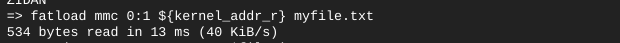


- we load it as a .txt file just strings so we can not execute it 

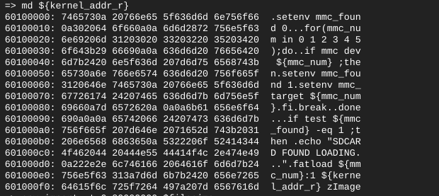


- if you try to execute you going to get this error

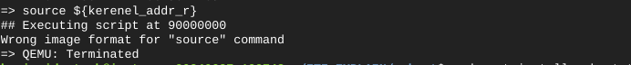


**What is the solution ?**

- mkimage 

- What is mkimage?

mkimage is a tool that prepares files, such as kernel images, device tree blobs, and ramdisk images, for use with U-Boot. It generates images with headers that include metadata required by U-Boot to properly load and execute them.

```bash
sudo apt-get update
sudo apt-get install u-boot-tools
```
- simply we need it to convert our script into executable script on u-boot enviroments 

1. use this command to convert our .txt script into .img 

```bash
mkimage -A arm -T script -C none -n 'Boot script' -d /PATH/TO/SCRIPT.txt /PATH/TO/boot_script.img

```
-T -> type 

1. script
2. image(zimage - image)

-C -> the image is compressed or no 

-e -> entrypoint (address to load)

-A archeticture

-d -> path to (Script/kernel) input


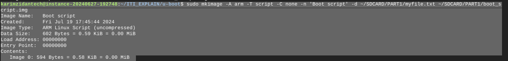


2. move it into the FAT partition of our EMULATED SDCARD


3. launch qemu 

```bash 
sudo qemu-system-arm -M vexpress-a9 -nographic -kernel u-boot -sd ~/SDCARD/EMULATEDSD.img -net nic -net tap,ifname=tap0,script=/home/karimzidantech/NETWORK_SCRIPT/qemu-ifup
```


4. load the boot_script.img into ram

```bash
fatload mmc 0:1 (address) (scriptname.img)
#then memory display at this address
md (address)
```
EX:


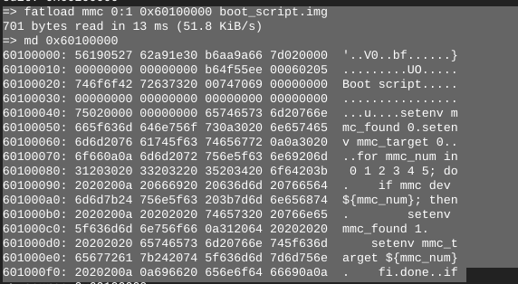


5. now if we tried to run the script it gonna execute


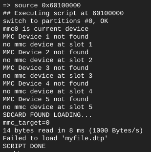


6. so now we gonna create simple file called zImage on the FAT Partition on SDCARD contain a string to make sure that script behave on the right way and load the kernel   


```bash 

sudo vim zImage 

```

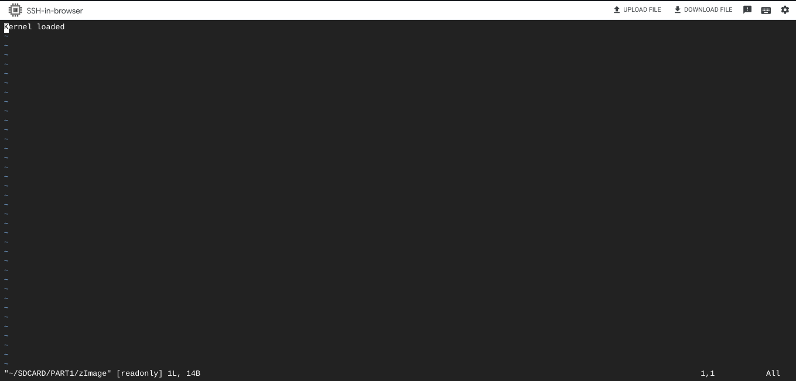 


- So now we have boot_script.img and zImage on the fat partition , we going to use boot_script.img to auto load zImage on ram as we mentioned before on the script explaination 
 
```bash
    fatload mmc ${mmc_target}:1 ${kernel_addr_r} zImage
```

7. on qemu side now we going to check on ${kernel_addr_r} the address where script has loaded zImage

**if you quit qemu you need to reload the script**


```bash
fatload mmc 0:1 (address) (scriptname.img)

```

- md (address) check that script already loaded


8. now execute the script and you will find that zImage is loaded 

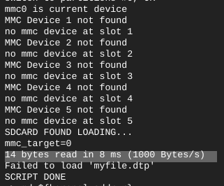 

9. check on ${kernel_addr_r} on ram and you will find the string we wrote before on zImage "Kernel Loaded"

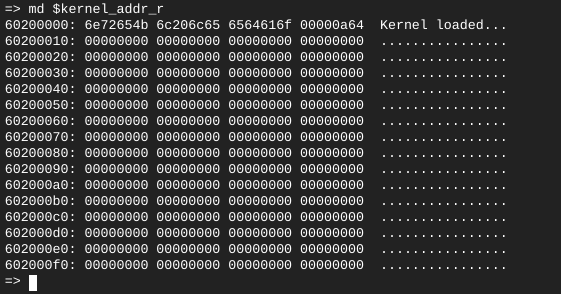  


## now we need to make bootcmd load the script manually once autoboot called

- so we going to editenv the bootcmd (you need to enable saveenv and editenv from menuconfig first)

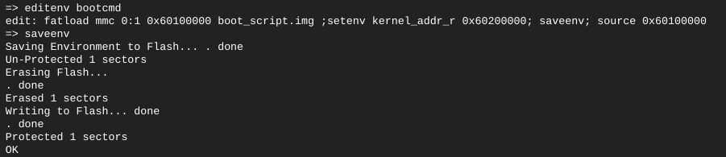 

- once autoboot called bootcmd (firstscript of u-boot) we need the following   

1. load the script from fat partition from sd card on $kernel_addr_r which is prefered to write it directly on hex form 0x60100000 and we gonna findout why or just before loading set a new envvar to 0x60100000 and use it choose what suits u


```bash
fatload mmc 0:1 $kernel_addr_r boot_script.img 
```


2. then we need to add an offset to $kernel_addr_r because we don't need to overwrite our script so we going to edit $kernel_addr_r and save it

```bash
setenv kernel_addr_r 0x60200000 ; saveenv 
```
3. execute the script which located at 0x60100000


4. so our simple second script gonna be and save it on bootcmd  (change it from menuconfig or using envedit command )


```bash

envedit bootcmd

fatload mmc 0:1 0x60100000 boot_script.img ;setenv kernel_addr_r 0x60200000 ; saveenv ; source 0x60100000

```

5. to save the script value into bootcmd (you need to enable saveenv and editenv from menuconfig first)


```bash
saveenv 
```
6. so now if you tried to 


```bash
run bootcmd
```
- SCRIPT GONNA BE EXECUTED AND YOU GONNA FIND KERNEL ON REQUIRED ADDRESS ON RAM

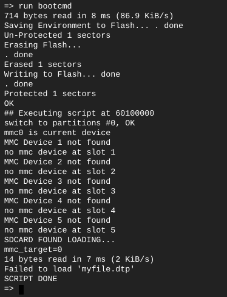 


  


