## Layer Design 

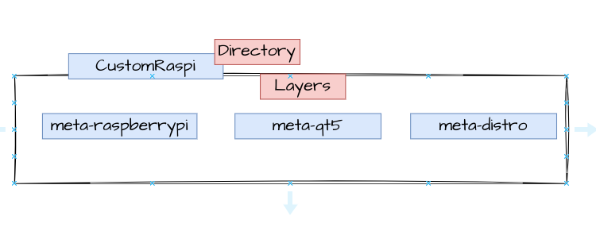

-I packed my layers into main **Directory** called meta-Customraspi
- **1-meta-raspberrypi** : This is the board support package layer for the 
     Raspberry Pi.

- **2- meta-qt5** has the qt5 

- **3- meta-distro** this is our custom layer contain the following 

        a- distro configuration file 
    
        b- image recipe "core-image-zidan"

        c- packages recipe Ex: our Qt Application


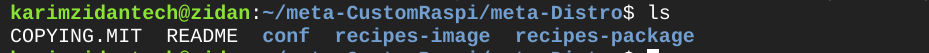
lets figure out 

## Cloning BSP for raspberry pi

1- visit (https://layers.openembedded.org/layerindex/branch/master/layers/)


2- search for raspberrypi , and select meta-raspberrypi

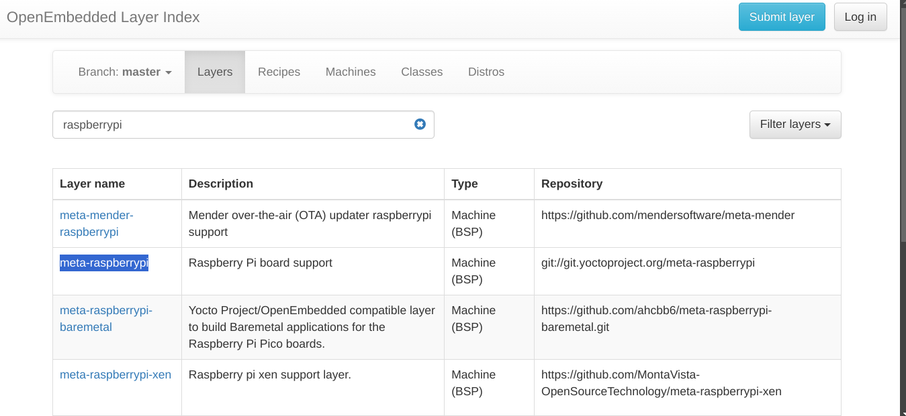

3- clone meta-raspberrypi from here


`git clone -b kirkstone git://git.yoctoproject.org/meta-raspberrypi`

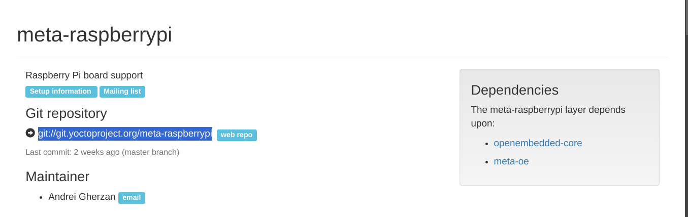

4- add the layer to your yocto project
`bitbake-layers add-layer /PATH/TO/meta-raspberrypi`


 **this DEPENDENCIS Layer should be included on your yocto project**

## Cloning Qt-5 Layer

1- on same website search for meta-qt5

 (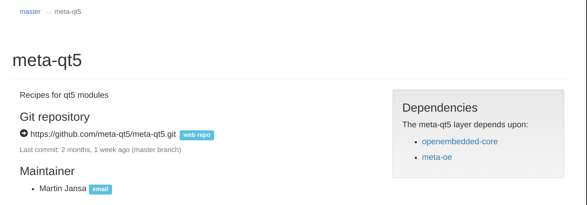)


 2- from our Meta-CustomRasp Layer 

 `git clone -b kirkstone https://github.com/meta-qt5/meta-qt5.git`

 3- add meta-qt5 

`bitbake-layers add-layer /PATH/TO/meta-customRaspi/meta-qt5`

 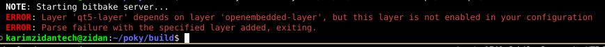

 4- we will get this error because meta-qt5 depends on another layers

 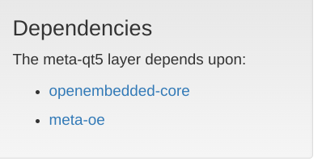


 5- clone the openembedded-core 

 `git clone -b kirkstone git://git.openembedded.org/openembedded-core`

 6- so now after cloning both you will find meta-oe layer inside openembedded-core layer by default

 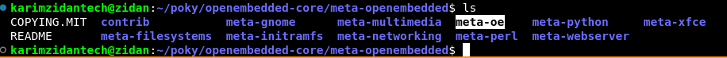


 7- add meta-oe to the bblayers.conf

`bitbake-layers add-layer /PATH/TO/meta-oe`

 `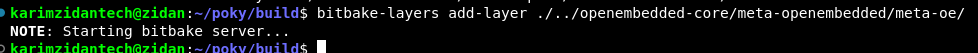


8- now we could add the meta-qt5 to bblayers.conf

`bitbake-layers add-layer /PATH/TO/meta-customRaspi/meta-qt5`


## create distro layer 
1- create a new layer for our custom distro inside meta-CustomRaspi

`bitbake-layers create-layer meta-distro`

2- add this layer to bblayer.conf 
- or from build directory

`bitbake-layers add-layer /PATH/TO/meta-CustomRaspi/meta-distro`

2- mkdir /distro  under /conf directory


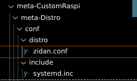

3- create disro conf file with the name of your distro 

**i inherit from poky distro and overwrite some variables with my configurations**

```bash
include meta-poky/conf/distro/poky.conf

DISTRO = "zidan"
DISTRO_NAME = "zidan"
DISTRO_VERSION = "4.0.20"
DISTRO_CODENAME = "kirkstone"

MAINTAINER="karimzidantech@gmail.com"

ZIDAN_DEFAULT_DISTRO_FEATURES = "largefile opengl ptest multiarch wayland vulkan ssh wifi qt5 x11"

DISTRO_FEATURES ?= "${DISTRO_FEATURES_DEFAULT} ${ZIDAN_DEFAULT_DISTRO_FEATURES}"


INIT_MANAGER = "systemd"
DISTRO_FEATURES:append = " systemd"
VIRTUAL-RUNTIME_init_manager = "systemd"
DISTRO_FEATURES_BACKFILL_CONSIDERED:append = " sysvinit"
VIRTUAL-RUNTIME_initscripts = "systemd-compat-units"
VIRTUAL-RUNTIME_login_manager = "shadow-base"
VIRTUAL-RUNTIME_dev_manager = "systemd"

```


4- add qt5 as a DISTRO_FEATURE 

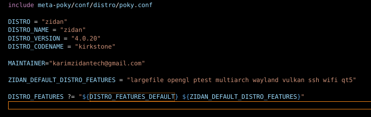


5- as i mentioned i add systemd and set it as the default init process

6- now lets create our qt application recipe 

**CREATE YOUR OWN QT_GUI APPLICATION AND MAKE A RECIPE TO CLONE IT**
- on my case i create directory on my meta-distro called **recipes-package** -> this directory will contain all the custom packages we want to include them into our image


```bash
cd meta-CustomRaspi/meta-distro

#create a subdirectory called QT_GUI that will contain our qt application
mkdir -p recipes-packages/QT_GUI 


touch qt-gui.bb
```

```bash
DESCRIPTION = "A simple GUI based on pyqt5"
LICENSE = "CLOSED"
DEPENDS += " qtbase"

S = "${WORKDIR}/git"

SRC_URI = "git://github.com/KarimZidan007/YOCTO_QT;branch=main;protocol=https"
SRCREV = "efa2269345dc9f8bb80ccbb4f10f89dbd571bba2"

do_install:append () {
    install -d ${D}${bindir}
    install -m 0755 QT_GUI ${D}${bindir}/qt-gui
}


PN = "qt-gui"

FILES:${PN}  = "${bindir}"

inherit qmake5

PROVIDES = "qt-gui"

```
customize your recipe like this one 

**NOTE you have to inherit qmake5** 


7- now lets create our image recipe 


```bash

cd meta-CustomRaspi/meta-distro

#create a subdirectory called QT_GUI that will contain our qt application
mkdir -p recipes-image/core-image-zidan


touch core-image-zidan.bb

```

i copied core-image-sato.conf content and i customized it 

```bash
DESCRIPTION = "Image with Sato, a mobile environment and visual style for \
mobile devices. The image supports X11 with a Sato theme, Pimlico \
applications, and contains terminal, editor, and file manager."
HOMEPAGE = "https://www.yoctoproject.org/"

IMAGE_FEATURES += "splash package-management x11-base x11-sato ssh-server-dropbear hwcodecs "

LICENSE = "MIT"

inherit core-image

inherit rm_work

IMAGE_INSTALL += " qt-gui qtbase qtdeclarative qttools"

IMAGE_NAME="zidan-rpi-sdimg"

IMAGE_FSTYPES="tar.xz ext3 rpi-sdimg"

TOOLCHAIN_HOST_TASK:append = " nativesdk-intltool nativesdk-glib-2.0"
TOOLCHAIN_HOST_TASK:remove:task-populate-sdk-ext = " nativesdk-intltool nativesdk-glib-2.0"

QB_MEM = '${@bb.utils.contains("DISTRO_FEATURES", "opengl", "-m 512", "-m 256", d)}'
QB_MEM:qemuarmv5 = "-m 256"
QB_MEM:qemumips = "-m 256"


```

**NOTES you have to append your gui-application-name ,qtbase ,qtdeclarativeand qttools to IMAGE_INSTALL**

- IMAGE_FSTYPES="tar.xz ext3 rpi-sdimg"

add rpi-sdimg to get a bootable sd card image


8- go to /poky/"build-dir-name"/conf/local.conf

make MACHINE="raspberrypi3" 

DISTRO="zidan" (your distro name same as the file.conf we created on our meta-distro/conf/distro/)


9- after customize our layers , lets build
```bash

source oe-init-build-env zidan-image

bitbake core-image-zidan


```

9- after building finshed 

- you will find the sd-img bootable image on this directory 
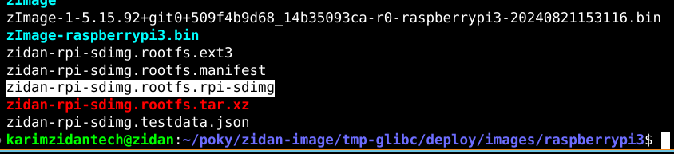


10- use this command to flash your image into your sdcard or usb

`sudo dd if=your-image-sd-img  of=/dev/yourdevice bs=4M status=progress`


11- modify the config.txt on bootable partition  

```bash
#add

kernel="kernel7"

```

12- lets boot and run our qt-gui application


## after booting 
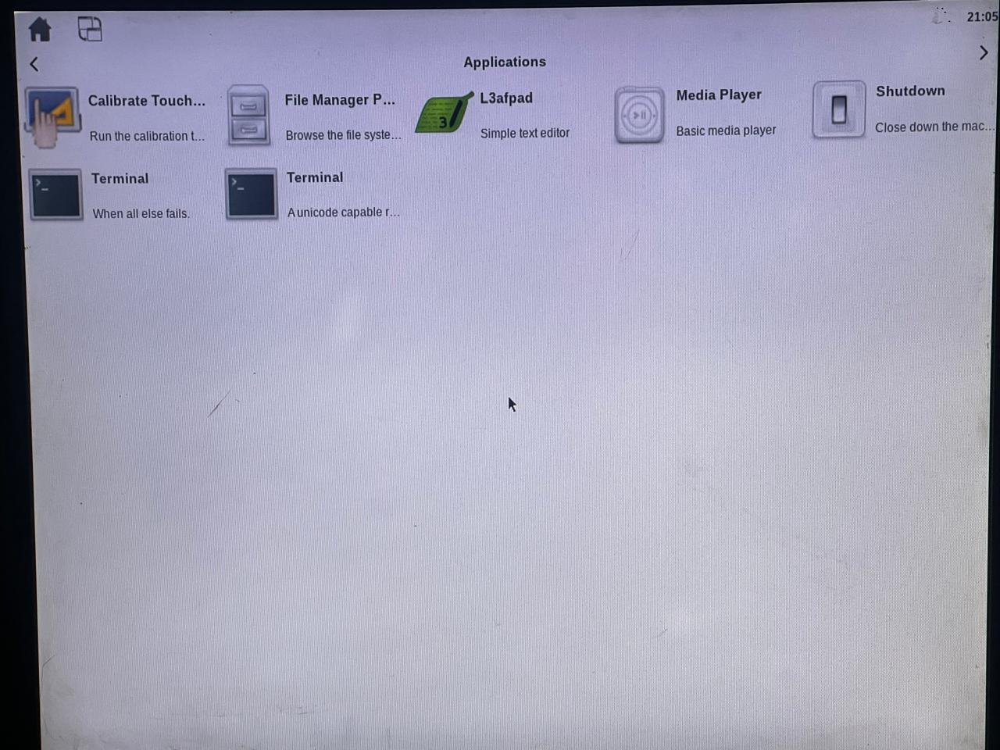

## searching under /usr/bin for our qt-gui application
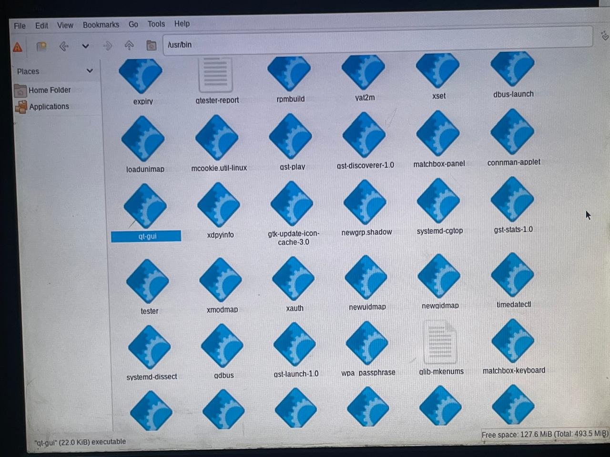


## run the simple application 
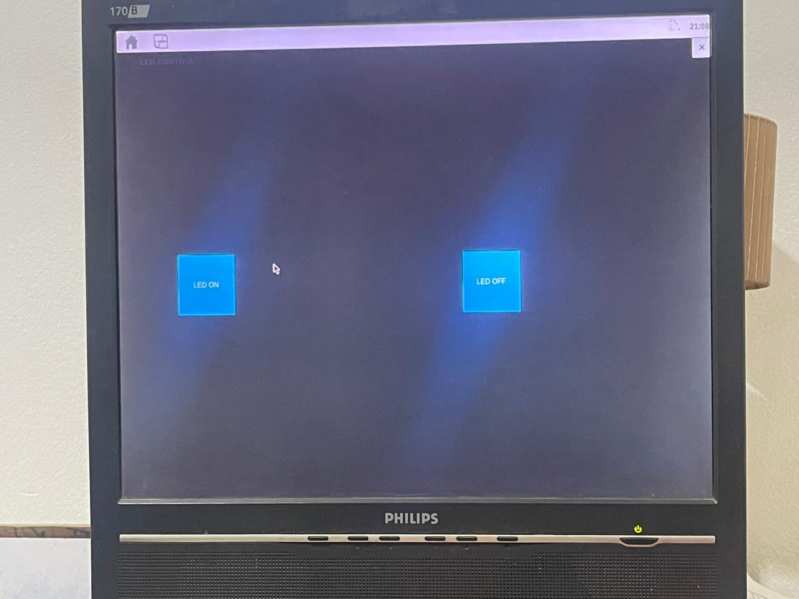


13- test our GUI application by Controling a led

<video controls src="WhatsApp Video 2024-08-22 at 12.12.20 AM.mp4" title="Title"></video>
