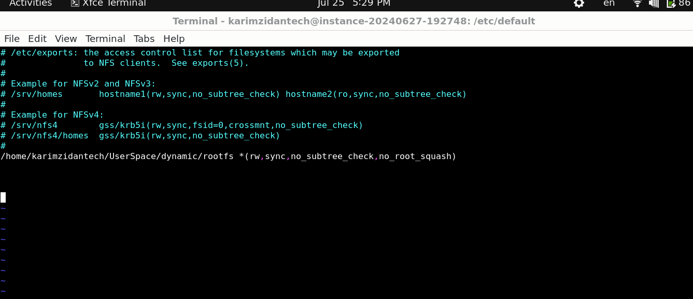

## BOOTING INTO NFS TASK

1. What is NFS ?

a root file system on another machine on Network

2. why we use it ?

on developing phase without inserting in and out the usb or sd card use the nfs to test an application on run time or fetch logs from targets and trace it


**your kernel has to be configured with CONFIG_ROOT_NFS ENABLE BY DEFAULT**
## on Host Machine SIDE

```bash
 sudo apt install nfs-kernel-server

sudo vim /etc/exports


/home/karimzidantech/rootfs *(rw,sync,no_subtree_check,no_root_squash)

```
* on the exports file line means that any client ip could access rootfs (if you want to make it available for specific address just replace * with ip)





or


## Ask NFS server to apply this new configuration (reload this file)

```bash

sudo exportfs -r


```

## on U-BOOT  SIDE


1. set the host - server -netmask configurataions 


```bash
setenv serverip 192.168.0.1
setenv ipaddr 192.168.0.2
setenv netmask 255.255.255.0

```


2. 


```bash

tftpboot $kernel_addr_r zImage
tftpboot $fdt_addr_r vexpress-v2p-ca9.dtb

```


3. set bootargs passed to kernel to notify kenerl that iam using nfs and you will find it on <server-ip>:<root-dir> 

```bash
# i have to add this info to the kernel through bootargs 
root=/dev/nfs rw nfsroot=<host-ip>:<root-dir> ip=<target-ip> init=/sbin/init

```

1. root=/dev/nfs

/dev/nfs: This tells the kernel that the root filesystem will be provided via NFS. This is a placeholder that indicates the use of NFS for the root filesystem.
Purpose:

Kernel Boot: During the boot process, the kernel needs to know where to find its root filesystem. By setting root=/dev/nfs, you're informing the kernel that the root filesystem will be available over the network, and it should prepare to mount it via NFS.

2. nfsroot=<host-ip>:<root-dir>
The nfsroot parameter provides additional details necessary for the kernel to locate and mount the NFS root filesystem.


```bash
setenv bootargs  root=/dev/nfs ip=192.168.0.2:::::eth0 nfsroot=192.168.0.1:/home/karimzidantech/Usersace/dynamic/rootfs,nfsvers=3,tcp rw init=/sbin/init
```


3. booting the kernel after passing all arguments (nfs ,initproc)


```bash 

bootz $kernel_addr_r - $fdt_addr_r 

```


this process are provided as a Script as a task -> (link)
