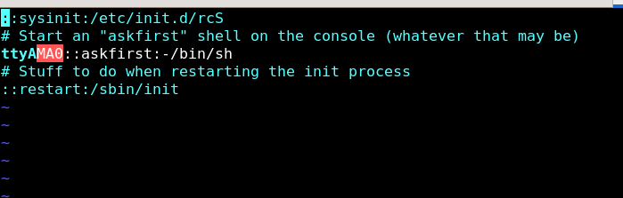

## Task Description

1. BOOT INTO RAMFS
2. mount devtmpfs , procfs ,sysfs 
3. launch a script by init process (/sbin/init) that ask user which rootfile system you want to changeroot to it 
4. once user choose script gonna mount the partition we choosed and change root into it 


## STEP ONE (BOOTING INTO RAMFS) -> check this notes about ramfs and how to build it (link)

**prerequisites**
 
1. u-boot 
2. zImage (kernel image has been build for our vexpess-ca9 )
3. .dtb   (device tree blob for vexpress-ca9)
4. uRamfs (make sure you have build it statically and make it small size as possible -large ramfs cause problems)


## We Choosed /sbin/init as init process after i boot with ramfs which is gonna parse /etc/inittab as we explained before

**i want /sbin/init (init process) to mount the procfs on /proc and devtmpfs on /dev and sysfs  on /sys**

- so before we gonna compress our ramfs i have to customize my configuration 

1. mount -t proc proc /proc 

2. mount -t sysfs sysfs /sys

3. mount -t devtmpfs devtmpfs /dev

4. launch my Script 


- so lets change directory to our ramfs 


```sh

cd PATH/TO/ramfs/

cd /etc 

touch inittab 

mkdir init.d 

touch ./init.d/rcS 

```

## 1- add configurations to the inittab 

```bash

## launch a process called rcS that going to mount the devnodes
::sysinit:/etc/init.d/rcS

# Start an "askfirst" shell on the console (whatever that may be)

ttyAMA0::askfirst:-/bin/sh

# Stuff to do when restarting the init process

::restart:/sbin/init

```


## 2- add rcS script

```sh

cd init.d 

vim rcS

```


- ADD THIS steps

```sh
#!/bin/sh

mount -t proc proc /proc

mount -t sysfs sysfs /sys

mount -t devtmpfs devtmpfs /dev

sh PATH/TO/OURSCRIPT //we will create it on next steps
```


2. run our script that ask user to choose between fsdiskone or fsdisk two


# Script Explanation

This script provides a simple menu for selecting between two root filesystems (rootfs_one and rootfs_two) or quitting and use ramfs. It uses the chroot command to change the root directory to the selected root filesystem.


## Script Content

```sh

#!/bin/sh
echo "Select an option:"
echo "1) rootfs_one"
echo "2) rootfs_two"
echo "3) quit"
read -r choice

case $choice in
    1)
        mkdir -p /mnt/rootfs_one
        mount -t ext4 /dev/mmcblk0p2 /mnt/rootfs_one
        /bin/chroot /mnt/rootfs_one
        ;;
    2)
        mkdir -p /mnt/rootfs_two
        mount -t ext4 /dev/mmcblk0p3 /mnt/rootfs_two
        /bin/chroot /mnt/rootfs_two
        ;;
    3)
        echo "Quitting..."
        break
        ;;
    *)
        echo "Wrong selection"
        ;;
esac


```

## 1-MenuDisplay


```sh
echo "Select an option:"
echo "1) rootfs_one"
echo "2) rootfs_two"
echo "3) quit"

```
## 2-User input

```sh

read -r choice

```

## This line starts a case statement to handle different values of choice.

```sh
case $choice in
```
## option one (create a directory and mount the rootfs on it and then change root to it)
```sh
1)
    mkdir -p /mnt/rootfs_one
    mount -t ext4 /dev/mmcblk0p2 /mnt/rootfs_one
    /bin/chroot /mnt/rootfs_one
    ;;

```
## option two same as option one but load rootfs from partition3

```sh
2)
    mkdir -p /mnt/rootfs_two
    mount -t ext4 /dev/mmcblk0p3 /mnt/rootfs_two
    /bin/chroot /mnt/rootfs_two
    ;;

```

## choose to stay on ramfs 

```sh
3)
    echo "Quitting..."
    break
    ;;

```

## save this script on /bin and it is name and path should be the same on rcS that we made before


## now iam going to cp rootfs into ext4 partitions 


- iam going to touch a file on each partition as a flag to make sure that script works well

1. ON PARTITION ONE


2. ON PARTITION TWO


## 1-LAUNCH QEMU


## 2-LOAD KERNEL


## 3- LOAD DTB 


## 4- LOAD RAMFS (0x61000000) address is sutible for vexpress-a9


## 5- EDIT KERNEL PARAMETERS (notify that init proc will be /sbin/init

 


## 6- start kernel

```sh
bootz $kernel_addr_r 0x61000000 $fdt_addr_r 

```


## WE BOOT INTO RAMFS AND SCRIPT WORKS 


## LETS CHOOSE PART_TWO


