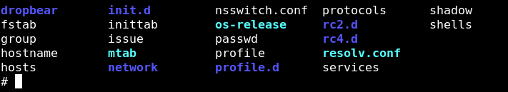
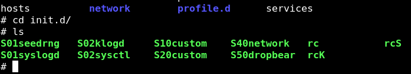
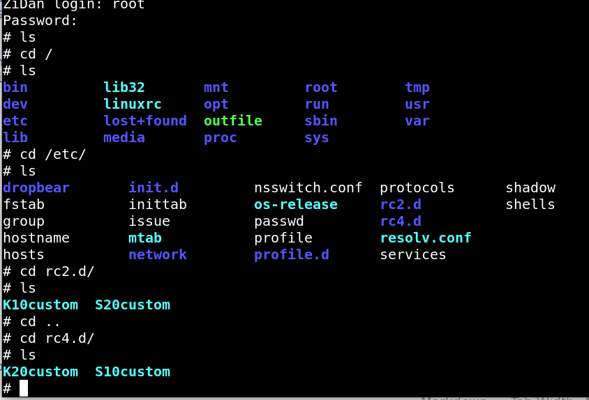
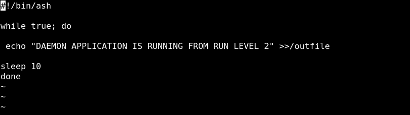
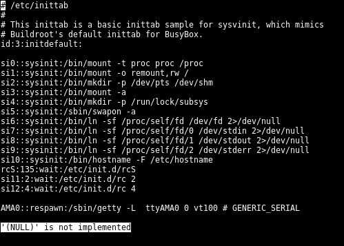
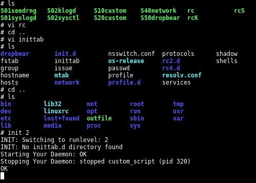
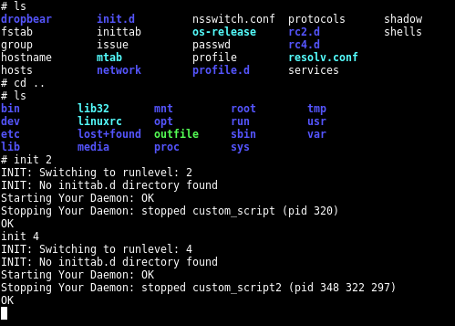
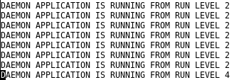

## Customized System-V

- as i mentioned before what is system-v and how system-v works -> check here (https://github.com/KarimZidan007/Andriod-Automotive/tree/main/Embedded_Linux_NOTES/5-InitProcess)

- so lets implement directly

## TASK DESCRPTION

1. customize two run levels (2,4)

2. create two scripts that control two bash scripts on /usr/bin to (start , stop ) daemons

3. create 2 simple bash scripts on /usr/bin one for every run level both log on same file (/output) but with different flags 

4. every run level Start a script and kill the other run level script through a nother script called rc


-----------------------------------------------------------------------------------------------------------

## 1. create two run level directories

```sh

cd /etc 

mkdir rc2.d rc4.d
```



## 2. Create two custom Scripts on /etc/init.d



## like most of scripts provided by system-v on /etc/init.d i copied the structure and modify to fit 
**S10custom** 
```sh
case "$1" in
  start)               
        printf "Starting Your Daemon: "
        start-stop-daemon -S -n custom_script -a  /usr/bin/custom_script &        
        [ $? = 0 ] && echo "OK" || echo "FAIL"         
        ;;                                    
  stop)   
        printf "Stopping Your Daemon: "
        start-stop-daemon -K -n custom_script       
        [ $? = 0 ] && echo "OK" || echo "FAIL"
        ;;                                                           
  *)                   
        echo "Usage: $0 {start|stop}" 
        exit 1                               
esac             
                 
exit $? 


```


**S20custom**
```sh

case "$1" in
  start)               
        printf "Starting Your Daemon: "
        start-stop-daemon -S -n custom_script2 -a  /usr/bin/custom_script &        
        [ $? = 0 ] && echo "OK" || echo "FAIL"         
        ;;                                    
  stop)   
        printf "Stopping Your Daemon: "
        start-stop-daemon -K -n custom_script2       
        [ $? = 0 ] && echo "OK" || echo "FAIL"
        ;;                                                           
  *)                   
        echo "Usage: $0 {start|stop}" 
        exit 1                               
esac             
                 
exit $? 


```


## 3. then make symbolic links to those scripts on rc2.d , rc4.d

- now lets make symbolic links to both scripts 

- on run level 2 (start daemon of run level 2 , kill daemon of run level 4)

- on run level 4 (start daemon of run level 4, kill daemon of run level 2) 



`example`

```sh

cd /etc/rc2.d


#to kill the daemon related to run level 4 make a symbolic link start with K ->KILL

ln -s  /etc/init.d/S10custom  ./K10custom       

# to start the daemon related to run level 2 make a symbolic link start with S ->Start
ln -s  /etc/init.d/S20custom  ./S20custom
```

`for run level 4`
```sh

cd /etc/rc4.d


#to kill the daemon related to run level 2 make a symbolic link start with K ->KILL

ln -s  /etc/init.d/S20custom  ./K20custom       

# to start the daemon related to run level 4 make a symbolic link start with S ->Start
ln -s  /etc/init.d/S10custom  ./S10custom
```


## 4. lets make our custom_scripts on /usr/bin  or /bin both are same

```sh
touch custom_script


touch custom_script1


```

## this scripts are used as a daemons to create file called /outfile and append on it this line every 10 seconds  
```sh
#!/bin/ash 

while true; do  
    
    echo "DAEMON APPLICATION IS RUNNING FROM RUN LEVEL 2" >>/outfile 
  
sleep 10 
done

```

```sh
#!/bin/ash 

while true; do  
    
    echo "DAEMON APPLICATION IS RUNNING FROM RUN LEVEL 4" >>/outfile 
  
sleep 10 
done

```




## 5. now we need the rc script which take run level number as an argument then parse the symbolic links then start,kill the required daemons 


```sh
#!/bin/bash

directory="$1"

case "$directory" in
    "2")
        for i in /etc/rc2.d/S??*; do
            [ ! -f "$i" ] && continue
            "$i" start
        done

        for i in /etc/rc2.d/K??*; do
            [ ! -f "$i" ] && continue
            "$i" stop
        done
        ;;
    
    "4")
        for i in /etc/rc4.d/S??*; do
            [ ! -f "$i" ] && continue
            "$i" start
        done

        for i in /etc/rc4.d/K??*; do
            [ ! -f "$i" ] && continue
            "$i" stop
        done
        ;;
    
    *)
        echo "Usage: $0 {2|4} (runlevel)"
        exit 1
        ;;
esac

exit 0

```

1. Script Input: Takes one argument, directory.

2. Case Statement: Checks if directory is "2" or "4".

3. For Loop for S Scripts: Executes all /etc/rc{directory}.d/S??* scripts with start argument.

4. For Loop for K Scripts: Executes all /etc/rc{directory}.d/K??* scripts with stop argument.

5. Default Case: Shows usage message if directory is neither "2" nor "4".

6. Exit: Ends script with status 0.


## finally modify in the inittab



- remove 2,4 from rcS line

- adding two run level 2 4 with a starting script rc (run level)


## script running 




## here the file after switching the daemon 2 has been killed and daemon 4 has started 





