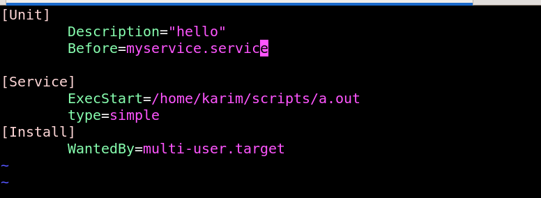
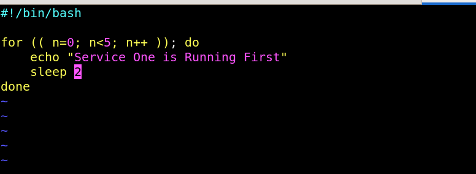
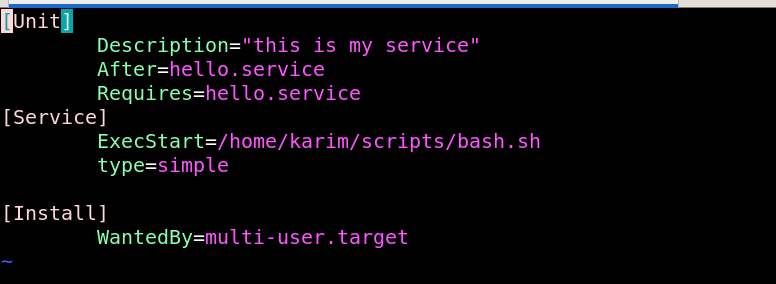
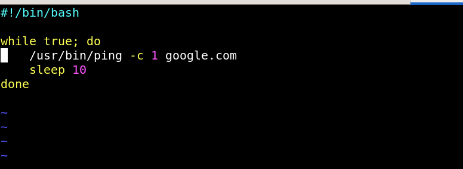
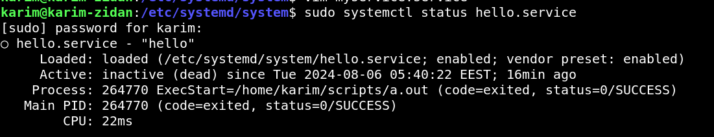
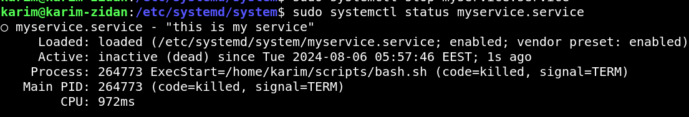
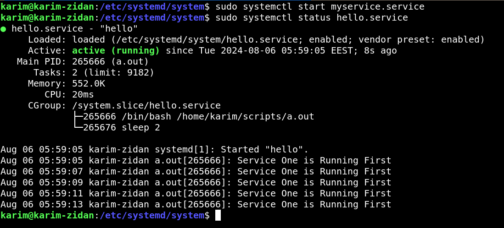
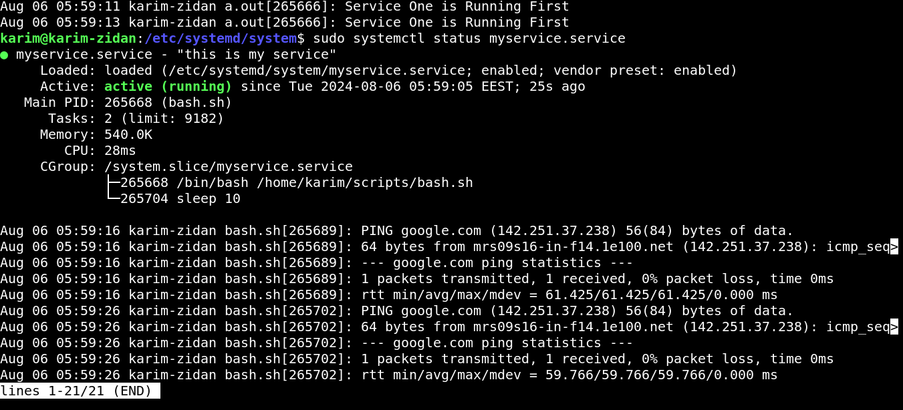

# You Will Find Massive Notes about System-D here (https://github.com/KarimZidan007/Andriod-Automotive/tree/main/Embedded_Linux_NOTES)


## Task Description

- Simply Create Two Services , First One Print a String on Standart Output , Second One Ping Google , but we need both are dependent , we need the second service requires the first service to run , lets figure out how 


1. `cd /etc/systemd/system`


2. Create Two units 

```sh
touch hello.service

touch myservice.service


```


3. First Unit 

`sudo vim hello.service`

```sh

[Unit]
        Description="hello"
        Before=myservice.service

[Service]
        ExecStart=/home/karim/scripts/a.out
        type=simple
[Install]
        WantedBy=multi-user.target


```


**Display Script that First Unit gonna execute it**



4. Second Service

```sh
[Unit]
        Description="this is my service" 
        After=hello.service
        Requires=hello.service
[Service]
        ExecStart=/home/karim/scripts/bash.sh
        type=simple

[Install]
        WantedBy=multi-user.target
                                   

```



**Ping Script that run after first service are launched**



5. reload 

```sh
sudo systemctl daemon-reload
```

6. lets find out the result

**1-service one is inactive**



**2-service two is inactive**


**3-once service two is started it will launch service one first**





