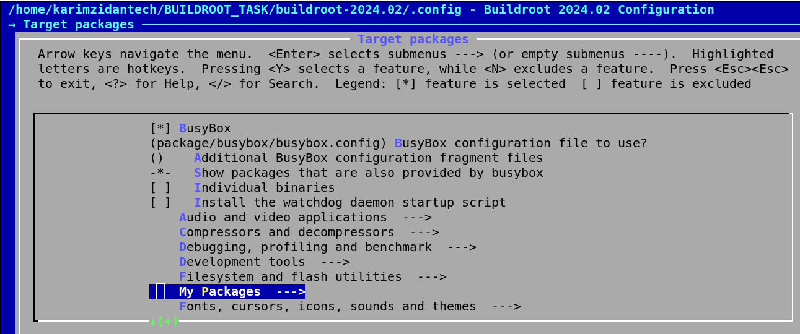

## 1. Why We Need to Add a New Package to Buildroot

Buildroot is a powerful tool for creating custom Linux systems, particularly for embedded devices. It provides a comprehensive framework for building cross-compilation toolchains, libraries, and applications. However, it may not include every software package you need out-of-the-box. Here’s why you might need to add a new package to Buildroot:

### 1.1 Custom Requirements

In many cases, a specific project may require custom software or libraries that are not included in the default Buildroot configuration. This could be due to unique application needs, compatibility requirements, or proprietary software that is essential for the project’s functionality.

### 1.2 Integration of Third-Party Software

Your project might depend on third-party libraries or applications that are not available in Buildroot’s standard package repository. Adding these packages to Buildroot ensures that all necessary dependencies are included and properly integrated into the build system.

### 1.3 Special Features or Configurations

Some software packages may require special configurations or patches to work correctly with your specific hardware or use case. Adding these packages to Buildroot allows you to customize and configure them to meet your project’s needs.

### 1.4 Version Control

Software packages often have multiple versions, and the version included in Buildroot might not be the latest or the one required by your project. By adding a new package, you can specify the exact version needed, ensuring compatibility and access to the latest features or bug fixes.


## HOW TO Custom a Package and Integrate it with Buildroot Using **GITHUB**

## FOLLOW Buildroot Documentation 


## STEPS ON HOST 

1. develop your application and makefile 

```make


TARGET = mysimpleapp
SRC = main.c


$(TARGET): $(SRC)
	$(CC) -o $@ $(SRC)

clean:
	-rm -f $(TARGET)


```

```c

#include <stdio.h>

int main() {

printf("HOST APPLICATION IS WORKING\n");

    return 0;
}

```


2. compress them using tar


3. push into github


4. run this command  

```sh
git log -1 | grep ^commit | cut -d " " -f 2
```

## why ? -> because previous documentation says that you have to use commit id or tag

## what is the difference between them ?

Examples
Commit ID:

```bash
git checkout 19c075f
```
Tag:

```bash
git checkout v1.0.0
```


**NOTE ,MAKE SURE THAT YOU PUSH YOUR FILES AFTER FINAL DEVELOPMENT OR YOU GONNA RUN THE PREVIOUS COMMAND FOR EVERY COMMIT ,AND YOU HAVE TO CHANGE THIS COMMIT ID ON THE SCRIPT EVERY NEW COMMIT**

## on buildroot (could be on same machine or another machine)

## 1. we gonna need to create a directory with two files with the package name eg:mysimpleapp

```sh

cd /build-root/directory

cd package

mkdir mysimpleapp

cd mysimpleapp/ 

touch mysimpleapp.mk

touch Config.in
```


**1. mysimpleapp.mk**

```sh
vim mysimpleapp.mk

```
## make sure you fill this argument correctlly with your github info on the next script 
MYSIMPLEAPP_SITE =$(call github,githubusername,reponame,$(MYSIMPLEAPP_VERSION))
Example:

```sh

MYSIMPLEAPP_VERSION = (SET THE COMMIT ID THAT WE MENTIONED BEFORE)

MYSIMPLEAPP_SITE =$(call github,KarimZidan007,BUILDROOT_PROGRAM,$(MYSIMPLEAPP_VERSION))

define MYSIMPLEAPP_BUILD_CMDS
    $(MAKE) CC="$(TARGET_CC)" LD="$(TARGET_LD)" -C $(@D)
endef


define MYSIMPLEAPP_INSTALL_TARGET_CMDS
    $(INSTALL) -D -m 0755 $(@D)/mysimpleapp  $(TARGET_DIR)/usr/bin
endef


$(eval $(generic-package))


```


**2. modify on Config.in**


```sh
vim Config.in

```

```sh
config BR2_PACKAGE_SIMPLEAPP
    bool "mysimpleapp"
    help
        mysimpleapp/ package.
```

**3. then we need to go back for -> package/Config.in**

```sh
cd ..

vim Config.in

```


`ADD THIS TO THE CONFIG FILE`

```sh

menu "MYSIMPLEAPP Packages"
    source "package/mysimpleapp/Config.in"
endmenu


```
3. now you could choose your package 
 

```sh
make menuconfig

```
 

 


## if you do not build an image follow the normal scenario after choosing your configurations

```sh
make 

```

## if you are already built an image you could choose your package from menuconfig then run this command

```sh

make (packagename)
```

ex:

```sh 

make mysimpleapp

then 

make -j4 

to include this application into the rootfs image it will take only seconds if you have build before

```
 


## EXECUTABLE ON TARGET FS

 


