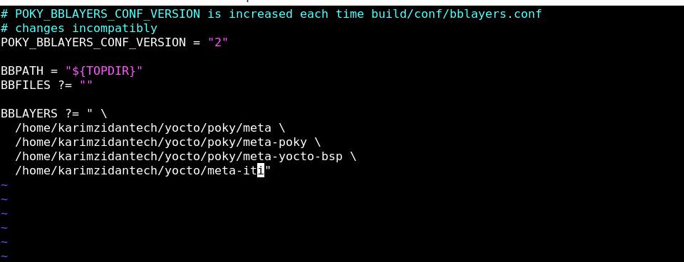

## Task Description

1. create an enviroment

2. create layer outside poky using skeleton

3. create recipe

4. then create on layer.conf variable that i check on the display receipe function  

5. add the layer to bblayers.conf 

6.  append recipe path to  layer.conf 

7. edit on display func

8. check if (variable==3) -> display KARIM else variable ==4 display ZIDAN


 

## STEPS

1. `source oe-init-build-env` 

2. `bitbake-layers create-layer ../meta-iti`


3. `mkdir zidan-recipes`


4. `cd zidan-recipes`


5. 

```sh
touch karim.bb`

vim karim.bb

```
## to enable display on terminal you have to add this line to your receipe

`inherit logging`


4. 

```sh

cd meta-iti/conf

vim layer.conf

```


5. add layer on bblayer.conf

```sh
cd poky/build/conf

vim bblayers.conf

```

## add your path as absloute path


5. go back to poky 

```sh

bitbake (recipe-name)

# on my case 

bitbake karim
```
## OUTPUT


