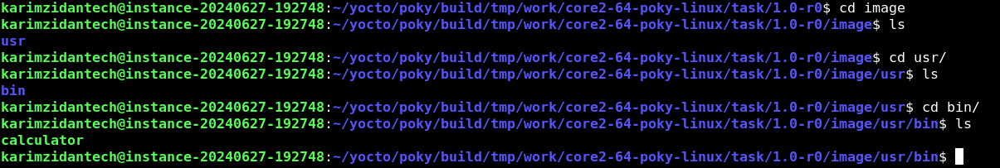

# CREATE A RECEIPE AND BUILD USING CMAKE

## RECIPE

```sh
SUMMARY = "DemoApp Recipe"
DESCRIPTION = "A recipe for DemoApp from GitHub."
LICENSE = "CLOSED"

inherit cmake

DEPENDS = "cmake"

SRC_URI = "git://github.com/FadyKhalil/DemoApp.git;protocol=https;branch=main"
SRCREV = "720c663c5fd7246b4b42c5205d74db7d9784b5b2"

S = "${WORKDIR}/git"
B = "${WORKDIR}/build"
D = "${WORKDIR}/image"

do_configure() {
    cmake -S ${S} -B ${B}
}

do_compile() {
    cmake --build ${B}
}

do_install() {
    install -d ${D}/usr/bin
    install -m 0755 ${B}/calculator ${D}/usr/bin/
}


```
## 1. create a new receipe under a custom layer

```sh
touch task.bb

```

## 2. add the recipe content 


## 3. change directory to /poky 

```sh

source oe-init-build-env

```

## 4. bitbake task


## 5. check output 




