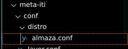
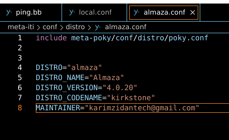
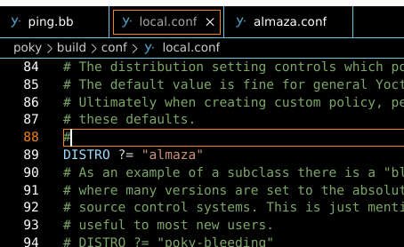

## STEP 1 

**1.CREATE A DIR CALLED distro under yourlayer/conf**
**2.CREATE A FILE CALLLED almaza.conf**
 

## STEP 2 

**1.include the poky.conf from meta-poky/conf/distro/poky.conf**

**2.change your required configuration**




**3.change DISTRO on /poky/build/conf/local.conf**


**4.also add (*)-sdimg extension here**

 

## STEP 3 (CREATE YOUR SCRIPT)

```bash

 #!/bin/sh


PIN_NUMB=17
IP_ADDRESS=192.168.1.15

if [[ ! -d /sys/class/gpio/gpio${PIN_NUMB} ]];then

echo ${PIN_NUMB} > /sys/class/gpio/export
sleep 1
echo "out" > /sys/class/gpio/gpio$PIN_NUMB}/direction 

fi

sleep 1

if ping -c 3 "${IP_ADDRESS}" ;then
echo 0 > /sys/class/gpio/gpio${PIN_NUMB}/value
else
echo 1 > /sys/class/gpio/gpio${PIN_NUMB}/value
fi


```
## GPIO Ping Script

This script is used to control a GPIO pin based on the availability of a specific IP address on the network.

### Script Explanation
The script takes two variables as input:

1- `PIN_NUMB`: The number of the GPIO pin to control (in this case, pin 17).

2- `IP_ADDRESS`: The IP address to ping and check for availability (in this case, 192.168.1.15).

### The script performs the following actions:

1. It checks if the GPIO pin is already exported. If not, it exports the pin and sets its direction to "out".

2 .It waits for 1 second to ensure the pin is properly set up.

3. It pings the specified IP address three times using the ping command.

4. If the IP address is reachable (i.e., the ping command succeeds), it sets the GPIO pin to a low state (0).

5. If the IP address is not reachable (i.e., the ping command fails), it sets the GPIO pin to a high state (1).

### Usage

To use this script, simply save it to a file (e.g., ping.sh), 
make the file executable with 
`chmod +x ping.sh`, and then run it with `./ping.sh`.

## STEP4 -> Create your own recipe and include this script into our final image

1- create layer

`bitbake-layers create-layer /PATH/TOYOUR/LAYER`
EX:
`bitbake-layers create-layer ./..meta-iti`


2- add this layer to BBCONF

`bitbake-layers add-layer  /PATH/TOYOUR/LAYER`
EX:
`bitbake-layers add-layer ./..meta-iti`

or simply append it on /poky/build/conf/BBLAYER.conf


3- create recipe


```bash
cd meta-iti

mkdir recipe-custom

touch ping.bb

vim ping.bb
```

```bash
DESCRIPTION = "A simple Bash script"
LICENSE = "CLOSED"
FILES_PATH:append=" /home/karimzidantech/meta-iti/recipes-custom/ping-recipe/files"
SRC_URI += "file://ping.sh"

WORKDIR="/home/karimzidantech/poky/TASK_3_DISTRO"

S = "${WORKDIR}/src"
D = "${WORKDIR}/Dest"

do_install() {
    install -d ${D}${bindir}
    install -m 0755 ${WORKDIR}/ping.sh ${D}${bindir}
}


```

## Finally build you image and test the output on raspberrypi


