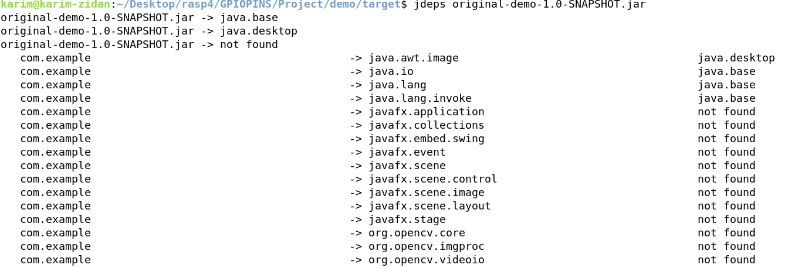
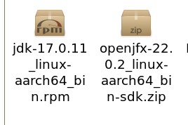

## STEPS OF INTEGRATING JAVAFX WITH YOCTO 

## there is a command called jeps (use it to check the dependencies required to run the Application)

## method 1 -> deploy those packages into the sdimage direct using scp 

scp package raspuser@raspIP:~/path on raspberrypi 

## depack this packages 
- rpm -i (.rpm)

## then add the JAVAFX/lib to PATH 

export JAVAFX_LIB = /PATH/TO/jAVAFX/LIB

export PATH=$JAVAFX_LIB:$PATH

## then run your JAR application
- java --module-path PATH/TO/JAVAFX/lib --add-modules=javafx.controls,javafx.fxml -jar Application.jar
 