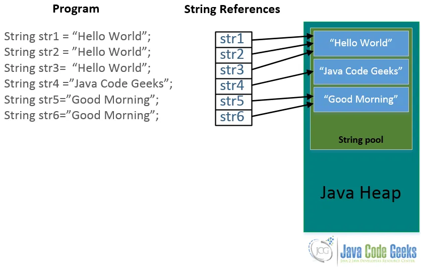

## OOP PART2

Association -> without ownership but if method use a refernce of a another Class

Aggregation -> With ownership with reference of another Class use it in Constructor or method 

Compsition -> instance created in another class body they start together (same life time and has ownership)


## Identifiers

Datatypes of Java

-1 : Primitive same data types as cpp but add ,(byte ->1B) , modify char to (2Byte)

every primitive data type has a corresponding wrapper class 
EX ; int -> Int(class)

With Wrapper Class it has MIN_VALUE and MAX_VALUE i could set max and min value on it 


-2 : Reference (Array,Classes,interfaces) -> has reference on memory on another place with obj that alloc place on memory on another memory frame.

## auto boxing , auto unboxing
```java
class Wrappers {

    public static void main(String[] args) {
        Integer i = new Integer(5);
        int pi = i; // auto outboxing
        System.out.println("pi:" + pi);
        i = 10; // auto boxing
        System.out.println("i:" + i);

    }
}
```
## this object class is the parent class of all classes
```java
    public void send(Object o)
    {

    }
```
```java
class Wrappers {

    public static void main(String[] args) {
        float f= 0.01;
    }  

}
```
this will generate this error 
Wrappers.java:4: error: incompatible types: possible lossy conversion from double to float
        float f= 0.01;

i have to set Post Suffix to it 0.01f

## casting from small data type to big 
it happen implicitly 

## casting from big data to small 
it has to happen explicitly

## instanceof 

it is new operator  check if this an instance on 

```java
Integer x=10;
if(x instanceof Integer)
{

}

```
## Reference Data types

- Reference allocate in Stack 

- Object allocate in Heap


## Garbage collector in java

- it is a thread that run in background
- it is used to free the memory that is not being used
- it is run by JVM


When the garbage collcete the object ? 


when object has no reference on it 

- i Could Ask from Garbage collector to start (could respond or not )

-How ?

```java
-> System.gc();
```

## NULLPointerxception

- happen only when there is null refernce call from it instance member method

- Using local variables not initialized will generate error 


## ARRAYS

int [] id;

there is an outboundsexception if i access outbound index

Allocation are always in Heap not Stack 
Stack only contain references

```java
int[3] Arr={1,2,3,4,5}; -> static allocation on heap 

```

## Reference Arrays

String[] namesArr;

namesArr = new String[3];

namesArr -> stack 

it points to Arr of three reference located in **heap** 
so they made an array of references to seperate the objects that would be a usefull in memory managment 


in cpp 
+--------------------+  <-- Address of Arr[0]
| String[0]          |
+--------------------+  <-- Address of Arr[1] (Address of Arr[0] + sizeof(String))
| String[1]          |
+--------------------+  <-- Address of Arr[2] (Address of Arr[1] + sizeof(String))
| String[2]          |
+--------------------+

objects are sequential on heap 

## island problem 

## String 

could i use new or i could use direct assignation but they still on heap

- it is a reference type 

never use (== with reference in strings ) // shallow comparison

- use .equals()

```java
myStr1.equals(sp1) //case sensitive
myStr1.equalsIgnoreCase(sp1) // ignore sensitive to case


// -> it is method for Object class it called Shallow Comparision
```
## There is Operator overloading only in String for concatinating '+' , '+=' 

----------------------------------------------------------------------------
## Array Concatination

String str =  myStr1 + sp2;  "Welcome to Java"
String +=    "Programming"  "Welcome to Java Programming" 
str =str.conact("Lang");   "Welcome to Java Programming Lang"

//Strings are immutable is constant because array is fixed size 

//Concatination always return anew string object with new size


----------------------------------------------------------------------------

## what is the difference between alloc with new and without it

if it is with out new 

every String goes to String pool 
and if i made anew reference needs to reserve a new memory to string which is  





## Control Flow


// Command line Calculator 


+ - x / support it 


main Args 


-----------------------------

163.121.12.30 

output should be then 

163
121
12
30 
with three methods 
1. substring , indexof on string class  then use indexof (from to ) , then substring that get the last one 

2. method called split inside String takes deligmeter -> Array of String   search on google and explain  it 


3. Class String Tokenizer -> READ IT FROM DOCUMENTATION AND READ IT 


4. two for loops only

