# Introduction to java

- Java is a high-level, object-oriented programming language that is widely used for developing large-scale applications,

- jave is platfrom and os independent language

- JCP
- Java Community Process -> they made a standart for every thing related to database ,os and any standart called JSR

- JSR 
- Java Specification Ruest

-open JDK 
- what is JDK
- JDK is a development kit for java

- JDK is a collection of tools and libraries that are used to develop, test, and run java
- JDK includes the following components:
- javac (java compiler)
- java (java runtime environment)
- javadoc (java documentation generator)


- Java SE -> Standart Edition

- Java ME -> Micro Edition

- Jave EE -> Enterprise Edition

- **we will go through JAVA SE**

## java is everywhere
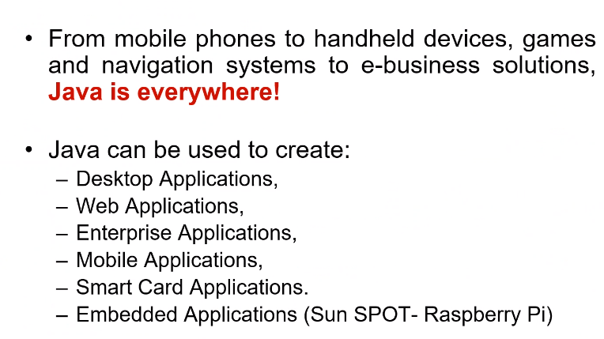

What is Enterprise Applications ?

**Enterprise applications are large-scale software systems that are designed to support the operations of an organization. They are typically complex, distributed, and require high levels of scalability, reliability, and security.** like Vodafone Projects


## Why java is easy to learn
-Syntax of C++
- Dynamic Memory Management (Garbage Collection)
- Object-Oriented Programming (OOP) concepts
- Platform independence
- Large community and resources

## how Java are platform independent


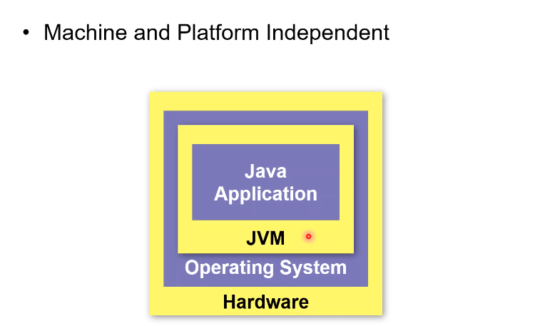 

-JVM 
- Java Virtual Machine
- JVM is a software program that runs Java bytecode on a computer
- JVM is responsible for loading, linking, and executing Java classes

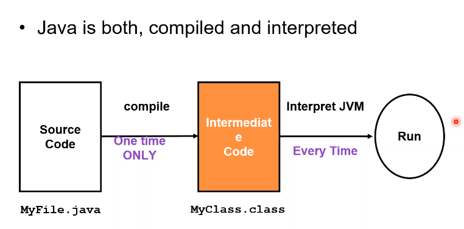

- i compile to intermediate code (bytecode) and JVM could handle it , it has an interpretor

- Bytecode is platform-independent and can run on any platform that has a JVM installed

- JVM provides a layer of abstraction between the Java code and the underlying platform

- JVM translates bytecode into native machine code at runtime

## JVM i download it or it part of java ?
- JVM is part of the Java Development Kit (JDK)
- JVM is also available as a standalone executable file

-how JVM is not part of the Java Runtime Environment (JRE) ?

- JRE includes the JVM + libraries, but it does not include the development tools(compiler , utilities)

- JVM is responsible for loading and executing Java classes, while the JRE provides the libraries and other

- so i need to download JDK during development (compiler , utilities) 

- if iam gonna host the application or run it only JRE is enough

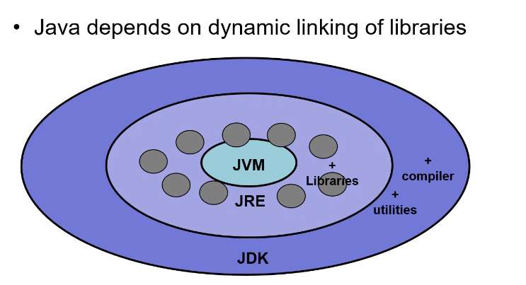

## Java is fully Object Oriented (there is no violations like CPP)


## Java is multi threading by default 


## lets hello world

```java
class HelloWorld
{
    public static void main (String [] args)
    {
        System.out .println("HELLOADD");
    }
}

```

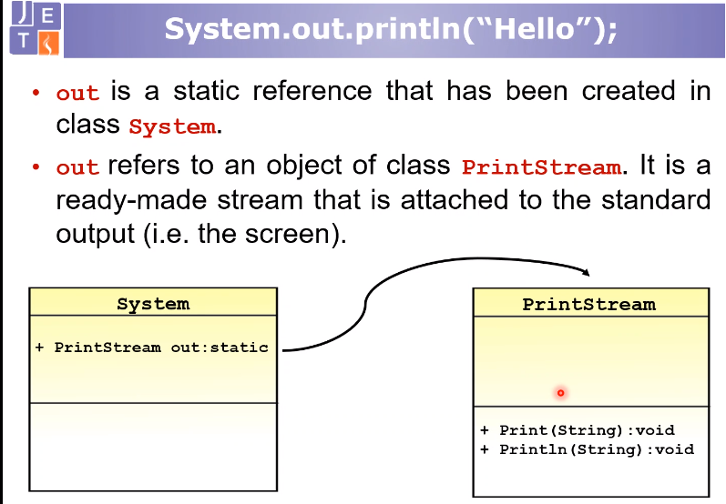

```java
java HelloWorld.class
```

## i have many classes (many files) 
```java

java (class name that contain main without .class)
```
## JRE responsible to call main 

```java
//explicitly JRE call .main from HelloClass
java HelloClass 
```

## java library is a folder contain classes of java library called package 


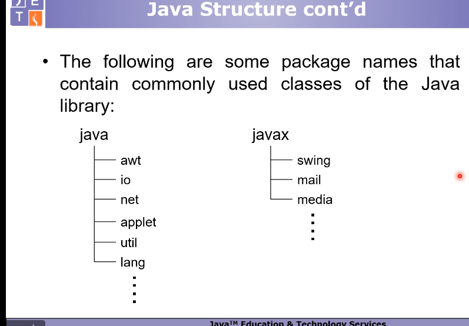

## if i want to create packages and set classes on it 

`javac -d ./custom hello.java`

## recommended to compile into packages


## to create compressed jar file (for files)
`jar -cvf hello.jar (files)`

## to create an executable jar file

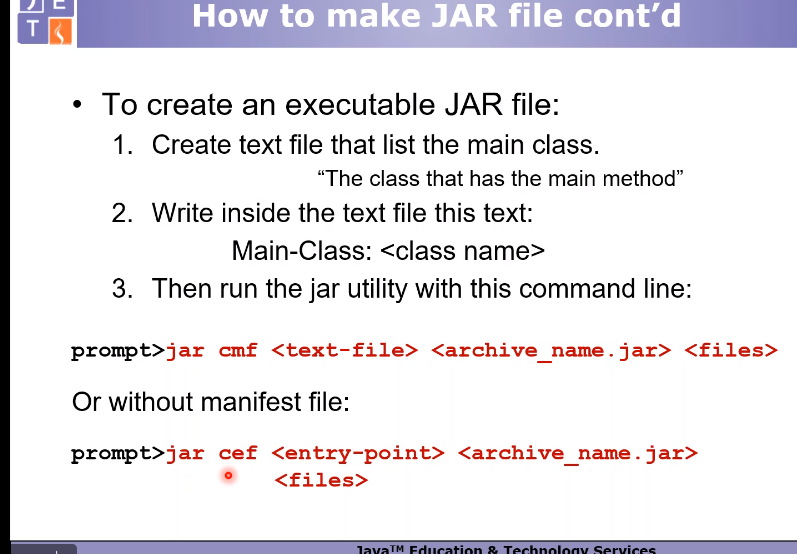
EX:

`jar -cfe name.jar (class contain main without .class) (classesfiles)`

`jar -cfe HelloWorld.jar HelloWorld HelloWorld.class zidan.class`

## how to run it ? 
`java -jar app.jar`

Error: Could not find or load main class hello.java
Caused by: java.lang.ClassNotFoundException: hello.java


## run it from package (from directory )

`jar cef mypkg.helloworld app.jar mypack/*.class`


## Standard Naming Convention 

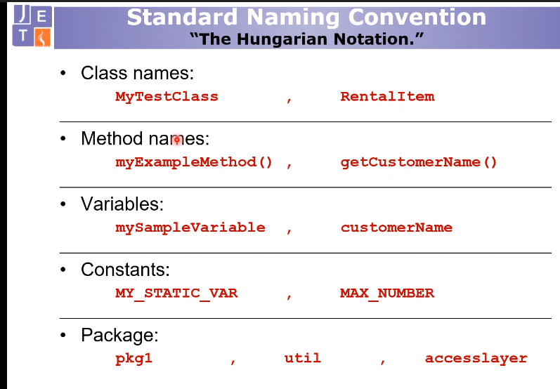


## Applets 

- Applet is a java program that run on web browser
- Applets is a small program 
- Applets are downloaded into locally and JRE execute it 

## Applets Security

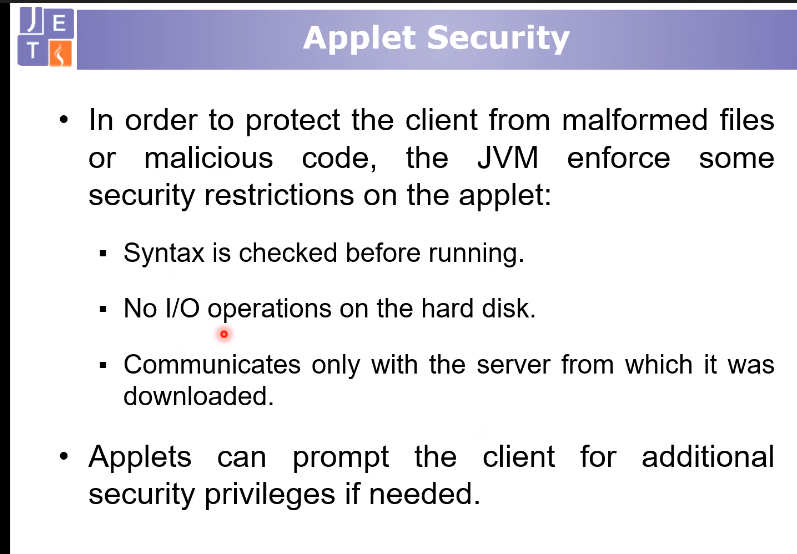

## anything haven't a main method or entry point it belong to lifecycle
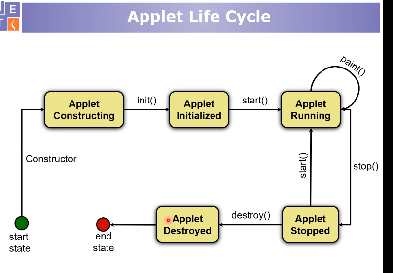

- methods that invoked automatically on the life cycle by applet manager

- for every method i will override it with the code that suitable with this situation

- init -> called only one time once object are called

- start -> could be called multiple times

- paint -> called multiple times

- stop -> could be called multiple times (release data , store data ,release db ,release streams)

- destroy -> called only one time once object are destroyed

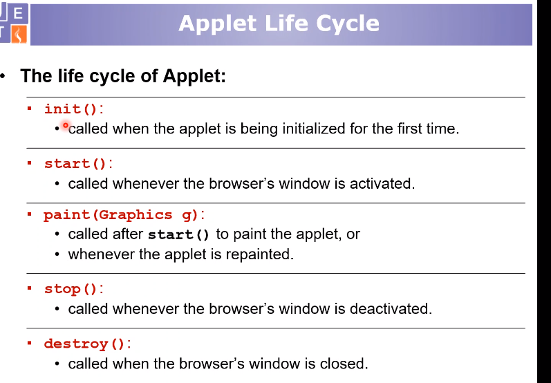

## it is forbidden to invoke callback method by the developer him self but i could request from applet manager 

## how to use applet

## inheret class Applet 


**extends** -> inheret keywork


## any feature on java.lang i could use it directly , if not i have to import it

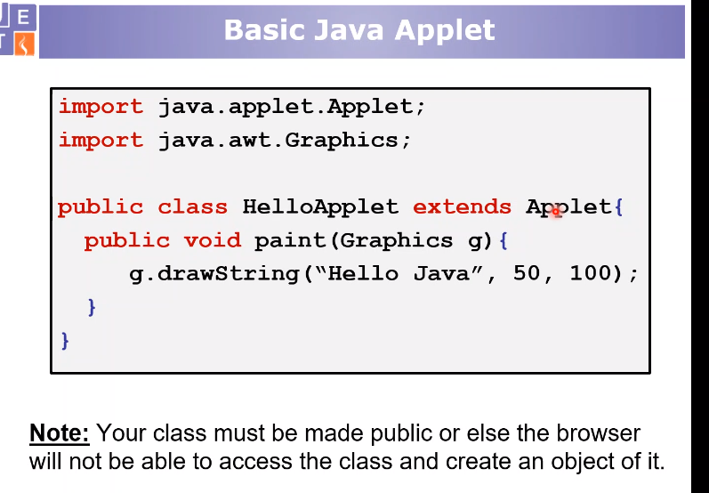

## basic html applet 

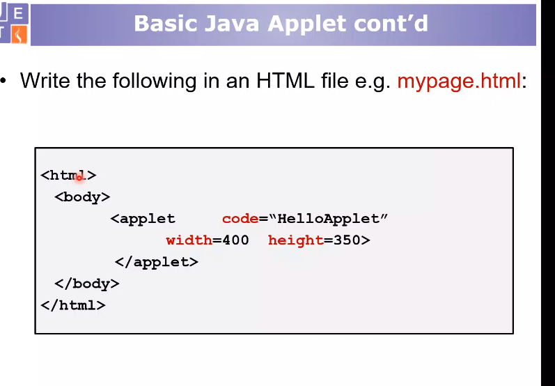

## how to run

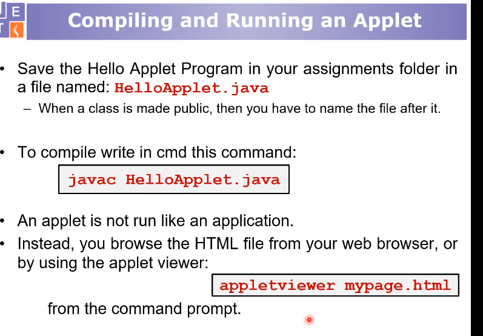

## Assignments

**1**
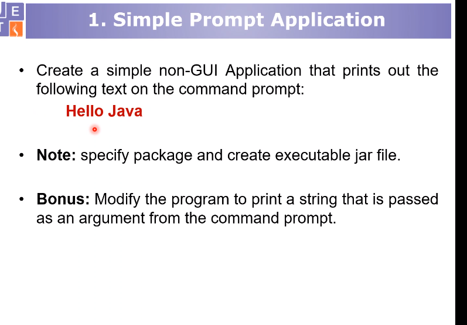

- concatenate your name

**2**
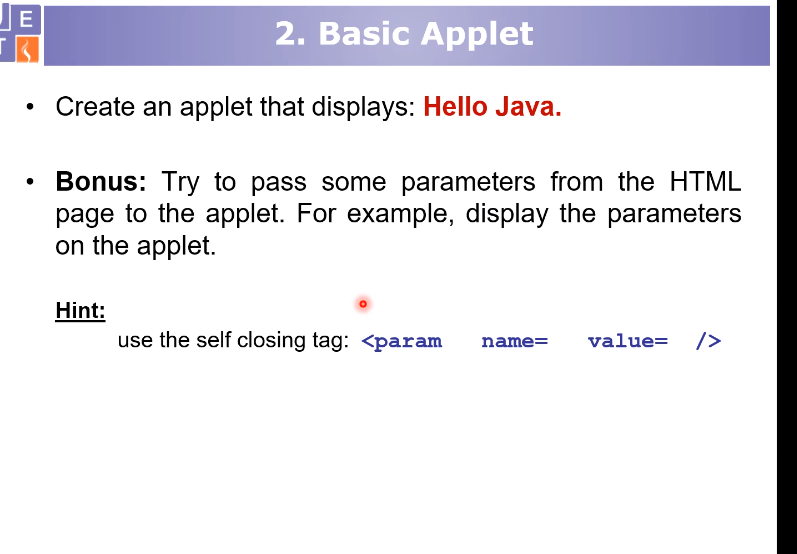