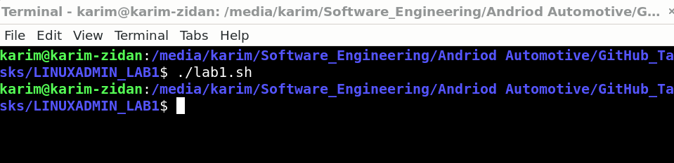
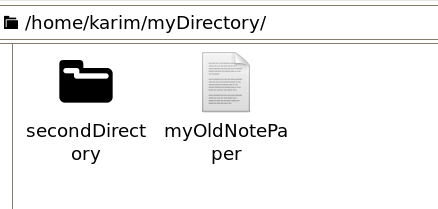
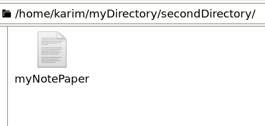

# Bash Script for Directory and File Operations

This repository contains a Bash script that performs several directory and file operations. Below is a detailed description of the script and screenshots demonstrating its execution and results.

## Script Description

The script performs the following operations:

1. Creates a directory named `myDirectory` in the home directory.
2. Creates a subdirectory named `secondDirectory` inside `myDirectory`.
3. Creates an empty file named `myNotePaper` inside `secondDirectory`.
4. Copies `myNotePaper` from `secondDirectory` to `myDirectory`.
5. Renames the copied `myNotePaper` to `myOldNotePaper` in `myDirectory`.

## Script

```bash
#!/bin/bash

mkdir ~/myDirectory
mkdir ~/myDirectory/secondDirectory
touch ~/myDirectory/secondDirectory/myNotePaper
cp ~/myDirectory/secondDirectory/myNotePaper ~/myDirectory
mv ~/myDirectory/myNotePaper ~/myDirectory/myOldNotePaper
```



