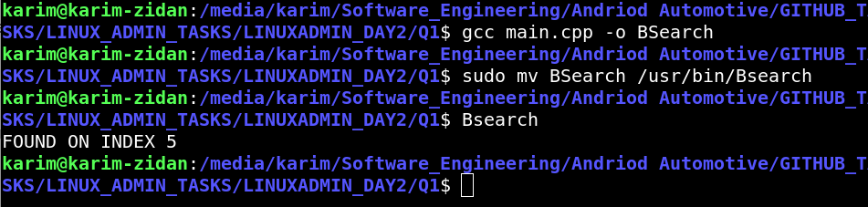
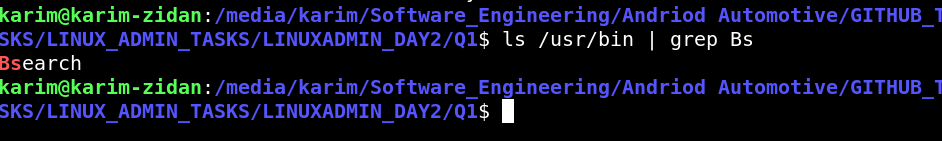

## Explaination

When you place the compiled binary (e.g., binary_search) in /usr/bin, it becomes accessible to the system as a command because /usr/bin is included in the system's $PATH environment variable. The $PATH variable specifies directories where the shell looks for executable files when you type a command. By placing the binary in /usr/bin, you ensure that the shell can find and execute it without needing to specify the full path. This allows you to run the binary simply by typing its name in the terminal.

