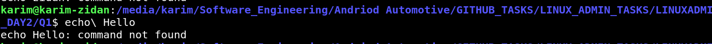

## \ in linux 



1. Escaping a Space:

If you want to include a space in a command without having the shell interpret it as a separator, you can use a backslash.

```bash
echo\ Hello
```
This command is equivalent to echo Hello, because the backslash escapes the space, effectively ignoring it.


2. Escaping Special Characters:

If you need to use special characters (like $, ", ', *, etc.) in a string without invoking their special functions, you can escape them with a backslash.
```bash

echo "This is a \$variable"

```
This will output This is a $variable without interpreting $variable as an environment variable.

3. Continuing a Command on the Next Line:


The backslash can also be used to continue a command on the next line for better readability.
```bash
echo "This is a long line that we want to \
split into multiple lines"
```
This command will output: This is a long line that we want to split into multiple lines.
