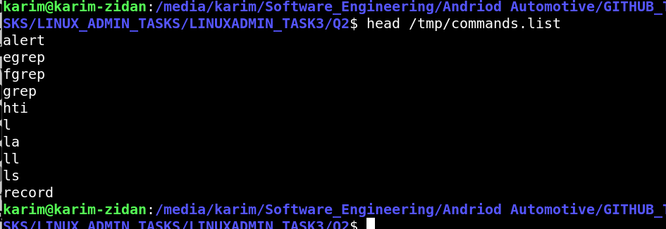
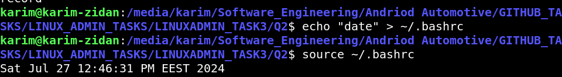
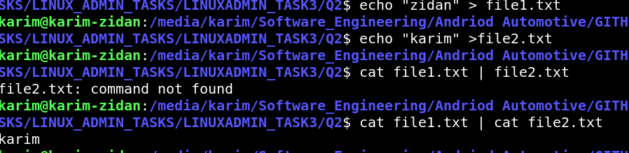
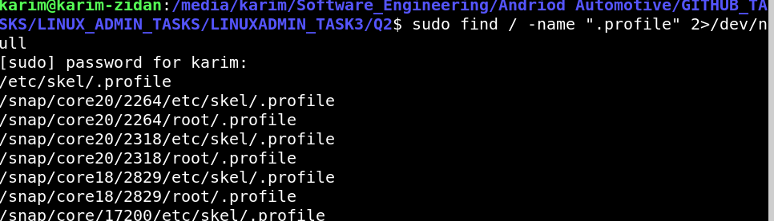
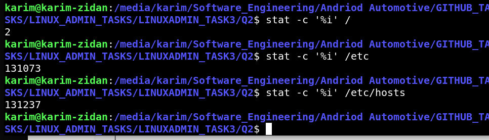
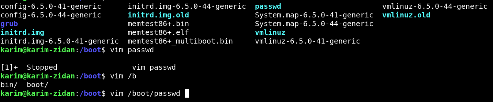
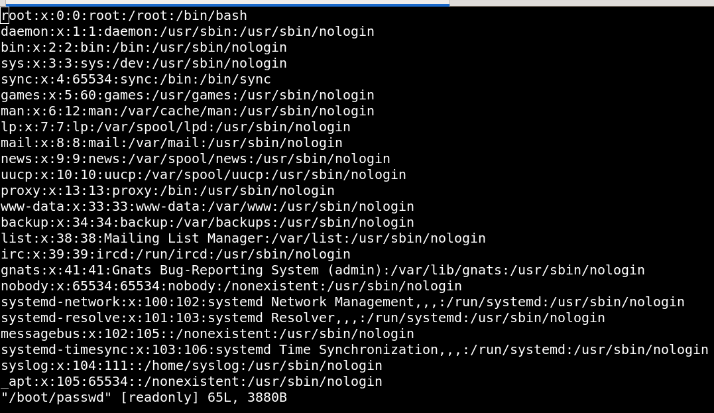

## Q2


1- 

```bash

compgen -c > /tmp/commands.list

```




2- 



3-

```sh

#command is

 wc --lines (file)

```


4-
Will output the contents of file2.txt.




5- 

```sh
sudo find / -name ".profile" 2>/dev/null
```



6- 



7- 

```bash
ln -s   /etc/passwd /boot/passwd
```





